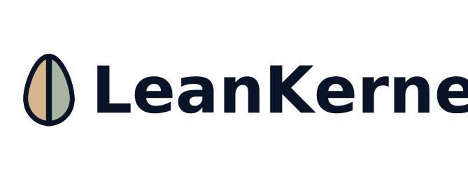

# LeanKernel — Lean Personal AI Agent



LeanKernel is the personal AI agent for builders who want **reliable output, lower token spend, and full control of context**. Instead of bloated chat history and unpredictable behavior, LeanKernel gives you a lean, observable agent runtime that helps you ship more with less friction.

## Ideal Audience (LeanKernel/Hermes-Style Users)

LeanKernel is built for power users who already rely on AI daily and want more control than typical hosted assistants:

- **Indie hackers and solo builders** running multiple projects who need dependable execution, not chat novelty.
- **Technical operators and developers** who care about auditability, composability, and predictable costs.
- **Privacy-conscious professionals** who want local data ownership and explicit control over what enters model context.
- **Small teams replacing assistant sprawl** (many disconnected tools) with one orchestrated, observable agent runtime.

## Value Proposition: From Agent Chaos to Reliable Throughput

LeanKernel helps you turn AI from "interesting demos" into repeatable output with lower spend, better context quality, and less operational friction.

### Before vs After

| Before (typical agent stack) | After (LeanKernel) |
|-----------------------------|----------------|
| Context bloat drives rising token costs and weaker answers | Context gatekeeper injects only high-value memory to improve relevance and reduce waste |
| Hard to debug agent failures across tools and model hops | Structured middleware logs and diagnostics make runs observable and fixable |
| Knowledge is fragmented across chat history, docs, and ad hoc notes | Unified 5W1H wiki + vector index keeps memory queryable and reusable |
| Switching models/providers requires code churn and config drift | LiteLLM routing centralizes model strategy and allows provider changes with minimal disruption |

### Benefit Stack (Feature -> Tangible Outcome -> Emotional Win)

- **Deny-by-default context gating** -> fewer irrelevant tokens and tighter prompts -> more confidence that answers stay on target.
- **5W1H structured memory + vector retrieval** -> faster recall of past facts and decisions -> less repeated explaining and lower frustration.
- **MAF multi-agent orchestration** -> specialized workers handle complex requests predictably -> more done per day with less manual juggling.
- **Dockerized sidecars (LiteLLM, Qdrant, indexer)** -> reproducible runtime on constrained hardware -> lower ops anxiety and easier recovery.
- **Built-in web UI + API compatibility** -> one place for chat, logs, files, and configuration -> faster troubleshooting and smoother handoffs.

## Main Pain Points with Existing AI Agents (Online Signals)

Recurring issues in production agent deployments map directly to the problems LeanKernel is designed to solve:

- **Complexity creep**: teams overbuild multi-agent flows where simpler patterns would work, increasing latency and cost ([Microsoft guidance](https://learn.microsoft.com/en-us/azure/architecture/ai-ml/guide/ai-agent-design-patterns)).
- **Compounding errors and loop risk**: autonomous systems can stall, bounce, or loop without strong iteration limits and checkpoints ([Anthropic](https://www.anthropic.com/engineering/building-effective-agents), [Microsoft guidance](https://learn.microsoft.com/en-us/azure/architecture/ai-ml/guide/ai-agent-design-patterns)).
- **Weak observability**: abstraction-heavy stacks make failures hard to trace and fix, reducing trust ([Anthropic](https://www.anthropic.com/engineering/building-effective-agents), [IBM](https://www.ibm.com/think/topics/ai-agents)).
- **Cost unpredictability**: orchestration multiplies model calls and token usage without tight budgeting and compaction ([Microsoft guidance](https://learn.microsoft.com/en-us/azure/architecture/ai-ml/guide/ai-agent-design-patterns)).
- **Governance and privacy concerns**: agents need stronger guardrails, least-privilege access, and auditable action trails ([IBM](https://www.ibm.com/think/topics/ai-agents), [PwC](https://www.pwc.com/us/en/tech-effect/ai-analytics/ai-predictions.html)).

## Architecture

LeanKernel is organized into three decoupled subsystems:

| Component | Role |
|-----------|------|
| **Commander** | Channel adapters (Signal, future Telegram/Discord). Routes messages. |
| **Thinker** | LLM reasoning via Microsoft Agent Framework. Prompt assembly, tool dispatch, agent orchestration. |
| **Archivist** | Memory & context gatekeeper. 5W1H wiki, vector search, deny-by-default context gating. |

### Component Diagram

```
┌─────────────────────────────────────────────────────────────────┐
│                    Docker Compose Network                        │
│                                                                  │
│  ┌────────────┐   ┌──────────────────────────────────────────┐  │
│  │ signal-cli  │◄─►│         LeanKernel.Engine (.NET 10)           │  │
│  │ (JSON-RPC)  │   │                                          │  │
│  └────────────┘   │  Commander ──► Thinker ──► Archivist      │  │
│                    │       │            │           │           │  │
│  ┌────────────┐   │       │            │           ▼           │  │
│  │  LiteLLM   │◄─►│       │            │      5W1H Wiki       │  │
│  │  (proxy)   │   │       │            │      Qdrant Search   │  │
│  └────────────┘   │       │            ▼                       │  │
│                    │       │     Agent Orchestrator             │  │
│  ┌────────────┐   │       │     ├── ResearchWorker             │  │
│  │  Qdrant    │◄─►│       │     ├── CodeWorker                 │  │
│  │  (vectors) │   │       │     └── ScheduleWorker             │  │
│  └────────────┘   │       ▼                                    │  │
│                    │  Scheduler · Plugins · Source Generators   │  │
│                    └──────────────────────────────────────────┘  │
└─────────────────────────────────────────────────────────────────┘
```

### Context Gatekeeper (Core Differentiator)

Unlike typical agents that send full conversation history to the LLM, LeanKernel's Archivist starts from **nothing** and only injects LeanKernels that earn their place:

```
[Query] → Intent Classification → 5W1H Wiki + Vector Search → Competitive Ranking → Budget Fill → Minimal Prompt
```

**Token budget allocation:** System Prompt 15% · Wiki Facts 20% · History 40% · RAG LeanKernels 20% · Tools 5%

**Scoring formula:** `(semantic_similarity × 0.40) + (recency_decay × 0.20) + (dimension_match × 0.25) + (interaction_frequency × 0.15)`

### 5W1H Wiki System

Knowledge is stored as structured facts across six dimensions:

| Dimension | Content |
|-----------|---------|
| **Who** | People, organizations, entities |
| **What** | Events, actions, concepts |
| **Where** | Locations, environments |
| **When** | Temporal facts, schedules |
| **Why** | Reasons, motivations, causes |
| **How** | Processes, methods, procedures |

Each fact carries confidence scores, source citations, and is automatically extracted from conversations via heuristic pattern matching.

Wiki entries are stored as **markdown files** with YAML frontmatter — human-readable, editable, and git-friendly:

```markdown
---
id: who-alice-smith
dimension: who
subject: Alice Smith
lastAccessed: 2024-06-15T10:00:00Z
accessCount: 12
---

# Alice Smith

- Alice is a software engineer at Acme Corp <!--{confidence: 0.9, source: session-123, confirmed: 2024-06-01}-->
- Alice prefers TypeScript over JavaScript <!--{confidence: 0.85, source: session-456, confirmed: 2024-06-10}-->

## Related

- [Project Atlas](../what/project-atlas.md)
```

### Knowledge Indexing

LeanKernel uses a **sidecar indexer** to unify wiki facts and document search into a single vector index:

| Service | Role |
|---------|------|
| **LeanKernel-indexer** | Python sidecar: watches wiki + documents, generates embeddings, stores in Qdrant |
| **unstructured** | Parses complex documents (PDF, DOCX, EPUB) into structured chunks |
| **Qdrant** (`LEANKERNEL_knowledge`) | Unified vector collection for wiki + documents |

**Agent-scoped search**: Each agent sees only knowledge matching its configured tags. Configure in `appsettings.json`:

```json
{
  "LeanKernel": {
    "Knowledge": {
      "AgentScopes": {
        "research": { "tags": ["*"] },
        "code": { "tags": ["wiki", "technical"] }
      },
      "TagRules": [
        { "pathPattern": "wiki/**", "tags": ["wiki"] },
        { "pathPattern": "documents/technical/**", "tags": ["technical"] }
      ]
    }
  }
}
```

To add documents, drop files into `./data/documents/`. The indexer automatically detects, parses, embeds, and indexes them.

## Stack

| Layer | Technology | Version |
|-------|-----------|---------|
| Runtime | .NET 10 / C# 14 | 10.0 |
| Orchestration | Microsoft Agent Framework | 1.3.0 |
| AI Abstractions | Microsoft.Extensions.AI | 10.5.0 |
| OpenAI SDK | OpenAI | 2.10.0 |
| LLM Proxy | LiteLLM | v1.83.7-stable |
| Vector DB | Qdrant | v1.17.1 |
| Document Parser | Unstructured.io | latest |
| Knowledge Indexer | Python 3.12 (sidecar) | custom |
| Messaging | signal-cli | latest |
| Logging | Serilog | 9.0.0 |
| Containers | Docker Compose | v2 |

## Quick Start (First Value in Minutes)

Spin up LeanKernel, complete guided onboarding, and run your first production-style agent flow from a single local stack.

```bash
# 1) Configure environment
cp .env.example .env
# Add provider keys in .env (Signal is optional)

# 2) Start the full stack
docker compose up -d

# 3) Open the web app
open http://localhost:5080

# 4) Complete one-shot onboarding in the UI
# - Configure LiteLLM, Qdrant, wiki, scheduler, and Signal (optional)
# - Run built-in validation probes
# - Click Complete Onboarding

# 5) Verify health
curl http://localhost:5080/api/health
```

If health returns successfully, proceed to `/chat` to run your first task and verify tool execution traces in the diagnostics panel.

### Local Development

```bash
# Requires .NET 10 SDK
cd src
dotnet build LeanKernel.sln
dotnet test LeanKernel.sln
dotnet run --project LeanKernel.Host
```

### Running Tests

```bash
cd src
dotnet test LeanKernel.sln -v minimal
```

### Quality Gates

```bash
# Coverage gate, default threshold: 80% line coverage
scripts/quality/test-coverage.sh

# Local Docker-backed SonarQube scan
scripts/quality/sonarqube-scan.sh
```

See [docs/QUALITY.md](docs/QUALITY.md) for details and environment variables.

## Project Structure

```
LeanKernel/
├── docker-compose.yml          # 5 services: engine, litellm, qdrant, unstructured, indexer
├── Dockerfile                  # Multi-stage .NET 10 build
├── .env.example                # Environment variables template
├── config/
│   ├── render_litellm_config.py # Dynamic LiteLLM config renderer
│   └── litellm/
│       ├── Dockerfile          # LiteLLM container image (dynamic config startup)
│       └── config.yaml         # Multi-provider/multi-tier routing template
├── data/
│   ├── wiki/                   # 5W1H knowledge filesystem (.md files)
│   │   ├── who/ what/ where/ when/ why/ how/
│   │   └── .LeanKernel/             # Internal metadata
│   ├── documents/              # Drop PDFs, ebooks, articles here
│   ├── sessions/               # Conversation history
│   ├── qdrant/                 # Vector DB storage
│   └── logs/                   # Rolling application logs
├── scripts/
│   ├── indexer/                # Knowledge indexer sidecar (Python)
│   │   ├── Dockerfile
│   │   ├── indexer.py
│   │   └── requirements.txt
│   ├── setup-signal.sh         # Signal registration helper
│   └── wiki-backup.sh          # Wiki backup/restore
└── src/
    ├── LeanKernel.Core/             # Interfaces, models, configuration
    ├── LeanKernel.Commander/        # Channel adapters (Signal)
    ├── LeanKernel.Thinker/          # LLM reasoning + agent orchestration
    ├── LeanKernel.Archivist/        # Memory, context gatekeeper, wiki
    ├── LeanKernel.Scheduler/        # Cron-based proactive tasks
    ├── LeanKernel.Plugins/          # Tool/plugin system
    ├── LeanKernel.Generators/       # Roslyn source generators
    ├── LeanKernel.Host/             # Web app: API controllers + Blazor UI
    │   ├── Controllers/        #   REST API + OpenAI-compatible endpoints
    │   ├── Services/           #   LogReader, FileBrowser
    │   ├── Components/         #   Blazor pages + layout
    │   └── wwwroot/css/        #   Cyber/Technical premium theme
    └── LeanKernel.Tests.Unit/       # Unit tests
```

## Configuration

All configuration is via `appsettings.json` or environment variables (using `__` separator for nested keys):

```bash
# Override via environment
LEANKERNEL__LiteLlm__BaseUrl=http://litellm:4000
LEANKERNEL__LiteLlm__DefaultModel=small
LEANKERNEL__Qdrant__Host=localhost
LEANKERNEL__Signal__Enabled=false
LEANKERNEL__Signal__AllowedSenders__0=+15551234567
```

### Authentication

LeanKernel requires authentication by default. During onboarding, you set an admin passcode.

```bash
# Auth modes (set via config or environment)
LEANKERNEL__Auth__Mode=LocalPasscode    # Default: passcode + API tokens
LEANKERNEL__Auth__Mode=Oidc             # OpenID Connect (external IdP)
LEANKERNEL__Auth__Mode=Disabled         # Dev only (ASPNETCORE_ENVIRONMENT=Development)
```

**API Token Usage** (for programmatic access to `/v1/*` endpoints):

```bash
# Create a token via the web UI or API
curl -X POST http://localhost:5080/api/auth/tokens \
  -H "Cookie: LEANKERNEL_session=..." \
  -H "Content-Type: application/json" \
  -d '{"name": "CI Pipeline"}'

# Use the token for API access
curl http://localhost:5080/v1/chat/completions \
  -H "Authorization: Bearer sk-LeanKernel-<your-token>" \
  -H "Content-Type: application/json" \
  -d '{"model": "LeanKernel", "messages": [{"role": "user", "content": "Hello"}]}'
```

**OIDC Configuration** (for enterprise SSO):

```bash
LEANKERNEL__Auth__Mode=Oidc
LEANKERNEL__Auth__Oidc__Authority=https://your-idp.example.com
LEANKERNEL__Auth__Oidc__ClientId=LeanKernel-app
LEANKERNEL__Auth__Oidc__ClientSecret=your-secret
LEANKERNEL__Auth__Oidc__AdminSubjectClaim=user@example.com
LEANKERNEL__Auth__Oidc__AdminClaimType=email
```

See `docs/prd-authentication.md` for the full authentication PRD.

### LiteLLM Dynamic Routing

LiteLLM runs from a dedicated container image built from `config/litellm/Dockerfile`.
At startup, it compiles the single-file source spec using `config/render_litellm_config.py`:

```bash
python3 /app/render_litellm_config.py /app/litellm_spec.yaml /tmp/litellm_config.yaml
```

This keeps `config/litellm/config.yaml` as a declarative source spec while
automatically excluding provider-key deployments that are missing required env vars.

Local preview command:

```bash
python3 config/render_litellm_config.py config/litellm/config.yaml /tmp/litellm_config.yaml
```

Sync model limits from live provider/deployment metadata:

```bash
# dry-run
python3 scripts/sync_litellm_model_limits.py

# write updates to config/litellm/config.yaml
python3 scripts/sync_litellm_model_limits.py --write
```

### LiteLLM Provider Environment Variables

Configure these in `.env` (or your secret manager):

```bash
OPENAI_API_KEY=
ANTHROPIC_API_KEY=
GROQ_API_KEY=
GROQ_API_KEY_2=
GEMINI_API_KEY=
GEMINI_API_KEY_2=
GEMINI_API_KEY_3=
AZURE_AI_API_KEY=
AZURE_AI_API_BASE=
AZURE_AI_API_KEY_2=
AZURE_AI_API_BASE_2=
OLLAMA_BASE_URL=http://host.docker.internal:11434
LITELLM_MASTER_KEY=sk-LeanKernel-local
LITELLM_SALT_KEY=change-me-to-random-string
```

### LiteLLM Model Routing Template

`config/litellm/config.yaml` is the only authoring file. It defines:

- `providers`: provider credentials + model catalog
- `routes`: route names mapped to provider/model selections
- `aliases`: optional OpenAI-compatible aliases mapped to route names
- `router`: retries, cooldown, and fallback policies

Example shape:

```yaml
providers:
  groq:
    keys:
      - source: env
        name: GROQ_API_KEY
    models:
      - id: scout
        name: meta-llama/llama-4-scout-17b-16e-instruct
        max_tokens: 8192

routes:
  small:
    - provider: groq
      model: scout
      order: 1
  embedding-small:
    - provider: openai
      model: text_embedding_3_small
      order: 1

aliases:
  gpt-4o-mini: small

# App model selection uses route names
# LEANKERNEL__LiteLlm__DefaultModel=small
# LEANKERNEL__LiteLlm__EmbeddingModel=embedding-small
```
## Multi-Agent System

LeanKernel uses the **MAF Agent-as-Tool** pattern — specialized worker agents are exposed as `AIFunction` tools on a coordinator agent. The LLM natively decides which specialists to invoke:

- **Simple queries** → direct `ChatClientAgent.RunAsync()` (no overhead)
- **Complex queries** → coordinator agent delegates to worker tools:
  - **ResearchWorker** — web search + summarization (4K token budget)
  - **CodeWorker** — code generation (8K token budget)
  - **ScheduleWorker** — calendar/reminder management (2K token budget)

### MAF Middleware Pipeline

| Layer | Middleware | Purpose |
|-------|-----------|---------|
| IChatClient | `ContextGatingMiddleware` | Prunes messages to token budget before LLM call |
| IChatClient | `FunctionLoggingMiddleware` | Logs tool invocations and results |
| Agent Run | `DiagnosticsMiddleware` | Timing, token counts, tool call stats → StateBag |

## Web UI

LeanKernel includes a **Blazor Server** web interface with a premium **Cyber/Technical** aesthetic. Access at `http://localhost:5080`.

| Page | Purpose |
|------|---------|
| **Login** (`/login`) | Passcode authentication gate |
| **Onboarding** (`/onboarding`) | First-run blocking setup wizard with dependency validation and go-live completion |
| **Dashboard** (`/`) | Health cards, uptime, wiki stats, system overview |
| **Chat** (`/chat`) | Interactive chat with expandable tool diagnostics & thinking traces |
| **Wiki** (`/wiki`) | 5W1H dimension tabs, search, entry detail with confidence bars |
| **Logs** (`/logs`) | Real-time log viewer with level/search filters |
| **Files** (`/files`) | Sandboxed data directory browser with file preview |
| **Settings** (`/settings`) | Configuration viewer per section |

### Design Theme
- Dark base (`#0a0a0f`), neon primary (`#00ff88`), secondary (`#00d4ff`)
- Glassmorphism panels with backdrop blur, noise overlay grain
- Staggered entrance animations, respects `prefers-reduced-motion`
- Full keyboard navigation + ARIA labels

## API

### Internal API (used by Web UI)

| Endpoint | Method | Auth | Description |
|----------|--------|------|-------------|
| `/api/health` | GET | Anonymous | Health check |
| `/api/auth/status` | GET | Anonymous | Auth mode and state |
| `/api/auth/login` | POST | Anonymous | Passcode login |
| `/api/auth/bootstrap` | POST | Anonymous* | Initial passcode setup (one-time) |
| `/api/auth/logout` | POST | Cookie | End session |
| `/api/auth/me` | GET | Admin | Current principal info |
| `/api/auth/passcode` | POST | Admin | Change passcode |
| `/api/auth/tokens` | GET/POST | Admin | List/create API tokens |
| `/api/auth/tokens/{id}` | DELETE | Admin | Revoke token |
| `/api/auth/revoke-sessions` | POST | Admin | Invalidate all sessions |
| `/api/stats` | GET | Admin | System statistics |
| `/api/config` | GET | Admin | Configuration (secrets masked) |
| `/api/chat/sessions` | GET | Admin | List chat sessions |
| `/api/chat/sessions/{id}` | GET | Admin | Session message history |
| `/api/chat/message` | POST | Admin | Send a message |
| `/api/wiki/dimensions` | GET | Admin | Wiki dimension counts |
| `/api/wiki/entries?dimension=` | GET | Admin | List wiki entries |
| `/api/wiki/search?q=` | GET | Admin | Search wiki |
| `/api/logs?level=&q=` | GET | Admin | Search logs |
| `/api/files/browse?path=` | GET | Admin | Browse data directory |
| `/api/files/read?path=` | GET | Admin | Read file contents |

### OpenAI-Compatible API

Connect any OpenAI SDK client to LeanKernel (requires API token):

```bash
# Chat completion (routes through LeanKernel's full pipeline)
curl http://localhost:5080/v1/chat/completions \
  -H "Authorization: Bearer sk-LeanKernel-<your-token>" \
  -H "Content-Type: application/json" \
  -d '{"model": "LeanKernel", "messages": [{"role": "user", "content": "Hello"}]}'

# List models
curl http://localhost:5080/v1/models \
  -H "Authorization: Bearer sk-LeanKernel-<your-token>"
```

## Plugin System

Tools are discovered at compile time via Roslyn source generators. Add a tool by implementing `ITool` with the `[ToolMetadata]` attribute:

```csharp
[ToolMetadata(
    Name = "my_tool",
    Description = "Does something useful",
    Category = ToolCategory.Information)]
public class MyTool : ITool
{
    public Task<ToolResult> ExecuteAsync(string input, CancellationToken ct) { ... }
}
```

Built-in tools: `wiki_query`, `web_search`, `reminder`, `file_system`

## Backup & Restore

```bash
# Backup wiki
./scripts/wiki-backup.sh backup

# List backups
./scripts/wiki-backup.sh list

# Restore from backup
./scripts/wiki-backup.sh restore data/backups/LeanKernel-wiki-20260429.tar.gz
```

## Resource Requirements

Designed for constrained hardware (4GB+ mini PC / NAS):

| Service | Memory Limit | Memory Reserved |
|---------|-------------|-----------------|
| LeanKernel Engine | 512 MB | 256 MB |
| Qdrant | 512 MB | 128 MB |
| LiteLLM | 256 MB | — |
| **Total** | **~1.3 GB** | |

## Logging

LeanKernel uses Serilog with structured logging:

- **Console**: real-time output with timestamp, level, source context
- **File**: rolling daily logs in `data/logs/LeanKernel-*.log` (14 day retention, 10MB per file)

## Design Decisions

| Decision | Rationale |
|----------|-----------|
| Deny-by-default context gating | Token efficiency — never send what isn't needed |
| Source generators for tool registry | Zero-reflection, lean binary, AOT-ready |
| 5W1H structured wiki | Semantic organization enables precise retrieval |
| Tiered conversation aging | Turns 0-3 full, 4-8 summarized, 9-15 one-line, 16+ archived to wiki |
| LiteLLM as proxy | Model-agnostic with hot-reload, no code changes for new providers |
| Docker Compose isolation | Security boundaries, reproducible deployment |

## Feature Enhancements to Make LeanKernel the Top Choice

The following enhancements are prioritized to overcome common buyer objections and strengthen LeanKernel's differentiation.

| Objection | Enhancement | Customer Benefit |
|-----------|-------------|------------------|
| "I don't trust autonomous agents in production." | **Policy-based autonomy levels** (suggest-only, approve-before-action, auto-execute by tool/category) | Safer rollout path from pilot to production with explicit control at each step |
| "Agent behavior is hard to understand." | **Run replay + decision timeline UI** (prompt slices, tool calls, context sources, token/cost per step) | Faster debugging and stronger team trust through transparent reasoning traces |
| "Costs can spike without warning." | **Hard budget guardrails** (per-session, per-agent, per-day limits + auto model downgrades) | Predictable spend and fewer billing surprises |
| "Memory quality degrades over time." | **Memory hygiene jobs** (staleness scoring, contradiction detection, merge/summarize candidates) | Higher retrieval accuracy and less context pollution |
| "Setup still feels technical." | **Guided deployment profiles** (local dev, homelab, small-team cloud) with one-click validation | Faster time-to-first-value for non-expert operators |
| "I need proof this improves outcomes." | **Outcome analytics dashboard** (resolution rate, human takeover rate, latency, cost per successful task) | Clear ROI narrative for adoption decisions |

### Proposed Near-Term Roadmap

1. Add autonomy policy engine and per-tool approval gates.
2. Ship run replay, cost timeline, and context provenance views in the web UI.
3. Implement budget enforcement with graceful fallback routing in LiteLLM profiles.
4. Add memory hygiene and quality scoring pipelines for wiki and session history.
5. Publish benchmark scenarios (support triage, research synthesis, coding tasks) with reproducible metrics.

## License

Private — All rights reserved.
