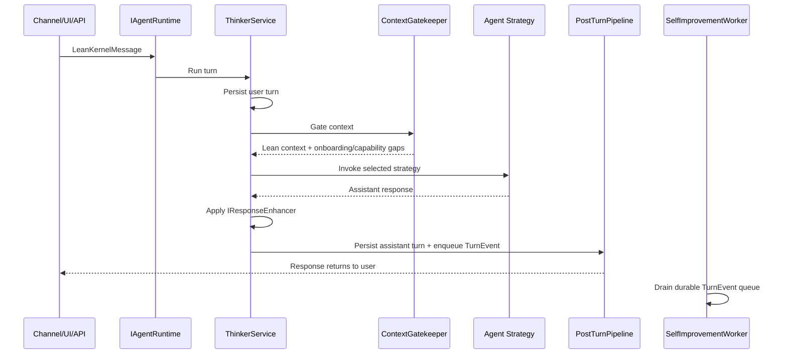
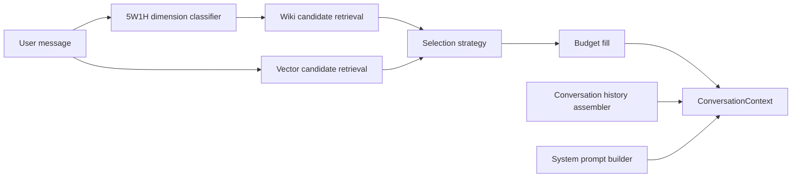

# LeanKernel Architecture

This explanation is for contributors who need to understand where new behavior belongs and how a user message becomes a self-improving agent turn.

## Design goals

LeanKernel optimizes for four outcomes:

| Goal | Architectural response |
|------|------------------------|
| Useful by default | Every turn enters through a single runtime facade, receives deny-by-default context, and can call approved tools. |
| Self-improving by default | Completed turns are emitted as durable `TurnEvent` records and processed by the learning pipeline after the response is returned. |
| Easy onboarding | Cross-project contracts live in `LeanKernel.Core`; feature projects own their domains; `LeanKernel.Host` is mostly composition, API, and UI. |
| Easy maintenance | Large orchestration classes delegate to named collaborators and strategies instead of accumulating domain logic. |

## Component ownership

| Project | Owns | Does not own |
|---------|------|--------------|
| `LeanKernel.Core` | Shared configuration, contracts, and DTOs. | Feature implementations. |
| `LeanKernel.Commander` | Channel adapters, channel routing, and durable outbound message queue. | Agent reasoning or memory policy. |
| `LeanKernel.Thinker` | Agent runtime, turn orchestration, prompt assembly, model invocation strategies, response enhancement, and post-turn learning publication. | Knowledge storage or channel delivery. |
| `LeanKernel.Archivist` | Sessions, identity/profile artifacts, engagement policy, capability gaps, wiki memory, vector retrieval, and context gating. | Model invocation. |
| `LeanKernel.Scheduler` | Cron-based jobs and time-boundary services. | HTTP endpoints or channel adapters. |
| `LeanKernel.Plugins` | Built-in tools, attachment extraction, and runtime skill loading. | Turn orchestration. |
| `LeanKernel.Host` | ASP.NET Core APIs, Blazor UI, auth/onboarding UI, hosted-service startup, and feature registration. | Domain logic that belongs to feature projects. |

## Agent loop

`IAgentRuntime` is the canonical public entry point. It currently delegates to `ThinkerService`, which keeps the turn pipeline explicit while moving specialized work into collaborators:

- `ContextGatekeeper` delegates prompt building, onboarding gap detection, candidate retrieval, history assembly, token estimation, and selection.
- `AgentStrategySelector` chooses static, routed, or shadow-routed model invocation.
- `PostTurnPipeline` persists assistant output and publishes durable learning events.

## Self-improvement pipeline

LeanKernel separates user-visible response work from background learning:

| Pipeline | Timing | Contract | Purpose |
|----------|--------|----------|---------|
| Response enhancement | Before the response is returned | `IResponseEnhancer` | Improve the current answer with synchronous knowledge synthesis. |
| Self-improvement | After the response is returned | `ISelfImprovementPipeline` + `ILearningStep` | Learn from the turn without slowing the user-facing path. |

The self-improvement pipeline is registered by `AddSelfImprovement()`. It provides null-object learning steps behind configuration flags, so disabling a step is explicit configuration rather than an accidental missing DI registration. `TurnEventQueue` stores queued events on disk before publishing them in-process, allowing the worker to restore pending learning after restart.

## Context gating

The Archivist starts from an empty context window and admits only the most relevant memory:

This keeps model input small, auditable, and easier to tune. Selection weights live in configuration so future optimization can change relevance behavior without editing orchestration code.

## Dependency rules

- Feature projects may depend on `LeanKernel.Core`.
- `LeanKernel.Thinker` may depend on `LeanKernel.Archivist` for concrete prompt and wiki integrations.
- `LeanKernel.Host` composes features but should not become the home for reusable domain behavior.
- Cross-project abstractions belong in `LeanKernel.Core.Interfaces`.
- New orchestration code should expose one public method and delegate domain work to named collaborators or strategies.
