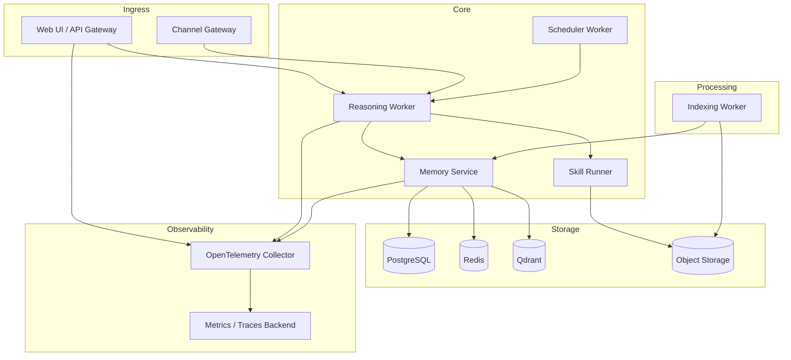
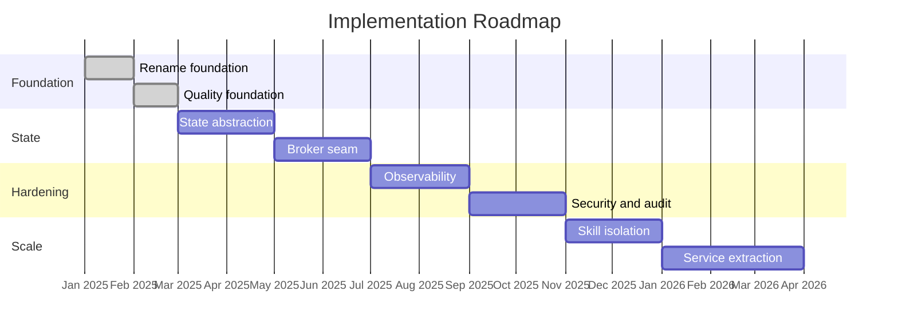

# Architectural Gaps and Target Architecture

## Current Gaps

| Gap | Current Limitation | Target Direction |
|-----|-------------------|-----------------|
| Monolithic engine | Host, channels, reasoning, memory, scheduling, UI, and queue processing run in one process. | Keep a modular monolith short-term, then extract API, reasoning, memory, indexing, and delivery workers behind stable contracts. |
| File-backed state | Sessions, wiki, onboarding, and runtime configuration rely on local files. | Move transactional state to PostgreSQL and keep markdown/wiki export as a portability layer. |
| SQLite queue | Queue durability is local and coupled to one engine instance. | Introduce a broker-backed queue with retries, delayed delivery, priority, and dead-letter handling. |
| Single-node vector store | Qdrant runs as a single local service. | Add deployment guidance for persistent/clustered Qdrant and tenant-aware collection or payload partitioning. |
| In-process skills | Skills/tools run in the engine process. | Add skill execution isolation through containers, subprocesses, or WASM with CPU, memory, and timeout limits. |
| Limited observability | Logs exist, but there is no end-to-end tracing or metrics pipeline. | Add OpenTelemetry traces, metrics, structured logs, request correlation, and per-component health probes. |
| Limited security model | Auth supports local passcode/OIDC, but API authorization and auditing are coarse. | Add RBAC/ABAC, token-level scopes, token quotas, and audit logs for state-changing operations. |
| Limited cost attribution | Routing tracks some metadata but does not expose full cost/accounting controls. | Track tokens, model/provider, requester, agent, cost bucket, and budget consumption. |
| Configuration versioning | Runtime settings are mutable JSON without history. | Store versioned configuration with audit records and rollback support. |
| Multi-tenancy | Data paths and vector collections are effectively single-tenant. | Add tenant identifiers to state, sessions, wiki, vectors, permissions, and logs. |
| Quality gate | Tests exist, but SonarQube and coverage gates were not active in the repository. | Add repeatable quality scripts, local SonarQube container support, and coverage threshold enforcement. |

---

## Target Architecture

The improved LeanKernel architecture keeps developer ergonomics while adding clear seams for reliability, scale, and security.

### Target Services

| Service | Responsibility | State |
|---------|---------------|-------|
| API Gateway / Web Host | UI, REST/OpenAI-compatible APIs, auth, onboarding, admin, and request admission. | Stateless except auth/session cookies. |
| Channel Gateway | Signal, Discord, webhook, and future channel adapters. | Broker offsets and delivery status. |
| Reasoning Worker | Prompt assembly, model routing, agent orchestration, and tool planning. | Session references, model telemetry. |
| Memory Service | Wiki facts, sessions, context gating, embedding cache, and context retrieval. | PostgreSQL, Redis, Qdrant. |
| Indexing Worker | Document parsing, chunking, embedding, tag assignment, and vector writes. | PostgreSQL index state, Qdrant. |
| Scheduler Worker | Cron jobs, proactive tasks, reminders, and maintenance jobs. | PostgreSQL schedules, broker messages. |
| Skill Runner | Isolated skill/tool execution. | Ephemeral sandbox plus artifact store. |
| Observability Stack | Metrics, traces, logs, dashboards, alerts. | OpenTelemetry collector and backend storage. |

### Target Service Topology

### Target Data Architecture

| Concern | Target |
|---------|--------|
| Transactional state | PostgreSQL schemas for tenants, users, channels, sessions, messages, wiki facts, config versions, audit events, budgets, and schedules. |
| Cache | Redis for session summaries, embedding cache, rate-limit counters, idempotency keys, and short-lived tool outputs. |
| Queue | RabbitMQ, NATS, Azure Service Bus, or another broker with priority, delayed retry, and dead-letter queues. |
| Vectors | Qdrant with persistent volumes, backups, tenant-aware payload filters, and collection migration tooling. |
| Files | Object storage or mounted volumes for attachments, documents, exports, and skill artifacts. |
| Audit | Append-only audit records for auth, config changes, tool execution, message delivery, and data mutations. |

### Target Quality Gates

Every implementation phase should keep these gates green:

1. `dotnet restore src/LeanKernel.sln`
2. `dotnet build src/LeanKernel.sln -c Release --no-restore`
3. `dotnet test src/LeanKernel.sln -c Release --no-build`
4. Coverage collection with an 80 percent line-rate threshold.
5. Docker-backed SonarQube scan with no blocker, critical, or major issues in new code.
6. Docker image build and optional image vulnerability scan when the required scanner is available.

---

## Incremental Implementation Phases

| Phase | Scope | Exit Criteria |
|-------|-------|--------------|
| 0. Rename foundation | Migrate source into the LeanKernel repository, rename projects/namespaces/config/deployment assets, preserve license, and remove generated artifacts. | Build and tests pass under LeanKernel names. |
| 1. Quality foundation | Add coverage gate and Docker-backed SonarQube scan scripts. | Quality commands are documented and repeatable. |
| 2. State abstraction | Introduce interfaces and adapters that separate sessions/wiki/config/queue from local files and SQLite. | Existing local providers still pass tests; interfaces can host PostgreSQL providers later. |
| 3. Broker seam | Add message queue abstraction for broker-backed delivery while retaining SQLite/local mode. | Queue behavior is covered by tests and delivery semantics remain compatible. |
| 4. Observability | Add OpenTelemetry instrumentation, correlation IDs, and metrics around inbound requests, LLM calls, tools, queue delivery, and indexing. | Traces/metrics are visible in local collector setup and covered by focused tests. |
| 5. Security and audit | Add scoped API tokens, audit events, and configuration history. | State-changing operations produce audit records and token scopes are enforced by tests. |
| 6. Skill isolation | Add a sandboxed skill runner with resource limits and explicit manifests. | In-process tools continue working; sandboxed tools have timeout/error tests. |
| 7. Service extraction | Split reasoning, memory, indexing, scheduler, and channel workers behind queue/API contracts. | Docker Compose can run extracted services; contract tests validate cross-service flows. |

