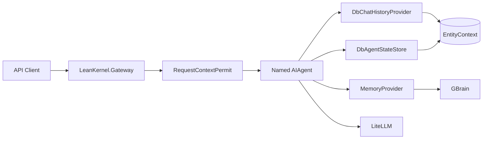

# Architecture

System design and ownership boundaries for the current runtime.

## Canonical Pages

| Document | Description |
|----------|-------------|
| [system-overview.md](system-overview.md) | Runtime topology and major boundaries. |
| [solution-structure.md](solution-structure.md) | Project ownership and dependency rules. |
| [runtime-flows.md](runtime-flows.md) | Request, session, and memory flow summary. |
| [data-and-persistence.md](data-and-persistence.md) | Entities, session state, and storage model. |

## Quick Reference

## Related Pages

- [Docs home](../index.md)
- [Features](../features/index.md)
- [Gateway API](../api/gateway-api.md)
