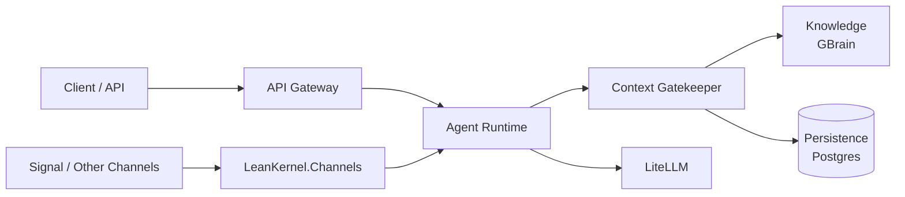

# Architecture

System design and ownership boundaries for the current runtime.

## Canonical Pages

| Document | Description |
|----------|-------------|
| [system-overview.md](system-overview.md) | Runtime topology and major execution boundaries. |
| [solution-structure.md](solution-structure.md) | Project ownership and dependency rules. |
| [runtime-flows.md](runtime-flows.md) | Inbound request and turn-processing flow summary. |
| [data-and-persistence.md](data-and-persistence.md) | Session, diagnostics, and persistence model overview. |
| [infrastructure-and-deploy.md](infrastructure-and-deploy.md) | Local infrastructure and deployment surfaces. |

## Quick Reference

Use the canonical pages above for current architecture behavior and ownership.
