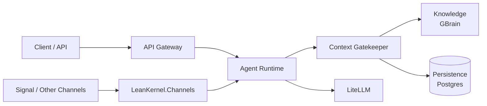

# Architecture

System design and ownership boundaries for the current runtime.

## Canonical Pages

| Document | Description |
|----------|-------------|
| [system-overview.md](system-overview.md) | Runtime topology and major execution boundaries. |
| [solution-structure.md](solution-structure.md) | Project ownership and dependency rules. |
| [runtime-flows.md](runtime-flows.md) | Inbound request and turn-processing flow summary. |
| [data-and-persistence.md](data-and-persistence.md) | Session, diagnostics, and persistence model overview. |
| [infrastructure-and-deploy.md](infrastructure-and-deploy.md) | Local infrastructure and deployment surfaces. |

## Legacy Pages

Legacy pages are still available while consolidation continues:

- [overview.md](overview.md)
- [architecture.md](architecture.md)
- [key-flows.md](key-flows.md)
- [infrastructure.md](infrastructure.md)
- [data-model.md](data-model.md)
- [gaps-and-roadmap.md](gaps-and-roadmap.md)

## Quick Reference

Start with [overview.md](overview.md), then use the reference documents for structure, infrastructure, and data-model details. Phase 2 inbound adapters now live in `LeanKernel.Channels` and reuse the same runtime path as the HTTP gateway.
