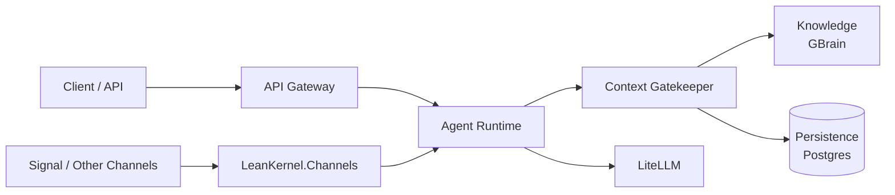

# Architecture

This section covers the structural design of LeanKernel, including both the current system and the **Phase 0 rearchitecture documentation set**.

## Contents

| Document | Description |
|----------|-------------|
| [overview.md](overview.md) | High-level explanation of the target MAF-native architecture, its core principles, and the platform technology stack. |
| [solution-structure.md](solution-structure.md) | Reference for target project responsibilities and dependency rules. |
| [infrastructure.md](infrastructure.md) | Reference for Docker Compose services, deployment topology, health checks, and configuration precedence. |
| [data-model.md](data-model.md) | Reference for the target Postgres schema and GBrain page conventions. |
| [architecture.md](architecture.md) | Contributor-oriented explanation of the current architecture, agent loop, and self-improvement pipeline. |
| [key-flows.md](key-flows.md) | Sequence diagrams and step-by-step descriptions of the inbound chat, knowledge indexing, and outbound message flows. |
| [gaps-and-roadmap.md](gaps-and-roadmap.md) | Current architectural gaps, target topology, and incremental implementation phases. |
| [diagrams/index.html](diagrams/index.html) | Multi-level architecture image set (system context, component flow, request/response sequence). |

## Quick Reference

Start with [overview.md](overview.md), then use the reference documents for structure, infrastructure, and data-model details. Phase 2 inbound adapters now live in `LeanKernel.Channels` and reuse the same runtime path as the HTTP gateway.
