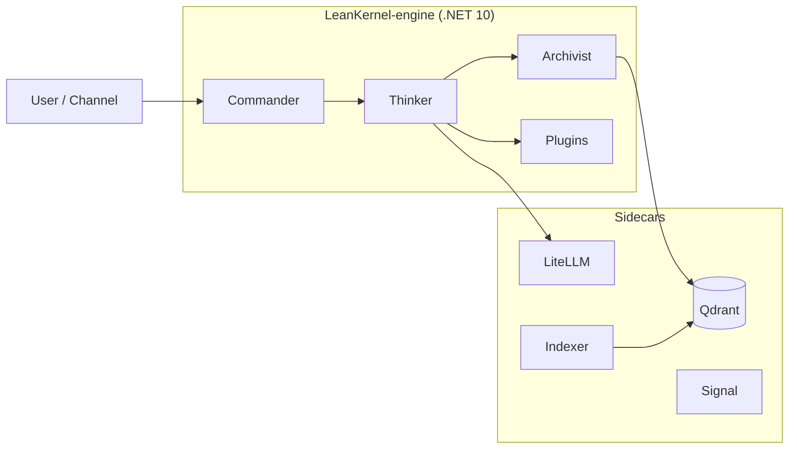

# Architecture

This section covers the structural design of LeanKernel — its solution components, runtime topology, data flows, data stores, and the roadmap toward the target architecture.

## Contents

| Document | Description |
|----------|-------------|
| [../ARCHITECTURE.md](../ARCHITECTURE.md) | Contributor-oriented architecture explanation, ownership rules, agent loop, and self-improvement pipeline. |
| [overview.md](overview.md) | High-level component map, runtime topology diagram, and data store summary. |
| [key-flows.md](key-flows.md) | Sequence diagrams and step-by-step descriptions of the inbound chat, knowledge indexing, and outbound message flows. |
| [gaps-and-roadmap.md](gaps-and-roadmap.md) | Current architectural gaps, the target architecture with service topology, and the incremental implementation phase plan. |

## Quick Reference

See [overview.md](overview.md) for the full topology and component descriptions.
