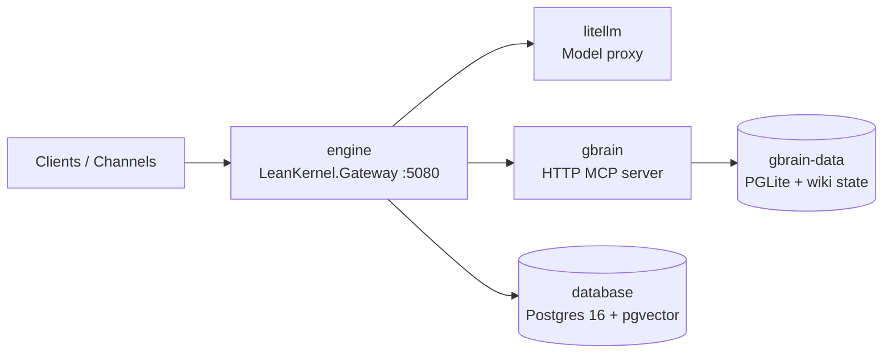

# Infrastructure

This reference describes the current deployment topology for LeanKernel's Docker Compose stack.

## Docker Compose services

| Service | Runtime | Responsibility | Ports | Persistence |
|---------|---------|----------------|-------|-------------|
| `engine` | .NET 10 (`LeanKernel.Gateway`) | Public API gateway, auth, channel adapters, request routing, and composition of the agent pipeline | `5080` | Stateless container; uses Postgres for application state |
| `database` | PostgreSQL 16 + `pgvector` | Primary transactional store for sessions, diagnostics, schedules, and vector-backed retrieval support | `5432` (internal by default) | Persistent Docker volume |
| `litellm` | LiteLLM | OpenAI-compatible model proxy, provider routing, fallback policy, and model indirection | `4000` | Config from `config/litellm/` |
| `gbrain` | Bun / `garrytan/gbrain` | Wiki-backed knowledge service and MCP HTTP endpoint for retrieval and page operations | `8789` | Persistent `gbrain-data` volume backing the embedded PGLite brain |

## Network topology

- `engine` is the only service that needs to be exposed outside the Compose network.
- `litellm`, `gbrain`, and `database` stay on the internal application network.
- `gbrain` no longer depends on the shared Postgres service; it persists its own embedded PGLite state in the `gbrain-data` Docker volume.

## Health checks

| Service | Probe | Purpose |
|---------|-------|---------|
| `engine` | `GET /api/health` | Confirms the gateway and composed runtime are serving requests |
| `database` | `pg_isready` | Confirms Postgres is accepting connections |
| `litellm` | `GET /health` | Confirms the model proxy is alive before routing requests |
| `gbrain` | `GET /health` | Confirms the knowledge service is ready to serve retrieval and page operations |

## Environment variable schema

Use .NET double-underscore binding for application settings and standard service-specific variables for infrastructure containers.

| Area | Example variables | Notes |
|------|-------------------|-------|
| Gateway | `ASPNETCORE_URLS`, `LEANKERNEL__GATEWAY__*` | Host binding, API behavior, and endpoint security |
| Database | `POSTGRES_DB`, `POSTGRES_USER`, `POSTGRES_PASSWORD`, `LEANKERNEL__DATABASE__CONNECTIONSTRING` | Service bootstrap values plus the application connection string |
| LiteLLM | `LITELLM_MASTER_KEY`, `DATABASE_URL`, provider API keys | Model proxy secrets and routing configuration |
| GBrain | `LEANKERNEL__GBRAIN__BASEURL`, `GBRAIN_PORT`, `OPENAI_API_KEY`, `ZEROENTROPY_API_KEY`, `ANTHROPIC_API_KEY` | MCP endpoint, Bun-hosted GBrain runtime, and embedding/query-expansion provider keys |
| Observability | `OTEL_SERVICE_NAME`, `OTEL_EXPORTER_OTLP_ENDPOINT`, `OTEL_RESOURCE_ATTRIBUTES` | OpenTelemetry exporters and resource tagging |

## Configuration hierarchy

For the rearchitecture target, configuration is resolved in this order, with later sources overriding earlier ones:

1. `appsettings.json`
2. Environment variables
3. Runtime overlay

Use the runtime overlay for machine-local or operator-managed overrides that should win without rebuilding containers.

## Data persistence strategy

- **Postgres volume:** LeanKernel application state, diagnostics, schedules, and vector-enabled relational records live in the persistent Postgres volume.
- **GBrain volume:** the `gbrain-data` Docker volume holds the Bun-hosted GBrain working directory, including its embedded PGLite database and wiki state.
- **Container replacement:** `engine`, `litellm`, and `gbrain` can be replaced without data loss as long as their persistent volumes and configuration are preserved.
- **Recovery model:** restore Postgres for LeanKernel state, restore `gbrain-data` for knowledge state, then restart the Compose stack so both services reconcile against their own stores.
