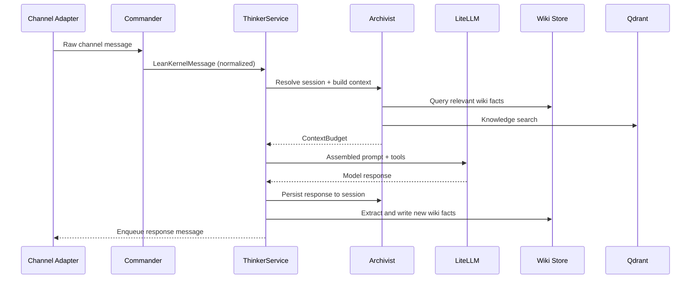
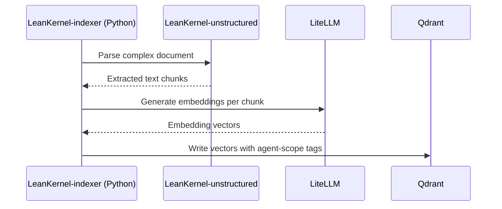
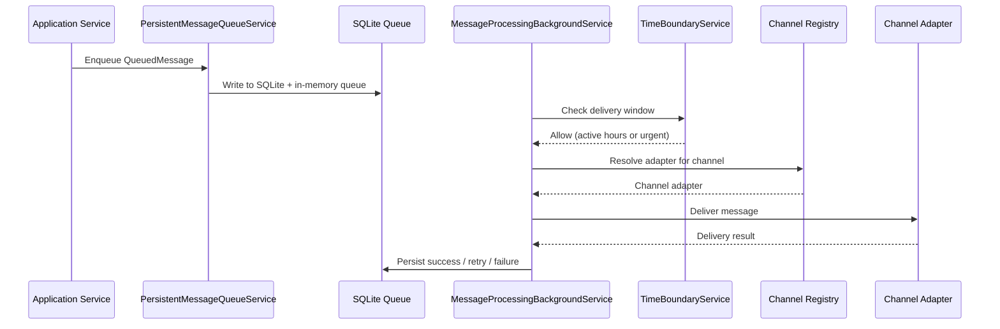

# Key Flows

This document describes the primary data flows within LeanKernel.

## Inbound Chat Flow

A message received from any channel is normalized, reasoned over, and a response is delivered back to the originating channel.

### Steps

1. A channel adapter receives a message.
2. Commander normalizes the payload into `LeanKernelMessage`.
3. `ThinkerService` resolves the session and appends the user turn.
4. Archivist builds a deny-by-default context budget from relevant wiki facts, conversation history, and knowledge search results.
5. Thinker assembles the system prompt, tools, and messages.
6. The model call is sent through LiteLLM directly or through the routing pipeline.
7. The assistant response is persisted to the session.
8. Wiki extraction runs on the exchange and writes learned facts back to the wiki store.

---

## Knowledge Indexing Flow

Documents and wiki entries are parsed, chunked, embedded, and stored as vectors for semantic retrieval.

### Steps

1. The Python indexer watches wiki and agent document paths.
2. Unstructured parses complex documents.
3. LiteLLM generates embeddings.
4. Qdrant stores tagged vectors in the unified collection.
5. Archivist and knowledge tools query Qdrant with agent-scope tag filters.

---

## Outbound Message Flow

Messages generated by the engine are queued, time-gated, and delivered through the appropriate channel adapter.

### Steps

1. Application services enqueue a `QueuedMessage`.
2. `PersistentMessageQueueService` writes the message to SQLite and the in-memory queue.
3. `MessageProcessingBackgroundService` polls ready messages.
4. The time-boundary service allows all ready messages during active hours and urgent messages outside active hours.
5. The channel registry resolves the adapter and delivers the message.
6. Delivery success, retry, or failure is persisted.
