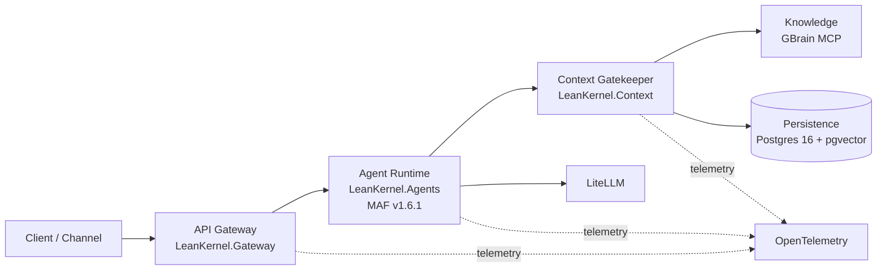

# Architecture Overview

This explanation describes the **target architecture** for the LeanKernel rearchitecture project. LeanKernel is being reshaped into a **MAF-native personal AI agent platform with deny-by-default context gating**.

## System purpose

The platform is designed to deliver a personal AI agent runtime where:

- the core turn loop is built natively on **Microsoft Agent Framework (MAF)**,
- context is admitted intentionally instead of accumulated by default,
- knowledge and persistence stay explicit platform dependencies, and
- transport concerns remain separate from agent reasoning.

## System map

## Core principles

### Native-first (MAF)

The agent runtime should use MAF as the default execution model rather than wrapping it in a parallel custom orchestration stack.

### Deterministic where it matters

Routing, persistence, context admission, policy enforcement, and diagnostics should remain explainable and testable even when model behavior is probabilistic.

### Context as a product feature

Context quality is a first-class feature. The platform starts from zero context and admits only what is allowed, relevant, and within budget.

### Custom only by exception

LeanKernel should prefer proven framework capabilities and managed platform components. Custom code should exist only when it creates clear product leverage or enforces a platform rule that off-the-shelf components cannot.

## Technology stack

| Technology | Role |
|------------|------|
| **.NET 10** | Primary application runtime |
| **MAF v1.6.1** | Native agent runtime and turn execution model |
| **GBrain (MCP)** | Knowledge service and wiki-oriented retrieval boundary |
| **Postgres 16 + pgvector** | Transactional persistence and vector-enabled storage |
| **LiteLLM** | Model proxy and provider abstraction |
| **OpenTelemetry** | Distributed tracing, metrics, and audit-friendly observability |
| **EF Core** | Data access and migrations for relational state |

## Document map

- Use [solution-structure.md](solution-structure.md) for project ownership and dependency rules.
- Use [infrastructure.md](infrastructure.md) for runtime services, deployment topology, and configuration precedence.
- Use [data-model.md](data-model.md) for Postgres schema and GBrain page conventions.
