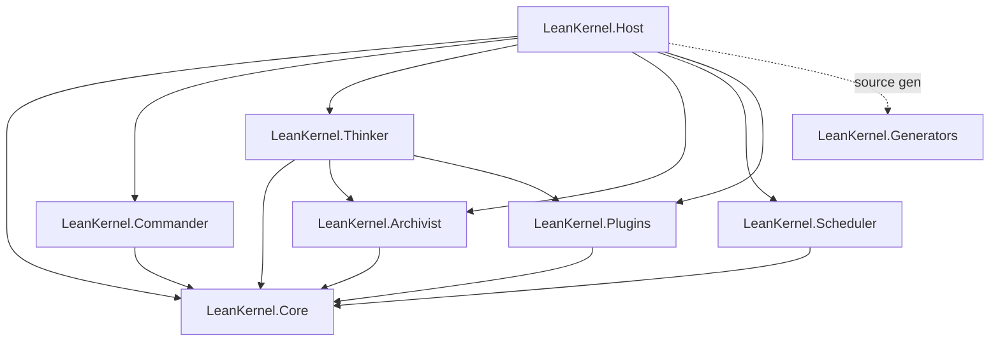
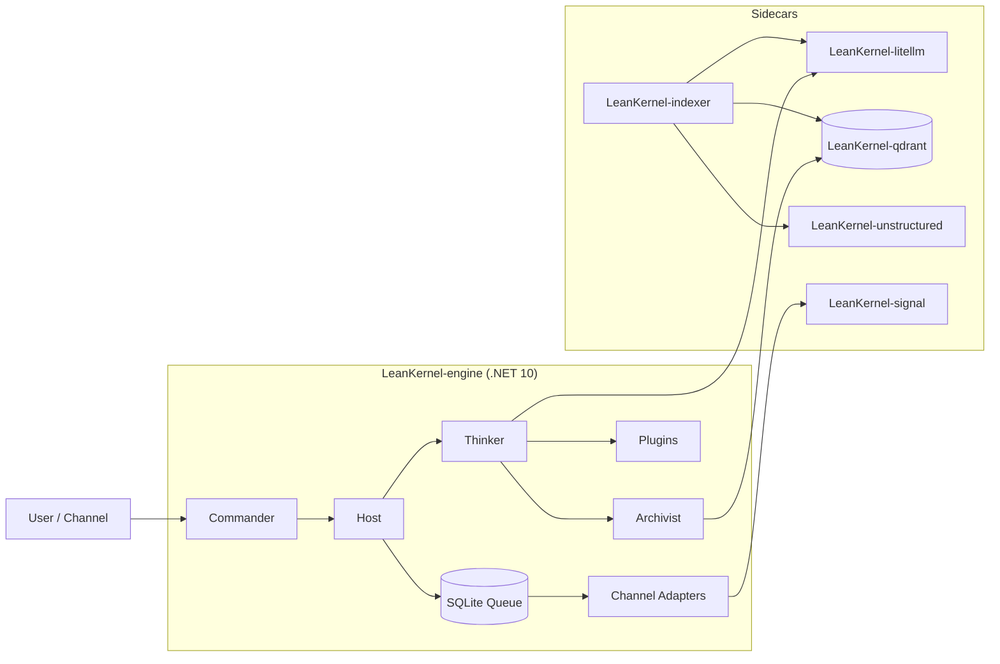

# Architecture Overview

LeanKernel is a personal AI agent platform built around a .NET 10 host, a channel layer, a reasoning layer, a memory layer, runtime skills, scheduled work, and containerized sidecars for model routing, vector search, document parsing, and messaging.

## Solution Components

| Project | Responsibility |
|---------|----------------|
| `LeanKernel.Core` | Shared configuration, interfaces, enums, and message/context/wiki models. |
| `LeanKernel.Commander` | Inbound channel routing, message normalization, and Signal adapters. |
| `LeanKernel.Thinker` | Prompt assembly, Microsoft Agent Framework integration, tool adaptation, model routing, and worker-agent orchestration. |
| `LeanKernel.Archivist` | Conversation sessions, 5W1H wiki memory, context gating, embedding cache, and Qdrant-backed knowledge search. |
| `LeanKernel.Scheduler` | Cron scheduler and proactive jobs such as wiki maintenance and model limit synchronization. |
| `LeanKernel.Plugins` | Built-in tools and runtime skill loading. |
| `LeanKernel.Generators` | Source generation for tool registry support. |
| `LeanKernel.Host` | ASP.NET Core API, Blazor UI, authentication, onboarding, message queue, channel delivery, health checks, and background services. |
| `LeanKernel.Tests.Unit` | Unit tests for core behavior, host services/controllers, plugins, scheduler, thinker, commander, and archivist. |
| `LeanKernel.Tests.Integration` | Integration tests for skill loading and basic cross-project behavior. |

## Component Dependency Diagram

## Runtime Topology

The default deployment is Docker Compose:

| Service | Role |
|---------|------|
| `LeanKernel-engine` | The ASP.NET Core host containing the web UI, APIs, Commander, Thinker, Archivist, Scheduler, and Plugins. |
| `LeanKernel-litellm` | LiteLLM proxy for model aliases, provider keys, and model routing indirection. |
| `LeanKernel-qdrant` | Vector store for wiki and document embeddings. |
| `LeanKernel-unstructured` | Document parser used by attachment and indexing flows. |
| `LeanKernel-indexer` | Python sidecar that scans wiki/documents, chunks content, generates embeddings through LiteLLM, and writes vectors to Qdrant. |
| `LeanKernel-signal` | HTTP sidecar around `signal-cli`, allowing Signal integration without locking the engine process to the Signal config directory. |

## Data Stores

| Store | Implementation | Notes |
|-------|----------------|-------|
| Runtime configuration | JSON overlay under the data directory | Loaded after appsettings and before environment overrides. |
| Onboarding state | JSON under the data directory | Gates channel and scheduler startup. |
| Sessions | JSON files under `data/sessions` | Created per channel/sender. |
| Wiki memory | Markdown files with frontmatter under `data/wiki` | Structured by 5W1H dimensions. |
| Message queue | SQLite `messagequeue.db` | Wraps an in-memory queue for recovery across restarts. |
| Vector index | Qdrant collection, default `LEANKERNEL_knowledge` | Populated by the indexer and queried by Archivist/tools. |
| Logs | Rolling Serilog files under `data/logs` | Also emitted to console. |
