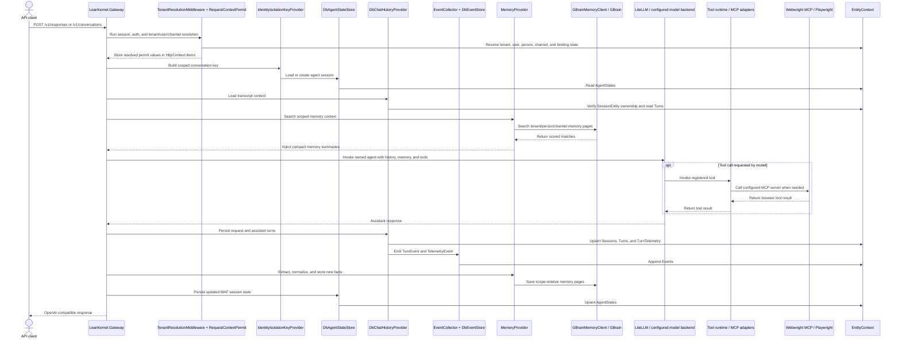

# Runtime Flows

This page summarizes the main request and persistence flows in the current runtime.

## Inbound Request Flow

1. `LeanKernel.Gateway` starts the ASP.NET pipeline.
2. Forwarded headers are applied.
3. Session middleware runs for anonymous isolation support.
4. Authentication middleware runs.
5. `TenantResolutionMiddleware` resolves tenant, user, person, and channel identity.
6. Authorization middleware runs.
7. OpenAI-compatible endpoints are mapped through MAF hosting.

Reference: [`../../src/Services/LeanKernel.Gateway/Program.cs`](../../src/Services/LeanKernel.Gateway/Program.cs)

## Identity Resolution Flow

1. `RequestContextPermit` reads host, principal, and ASP.NET session.
2. `IIdentityResolver` resolves or creates:
   - tenant from host
   - user from claims or guest fallback
   - person from the resolved user record
   - OpenAI HTTP channel
3. The resolved `IPermit` supplies tenant/user/channel IDs to downstream runtime components.

References:

- [`../../src/Services/LeanKernel.Gateway/Providers/RequestContextPermit.cs`](../../src/Services/LeanKernel.Gateway/Providers/RequestContextPermit.cs)
- [`../../src/Common/LeanKernel.Logic/Providers/IdentityResolver.cs`](../../src/Common/LeanKernel.Logic/Providers/IdentityResolver.cs)

## End-To-End Runtime Data Flow

This diagram combines the request, transcript, session-state, memory, and tool execution paths that are otherwise described separately below. Policy-core services are registered in DI but not broadly invoked on all request paths yet.

## Chat History Flow

1. The active MAF session is inspected for `chatSessionId`.
2. `DbChatHistoryProvider` verifies the transcript session belongs to the current permit partition.
3. Existing turns are replayed into chat history.
4. New request and assistant messages are persisted back as `TurnEntity` rows.
5. Turn and telemetry events are appended to `Events` through `IEventStore`.

Reference: [`../../src/Common/LeanKernel.Logic/Providers/DbChatHistoryProvider.cs`](../../src/Common/LeanKernel.Logic/Providers/DbChatHistoryProvider.cs)

## Document Ingestion Flow

1. Client uploads a file through `POST /api/documents/upload` or includes multipart attachments in an inbound request.
2. Gateway stages files under `Files:RootPath/documents/.../_staging`.
3. Upload endpoint enqueues directly, while multipart middleware emits `DocumentIngestionRequestedEvent`.
4. Event subscribers persist events and enqueue ingestion jobs.
5. `DocumentIngestionHostedService` claims queued jobs, ingests content, and updates job status.
6. `WatchFolderHostedService` monitors configured watch folders and enqueues new files through the same queue path.

References:

- [`../../src/Services/LeanKernel.Gateway/Requests/DocumentUploadEndpoint.cs`](../../src/Services/LeanKernel.Gateway/Requests/DocumentUploadEndpoint.cs)
- [`../../src/Services/LeanKernel.Gateway/Providers/AttachmentIngestionMiddleware.cs`](../../src/Services/LeanKernel.Gateway/Providers/AttachmentIngestionMiddleware.cs)
- [`../../src/Common/LeanKernel.Logic/Tools/DocumentIngestion/`](../../src/Common/LeanKernel.Logic/Tools/DocumentIngestion/)

## Memory Flow

1. `MemoryProvider` turns current request messages into a search query.
2. `IMemoryClient` retrieves scoped memory candidates.
3. Retrieved pages are compacted into prompt context.
4. After invocation, fact extraction and normalization run.
5. Scope-relative normalized memory pages are persisted back through `IMemoryClient`.

Memory scoping uses the memory pipeline's `MemoryScope` and transport-specific implementation. It does not reuse the agent-session isolation key provider.

Reference: [`../../src/Common/LeanKernel.Logic/Providers/MemoryProvider.cs`](../../src/Common/LeanKernel.Logic/Providers/MemoryProvider.cs)

## Agent State Flow

1. The MAF conversation id is scoped through `IdentityIsolationKeyProvider`.
2. `DbAgentStateStore` loads or creates the runtime session.
3. Serialized session state is stored in `AgentStateEntity` for future resumption.

This flow is intentionally separate from durable memory scope so transcript/session continuity can evolve independently from long-term memory behavior.

References:

- [`../../src/Services/LeanKernel.Gateway/Providers/IdentityIsolationKeyProvider.cs`](../../src/Services/LeanKernel.Gateway/Providers/IdentityIsolationKeyProvider.cs)
- [`../../src/Services/LeanKernel.Gateway/Sessions/DbAgentStateStore.cs`](../../src/Services/LeanKernel.Gateway/Sessions/DbAgentStateStore.cs)

## Tool Invocation Flow

1. Gateway startup discovers configured MCP servers from `Agents:Tools:McpServers`.
2. Webwright tools are adapted into LeanKernel `ToolDefinition` entries and registered in `IToolRegistry`.
3. `AddLeanKernelAgent(...)` attaches the registered tools to `ChatOptions.Tools` for the `leankernel` agent.
4. `.UseFunctionInvocation()` routes the model's tool calls through LeanKernel tool handlers.
5. Each Webwright tool handler creates a fresh MCP client for the configured server, invokes the tool, and returns the formatted result.

Reference: [`../../src/Common/LeanKernel.Logic/Mcp/`](../../src/Common/LeanKernel.Logic/Mcp/)
