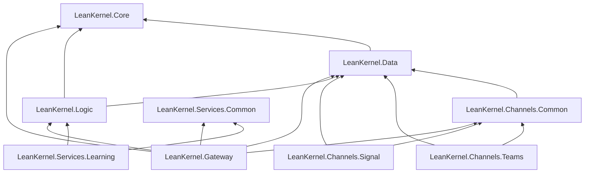

# Solution Structure

This page documents the projects that actually exist in the current rebuild.

## Current Solution

The app-only solution file is [`../../src/LeanKernel.sln`](../../src/LeanKernel.sln).

The full repo solution, which also includes the test projects, is [`../../LeanKernel.sln`](../../LeanKernel.sln).

Projects in the app-only solution:

| Project | Role |
|---|---|
| `src/Common/LeanKernel.Core` | Shared entities and cross-project interfaces/contracts |
| `src/Common/LeanKernel.Channels.Common` | Shared terminal/gateway helpers (health response writer, gateway health probe, connection-string resolver, channel binding token resolver) |
| `src/Common/LeanKernel.Data` | EF Core context, migrations, interceptors, design-time factory |
| `src/Common/LeanKernel.Logic` | Chat history provider, memory pipeline, identity resolution, MAF-facing logic services |
| `src/Services/LeanKernel.Services.Common` | Shared learning-service contracts, queue primitives, publisher client, and scheduler helpers |
| `src/Services/LeanKernel.Gateway` | Web host, endpoint mapping, auth/session middleware, GBrain wiring, agent session store |
| `src/Services/LeanKernel.Services.Learning` | Phase 07 learning host (turn-event ingest API, background learning pipeline, scheduler) |
| `src/Terminals/LeanKernel.Channels.Signal` | Signal channel terminal process (JSON-RPC socket transport to signal-cli sidecar) |
| `src/Terminals/LeanKernel.Channels.Teams` | Teams Bot Framework terminal process (webhook ingress + connector egress) |

Test projects:

- `test/LeanKernel.Tests.Unit`
- `test/LeanKernel.Tests.Integration`
- `test/LeanKernel.Tests.Playwright`

## Dependency Direction

The current direct project references are:

These arrows reflect the current `.csproj` references in `src/` rather than a conceptual layering sketch.

- `Gateway` depends on `Logic`, `Data`, `Core`, and `Channels.Common`
- `Gateway` also depends on `Services.Common` for cross-service learning contracts/publisher
- `Learning` depends on `Logic` and `Services.Common`
- `Logic` depends on `Data` and `Core`
- `Data` depends on `Core`
- `Channels.Common` depends on `Data`
- Channel terminals are edge processes; they depend on `Data` and `Channels.Common` directly and do not depend on `Gateway` or `Logic`
- Channel terminals only reach `Core` transitively through `Data`; they do not reference `Core` directly in the current solution
- `Core` is the bottom layer
