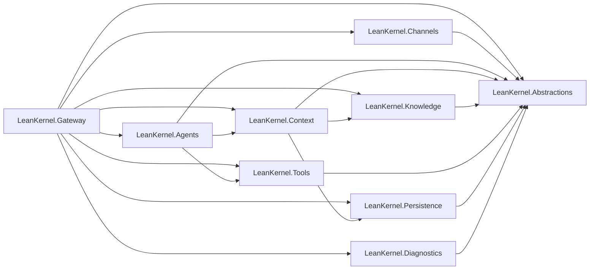

# Solution Structure

This reference describes the **target solution structure** for the LeanKernel rearchitecture project. It defines project boundaries so contributors can place new work in the correct project and avoid accidental coupling.

## Project responsibilities

| Project | Owns | Does Not Own |
|---------|------|--------------|
| `LeanKernel.Abstractions` | Shared configuration, contracts, DTOs, enums | Feature implementations |
| `LeanKernel.Agents` | MAF agent runtime, turn pipeline, strategies, middleware | Knowledge storage, channel delivery |
| `LeanKernel.Channels` | Channel adapters, channel auth, channel routing, hosted channel lifecycle | Agent reasoning, persistence rules |
| `LeanKernel.Context` | Context gating, budget enforcement, prompt assembly, token estimation | Model invocation, persistence |
| `LeanKernel.Knowledge` | GBrain MCP client, knowledge retrieval, wiki operations | Context admission decisions |
| `LeanKernel.Gateway` | API endpoints, auth, and runtime composition | Domain logic, agent reasoning |
| `LeanKernel.Tools` | Tool registry, governance policy, built-in tools, skill loading | Turn orchestration |
| `LeanKernel.Persistence` | EF Core DbContext, session store, migrations, Postgres access | Business rules, API endpoints |
| `LeanKernel.Diagnostics` | OpenTelemetry, audit logging, diagnostic sinks | Feature logic |

## Dependency rules

- All projects may depend on `LeanKernel.Abstractions`.
- `LeanKernel.Agents` depends on `LeanKernel.Context` and `LeanKernel.Tools`.
- `LeanKernel.Channels` depends only on `LeanKernel.Abstractions` plus hosting/http infrastructure packages.
- `LeanKernel.Context` depends on `LeanKernel.Knowledge` and `LeanKernel.Persistence`.
- `LeanKernel.Gateway` acts as the composition boundary for the full runtime pipeline and may directly reference the runtime registration projects it wires (`Agents`, `Channels`, `Context`, `Knowledge`, `Tools`, `Persistence`, and `Diagnostics`).
- `LeanKernel.Diagnostics` is a supporting library and should stay free of feature-specific domain behavior.
- No circular dependencies are allowed.

## Dependency map

## Placement guidance

- Put reusable contracts, options objects, and DTOs in `LeanKernel.Abstractions`.
- Put MAF turn execution, middleware, and agent strategies in `LeanKernel.Agents`.
- Put channel adapters, inbound channel auth, and hosted channel lifecycle in `LeanKernel.Channels`.
- Put deny-by-default context admission and prompt-budget logic in `LeanKernel.Context`.
- Put knowledge retrieval and GBrain-facing operations in `LeanKernel.Knowledge`.
- Keep `LeanKernel.Gateway` thin: HTTP transport, authentication, and composition only.
- Keep database access in `LeanKernel.Persistence`, even when a feature also needs domain logic elsewhere.
