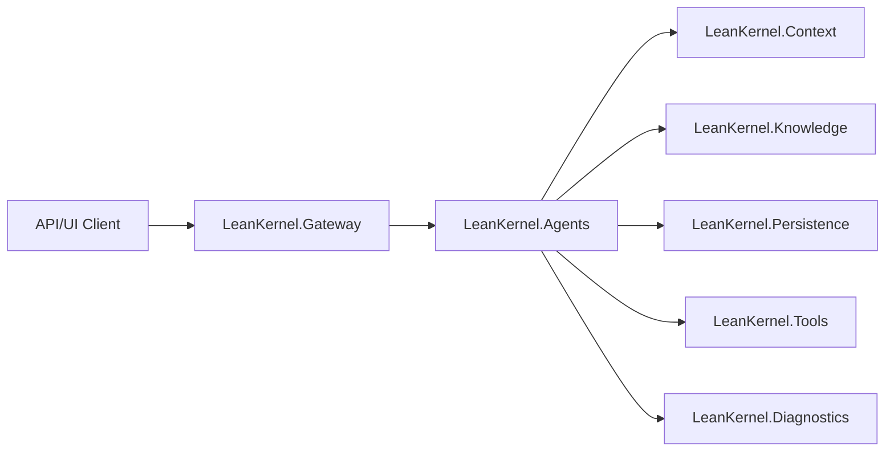

# System Overview

LeanKernel runs as a `.NET 10` modular monolith with Gateway as the HTTP + UI host.

## Runtime Topology

## Related Pages

- [Architecture index](index.md)
- [Solution structure](solution-structure.md)
- [Runtime flows](runtime-flows.md)
