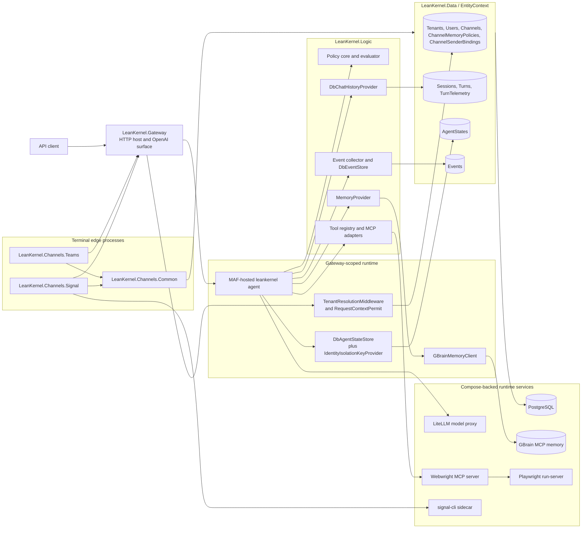
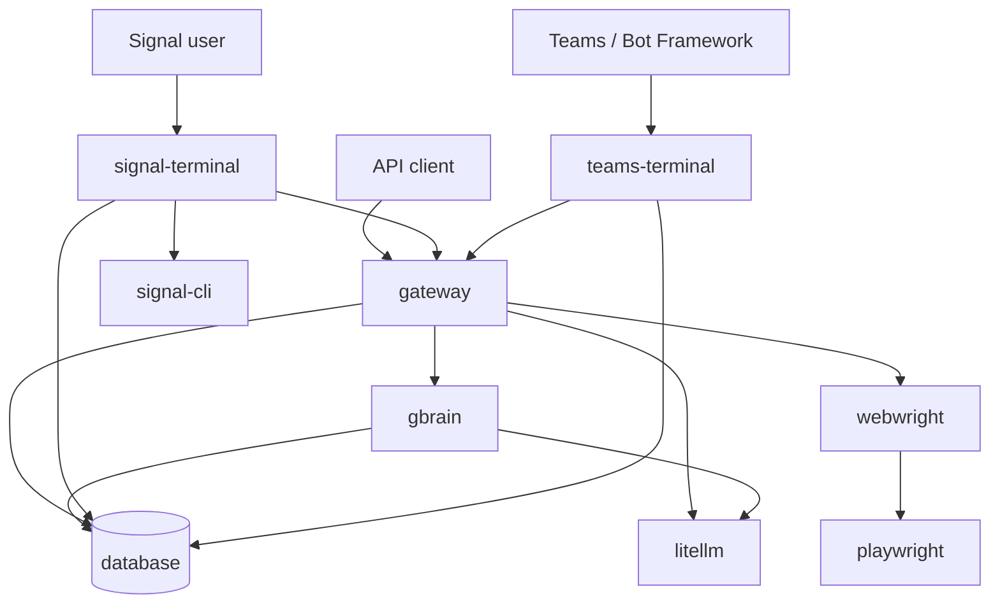

# System Overview

The current LeanKernel rebuild is a .NET 10 gateway-centered microservice architecture built around Microsoft Agent Framework (MAF) extension points.

## Core Topology

- `LeanKernel.Gateway` hosts the HTTP runtime.
- `LeanKernel.Logic` supplies reusable runtime services and MAF providers.
- `LeanKernel.Data` owns EF Core persistence.
- `LeanKernel.Core` holds shared entities and contracts.

The composition root is [`../../src/Services/LeanKernel.Gateway/Program.cs`](../../src/Services/LeanKernel.Gateway/Program.cs).

## Runtime Topology

This diagram reflects the current runtime host, provider, persistence, and external integration boundaries. The service relationships are cross-checked against `docker-compose.yml`, which currently wires Gateway to PostgreSQL, LiteLLM, GBrain, and optional Webwright MCP services, with Webwright using the shared Playwright run-server and the Signal terminal using a dedicated `signal-cli` sidecar. The Signal and Teams projects remain separate edge processes rather than alternate hosts for `LeanKernel.Gateway`.

## Compose Deployment Topology

This deployment view is derived directly from `docker-compose.yml` and shows the active service-to-service wiring used by local and containerized development. It complements the runtime topology above by focusing on deployed containers instead of in-process boundaries.

## Main Runtime Components

| Component | Responsibility | Code anchor |
|---|---|---|
| Gateway host | DI, auth, session middleware, endpoint mapping, startup migrations | `src/Services/LeanKernel.Gateway/Program.cs` |
| Request permit | Resolve tenant, user, channel, and guest fallback for the current request | `src/Services/LeanKernel.Gateway/Providers/RequestContextPermit.cs` |
| Agent session store | Persist MAF session state blobs | `src/Services/LeanKernel.Gateway/Sessions/DbAgentStateStore.cs` |
| Policy core | Evaluate identity-aware domain policies that compose with permit/filter enforcement | `src/Common/LeanKernel.Logic/Policy/` |
| Chat history provider | Persist and retrieve transcript turns through EF Core | `src/Common/LeanKernel.Logic/Providers/DbChatHistoryProvider.cs` |
| Event spine | Collect and durably append runtime events to `Events` | `src/Common/LeanKernel.Logic/Events/` |
| Memory provider | Retrieve memory context and persist normalized facts | `src/Common/LeanKernel.Logic/Providers/MemoryProvider.cs` |
| Memory backend | GBrain-backed `IMemoryClient` implementation | `src/Services/LeanKernel.Gateway/Memory/GBrainMemoryClient.cs` |
| MCP browser tools | Webwright MCP discovery, tool adapter registration, and per-call invocation | `src/Common/LeanKernel.Logic/Mcp/` |

## Major Design Choices

- MAF-native runtime instead of a custom agent framework
- canonical identity context that preserves tenant, person, user, channel, and anonymous session boundaries
- persisted identity partitioning by tenant, user, and channel for transcript/session ownership
- separate transcript session persistence and agent state persistence
- append-only event spine persistence that coexists with transcript rows
- deterministic-first memory shaping with bounded model-assisted refinement
- browser automation is provided by pre-configured Webwright MCP tools, not a custom Playwright sidecar
- MCP tool adapters use LeanKernel-owned registration and invocation boundaries instead of reusing stale discovery clients

Those decisions are also captured in the repo ADRs under [`../decisions/index.md`](../decisions/index.md).
