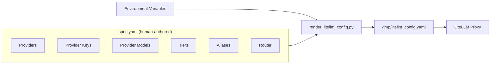
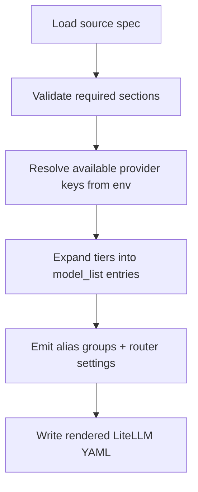

# LiteLLM Single-File Spec

This document describes the plan to replace the current hand-expanded LiteLLM template with a single human-authored source spec compiled at container startup into the final LiteLLM YAML.

## Overview

The recommended source format is a single declarative YAML spec. The new spec lets contributors edit five concepts directly:

- **providers** — provider families such as `groq`, `gemini`, `azure`, `local`
- **provider_keys** — named key instances per provider including required env vars
- **provider_models** — model catalog per provider family
- **tiers** — tier definitions containing model-info profiles and tier routes
- **aliases** — external model names mapped to tiers



## Implementation Phases

### Phase 1: Source Spec Format

Replace `config/litellm/config.yaml` with a single source-spec format. The source spec exposes these top-level sections:

```yaml
providers:
  - name: groq
  - name: gemini
  - name: azure
  - name: local

provider_keys:
  groq:
    - name: groq1
      required_env: [GROQ_API_KEY]
      priority: 1
    - name: groq2
      required_env: [GROQ_API_KEY_2]
      priority: 2

provider_models:
  groq:
    - id: scout
      model: llama-3.1-8b-instant
    - id: maverick
      model: llama-3.3-70b-versatile

tiers:
  - name: tier1
    routes:
      - provider: groq
        keys: [groq1, groq2]
        model: scout

aliases:
  gpt-4o-mini: tier1
  gpt-4o: tier2

router:
  retry_policy:
    num_retries: 3
  fallback: [tier1, tier2, tier3]
```

### Phase 2: Structured Compiler

Rewrite `config/render_litellm_config.py` from a line-based filter into a structured compiler:



#### Compiler Validation

The compiler performs strict validation so configuration errors fail fast before LiteLLM starts:

- Referenced provider keys exist
- Referenced provider models exist for the provider family
- Aliases point to valid tiers
- Fallback targets point to valid tiers
- Orders are numeric and comparable

### Phase 3: Dockerfile Update

Update `config/litellm/Dockerfile` so the container:
1. Copies the new source spec
2. Runs the structured compiler before starting LiteLLM
3. Preserves the current runtime-only generation pattern (compiled YAML is not committed to git)

### Phase 4: Application Compatibility

The new generator must continue emitting all model aliases and direct model names that the app depends on.

Preserved contracts:

| Contract | Location |
|----------|----------|
| `LEANKERNEL__LiteLlm__DefaultModel` | Free-form string resolving against LiteLLM output |
| `LEANKERNEL__LiteLlm__EmbeddingModel` | Separate from chat model selection |
| `/v1/embeddings` | Embedding-capable model entries preserved |

### Phase 5: Documentation Update

Update `README.md` and `.env.example` to document:

- The new single-source authoring flow
- The provider key/env model
- A local preview command for rendering the final LiteLLM YAML before container startup

## Affected Files

| File | Change |
|------|--------|
| `config/litellm/config.yaml` | Replaced with single source spec |
| `config/render_litellm_config.py` | Rewritten as structured compiler |
| `config/litellm/Dockerfile` | Updated to run compiler before LiteLLM start |
| `docker-compose.yml` | Interface unchanged — continues passing provider env vars |
| `.env.example` | Updated with provider key/env documentation |
| `README.md` | Updated with new authoring flow docs |
| `src/LeanKernel.Core/Configuration/LeanKernelConfig.cs` | No change (preserves `DefaultModel`, `EmbeddingModel`) |

## Verification

1. Render the source spec locally with a full env set and confirm the compiler produces valid LiteLLM YAML with all expected provider deployments, alias groups, and router settings.
2. Render again with selective env vars removed and confirm only the corresponding provider-key deployments disappear while unrelated providers remain intact.
3. Run `docker compose config` to confirm the container interface did not drift.
4. Start the LiteLLM service and confirm `/v1/models` includes the expected aliases used by the app, including the default chat model alias.
5. Run an embeddings probe against `/v1/embeddings` using the configured embedding model.
6. Smoke test the app path by keeping `LEANKERNEL__LiteLlm__DefaultModel` pointed at an alias and confirming no C# code changes are required.
