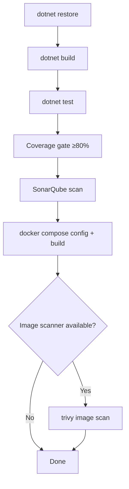

# Quality Gates

LeanKernel quality validation is intentionally runnable from a clean developer workstation using the existing .NET SDK and Docker.

## Standard Validation

```bash
dotnet restore src/LeanKernel.sln
dotnet build src/LeanKernel.sln -c Release --no-restore
dotnet test src/LeanKernel.sln -c Release --no-build
```

## Coverage Gate

Run tests with coverage and enforce the default 80 percent line coverage gate:

```bash
scripts/quality/test-coverage.sh
```

Override the threshold when needed:

```bash
COVERAGE_THRESHOLD=85 scripts/quality/test-coverage.sh
```

The script writes Cobertura reports under `coverage-results/` and uses `scripts/quality/coverage-gate.py` to aggregate line coverage by source file and line number.

### Coverage Exclusions

Coverage excludes the following categories because they are integration surfaces that require environment-backed tests rather than line coverage in the unit gate:

- Generated files
- EF migrations
- Razor components
- Startup/auth registration glue
- External channel/process adapters
- Hosted-service loops
- Runtime skill execution boundaries

## Local SonarQube Scan

Run a local SonarQube Community Edition server from the standalone `docker-compose.sonar.yml` file and execute the .NET scanner from a .NET SDK container:

```bash
scripts/quality/sonarqube-scan.sh
```

### Environment Variables

| Variable | Default | Purpose |
|----------|---------|---------|
| `SONAR_HOST_URL` | `http://localhost:9000` | URL used by the host script to check SonarQube status. |
| `SONAR_SCANNER_HOST_URL` | `http://host.docker.internal:9000` on macOS, otherwise `http://localhost:9000` | URL used from inside the scanner container. |
| `SONAR_PROJECT_KEY` | `LeanKernel` | SonarQube project key. |
| `SONAR_TOKEN` | empty | Existing token to use. If omitted, the script tries to generate a local token with `SONAR_LOGIN`/`SONAR_PASSWORD`. |
| `SONAR_LOGIN` | `admin` | Local SonarQube username used only when generating a token. |
| `SONAR_PASSWORD` | `admin` | Local SonarQube password used only when generating a token. |

The scan uses OpenCover output from Coverlet and waits for the SonarQube quality gate.

## Docker Validation

Validate the rearchitected local stack definition before publishing images:

```bash
docker compose config
docker build -t leankernel-engine:local .
```

If an image scanner such as Trivy is installed, scan the image before publishing:

```bash
trivy image leankernel-engine:local
```

## Quality Gate Summary


