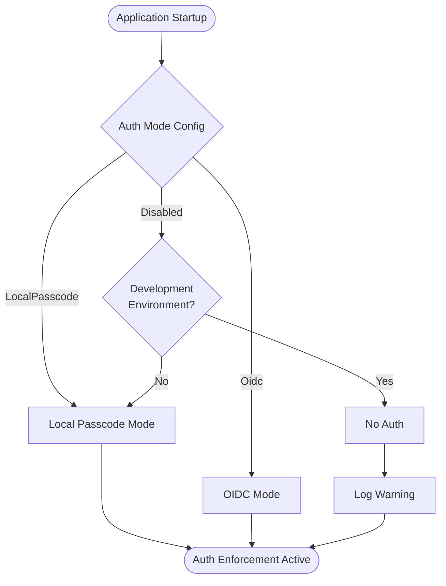
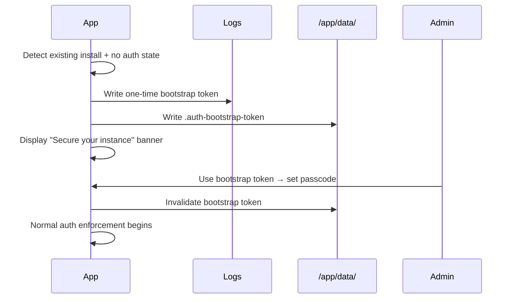

# Authentication and Authorization

## Overview

LeanKernel exposes a layered authentication and authorization model designed to be secure by default for single-admin deployments while supporting pluggable OIDC/OAuth providers.

## Goals

- **Secure by default**: Fresh installs require auth setup before the app is usable.
- **Simple baseline**: Single passcode login for UI + generated API tokens for programmatic access.
- **Pluggable providers**: Generic OIDC/OAuth support without hard-coding specific IdPs.
- **Migration-safe**: Existing installations upgrade gracefully without lockout.
- **Defense in depth**: Server-enforced authorization on every endpoint.

## Non-Goals (v1)

- Multi-user identity management
- Fine-grained RBAC beyond `admin` / `api_client`
- OAuth2 resource-server semantics for third-party consumers
- Federated identity linking across providers

---

## Authentication Modes

| Mode | Description | Default |
|------|-------------|---------|
| `LocalPasscode` | Admin passcode → cookie session; API tokens for machines | ✅ |
| `Oidc` | OpenID Connect challenge/callback; claims → LeanKernel roles | — |
| `Disabled` | No auth enforcement (dev-only; restricted to `ASPNETCORE_ENVIRONMENT=Development`) | — |

### Mode Selection Flow



### Local Passcode Mode

- Interactive login via passcode → secure HttpOnly cookie session.
- Passcode stored using **Argon2id** (or PBKDF2 with ≥100k iterations) with per-secret salt.
- Timing-safe comparison for passcode verification.
- API token generation for programmatic clients:
  - Raw token displayed exactly once on creation.
  - Only hash + metadata stored at rest.
  - Supports list, revoke, rotate operations.

### OIDC Mode

- Standard OpenID Connect Authorization Code flow.
- Configuration: authority URL, client ID, client secret, callback path, scopes, claim mappings.
- Admin identity whitelisting: exact `issuer + subject` pair (or exact email claim) must match configured value.
- Bundled local dev provider (`plainscope/simple-oidc-provider`) for testing.

### Disabled Mode

- Only available when `ASPNETCORE_ENVIRONMENT=Development`.
- Logs a warning and falls back to `LocalPasscode` in Production/Staging.

---

## Authorization Model

### Roles

| Role | Source |
|------|--------|
| `admin` | Local passcode session, or mapped OIDC admin claim |
| `api_client` | Valid API bearer token |

### Policies

| Policy | Required Claims |
|--------|----------------|
| `UiAuthenticated` | Cookie-authenticated user (admin role) |
| `AdminOnly` | `admin` role via any scheme |
| `ApiAccess` | Valid API token (bearer scheme required) |

### Endpoint Policy Mapping

```mermaid
flowchart LR
    subgraph Anonymous
        Health[/api/health]
        Login[/api/auth/login]
        OIDC[OIDC callbacks]
        Onboard[/api/onboarding/* (bootstrap)]
    end

    subgraph AdminOnly
        Config[/api/config]
        Files[/api/files]
        Logs[/api/logs]
        Stats[/api/stats]
        Chat[/api/chat/*]
        Sessions[/api/sessions/*]
    end

    subgraph ApiAccess
        OpenAI[/v1/* OpenAI-compatible]
    end

    subgraph UiAuthenticated
        Blazor["/_blazor (SignalR)"]
    end
```

| Endpoint Group | Policy | Notes |
|---------------|--------|-------|
| `/api/health` | Anonymous | Liveness/readiness probes |
| `/api/auth/login`, `/api/auth/challenge` | Anonymous | Login flow |
| OIDC callback endpoints | Anonymous | Provider callbacks |
| `/api/onboarding/*` | Anonymous during bootstrap; `AdminOnly` after completion | Hardened post-setup |
| `/api/config`, `/api/files`, `/api/logs`, `/api/stats` | `AdminOnly` | Sensitive admin APIs |
| `/api/chat/*`, `/api/sessions/*` | `AdminOnly` | Chat session management |
| `/v1/*` (OpenAI-compatible) | `ApiAccess` (bearer token only) | Machine access |
| `/_blazor` (SignalR hub) | `UiAuthenticated` | Circuit auth |

---

## API Token Management

### Endpoints

| Method | Path | Policy | Description |
|--------|------|--------|-------------|
| GET | `/api/auth/tokens` | `AdminOnly` | List API tokens (metadata only) |
| POST | `/api/auth/tokens` | `AdminOnly` | Create new API token (returns raw once) |
| DELETE | `/api/auth/tokens/{id}` | `AdminOnly` | Revoke specific token |
| POST | `/api/auth/revoke-sessions` | `AdminOnly` | Invalidate all sessions |

### Token Schema

```json
{
  "id": "tok_abc123",
  "name": "CI Pipeline",
  "hash": "<argon2id hash of raw token>",
  "createdAt": "2026-04-30T12:00:00Z",
  "lastUsedAt": "2026-04-30T13:45:00Z",
  "expiresAt": "2026-07-30T12:00:00Z",
  "revokedAt": null
}
```

- Default expiration: 90 days (configurable; nullable for non-expiring).
- `lastUsedAt` updated on each successful authentication.

---

## Security Configuration

### Cookie Settings

| Setting | Value | Notes |
|---------|-------|-------|
| `HttpOnly` | `true` | Prevent XSS token theft |
| `SameSite` | `Lax` | Block cross-origin form POSTs |
| `Secure` | Environment-aware | `Always` when HTTPS detected; `SameAsRequest` for plain HTTP dev |
| `Path` | `/` | Scoped to app root |
| `Expiration` | 8 hours (sliding) | Configurable via `AuthConfig.SessionDurationMinutes` |

### Session Revocation

- A **security stamp** (random value) is stored in persistent auth state.
- Stamp is included in cookie claims and validated on every request.
- Stamp is bumped on: passcode change, auth mode switch, explicit "revoke all sessions", token purge.
- All existing cookies become invalid immediately on stamp change.
- Blazor `RevalidatingServerAuthenticationStateProvider` revalidates circuits every 30 seconds.

### Rate Limiting

| Scope | Login Limit |
|-------|-------------|
| Per-IP | 5 attempts/min, 20/hour |
| Global | 50 attempts/min |
| Token creation | 10/hour per authenticated session |

---

## Configuration Model

```csharp
public sealed class AuthConfig
{
    public AuthMode Mode { get; set; } = AuthMode.LocalPasscode;
    public int SessionDurationMinutes { get; set; } = 480; // 8 hours
    public int TokenDefaultExpirationDays { get; set; } = 90;
    public string[] AllowedOrigins { get; set; } = [];
    public LocalPasscodeConfig Local { get; set; } = new();
    public OidcConfig Oidc { get; set; } = new();
    public RateLimitConfig RateLimit { get; set; } = new();
}

public enum AuthMode { LocalPasscode, Oidc, Disabled }

public sealed class OidcConfig
{
    public string Authority { get; set; } = "";
    public string ClientId { get; set; } = "";
    public string ClientSecret { get; set; } = "";
    public string CallbackPath { get; set; } = "/auth/oidc/callback";
    public string[] Scopes { get; set; } = ["openid", "profile", "email"];
    public string AdminSubjectClaim { get; set; } = "";
}
```

---

## Observability and Audit

| Event | Level | Data |
|-------|-------|------|
| Login success | Information | timestamp, source IP |
| Login failure | Warning | timestamp, source IP, reason |
| Logout | Information | timestamp |
| Passcode changed | Warning | timestamp |
| Token created | Information | token name, expiry |
| Token revoked | Information | token name |
| Auth mode changed | Warning | old mode → new mode |
| Sessions revoked | Warning | timestamp, reason |
| Rate limit triggered | Warning | source IP, endpoint |

---

## Migration and Upgrade Path

When an upgraded instance starts and detects an existing install with no auth state file:



This prevents lockout while ensuring security is not silently disabled.

### Auth Mode Transitions

When auth mode changes (e.g., `LocalPasscode` → `Oidc`):

1. Security stamp is bumped — all cookie sessions are invalidated immediately.
2. API tokens remain valid (they are mode-independent).
3. Change takes effect without restart via `IOptionsMonitor`.
4. Audit log entry recorded.
