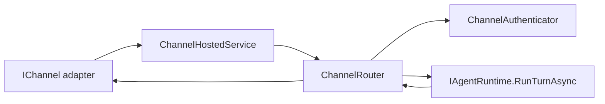

# Channels
Channels give LeanKernel a transport abstraction for inbound and outbound messaging outside the HTTP gateway. Phase 2 keeps channel-specific concerns in `LeanKernel.Channels`, but every inbound message still reaches the same `IAgentRuntime.RunTurnAsync` path used by `POST /api/chat`.

The result is one runtime with multiple entry points, not multiple runtimes with duplicated logic.
## Why it exists
The Phase 1 gateway proved the core runtime through HTTP. Phase 2 adds a reusable transport layer so LeanKernel can accept messages from adapters such as Signal while preserving shared session, context, and response behavior.

## Runtime components
| Component | Responsibility |
| --- | --- |
| `IChannel` | Defines channel lifecycle, send behavior, connectivity state, and the `MessageReceived` event. |
| `ChannelHostedService` | Starts and stops registered channels and subscribes to inbound messages. |
| `ChannelRouter` | Validates the channel, authenticates the sender, maps to `LeanKernelMessage`, invokes `IAgentRuntime`, and sends the reply back through the same adapter. |
| `ChannelAuthenticator` | Enforces per-channel allowlists from `LeanKernel:Channels:ChannelAuth`. |
| `SignalChannel` | Polling HTTP adapter for the Signal daemon API. |
| `AddLeanKernelChannels` | Registers the router, authenticator, hosted service, and optional Signal adapter. |
## Shared routing flow
When a channel raises `MessageReceived`, LeanKernel follows one path:

1. `ChannelHostedService` receives the normalized `ChannelMessage`
2. `ChannelRouter` checks whether channels are enabled and whether the adapter is registered
3. `ChannelAuthenticator` authorizes the sender for that channel
4. the router maps the message to `LeanKernelMessage`
5. `IAgentRuntime.RunTurnAsync` processes the turn
6. the adapter sends the response back to the original sender

This keeps transport details separate from reasoning. `ChannelRouter` does not create a special channel-only agent flow.
## Authentication model
Channel auth is configured per channel id and fails closed by default.

| Rule | Result |
| --- | --- |
| Missing channel auth config | Deny the message. |
| `RequireAuth = false` | Allow all senders for that channel. |
| `RequireAuth = true` with blank sender | Deny the message. |
| `RequireAuth = true` with empty `AllowedSenders` | Deny the message. |
| `RequireAuth = true` and sender in allowlist | Allow the message. |

That is intentionally simpler than the gateway API-key model. Channels authenticate the sender, not the HTTP caller.
## Signal adapter
`SignalChannel` is the first implemented adapter.
### Registration and startup
Signal is disabled by default. The adapter is registered only when:

- `LeanKernel:Channels:Signal:Enabled = true`

Even then, `StartAsync` refuses to poll when `PhoneNumber` is empty. That prevents a half-configured daemon connection from starting silently.
### Receive path
The adapter connects via WebSocket:
```text
ws://signal:8080/v1/receive/{phoneNumber}
```
It reads SSE envelopes from the Signal daemon, ignores payloads that lack a sender or text message, and turns valid messages into `ChannelMessage` values.
### Send path
Outbound replies are posted to:
```text
POST /v2/send
```
with a JSON body containing:

- `number`
- `recipients`
- `message`
### Reconnect behavior
WebSocket disconnects increment a reconnect counter and apply exponential backoff based on `ReconnectDelaySeconds`. The delay is capped at 300 seconds, and reconnection stops after `MaxReconnectAttempts` consecutive failures. Each disconnection is logged with the elapsed connection duration, and the reconnect attempt count is included in the log message.

### Rate-limit handling
When `POST /v2/send` returns a 429 response (rate-limited), the engine logs the challenge tokens from the response body with a clear error message including the recovery instructions. The rate limit must be resolved by submitting a captcha to the signal-cli daemon's `POST /v1/accounts/{number}/rate-limit-challenge` endpoint. See the [Swarm operational notes](https://github.com/anomalyco/swarm/blob/main/docs/deployment/stacks/leankernel/operational-notes.md#signal-rate-limit-recovery) for the full recovery procedure.
## Adding a new channel
A new adapter fits the existing design when it:

1. implements `IChannel`
2. normalizes inbound payloads into `ChannelMessage`
3. registers itself through `AddLeanKernelChannels`
4. adds a `ChannelAuth` entry so sender auth is explicit

If those pieces exist, `ChannelHostedService` and `ChannelRouter` provide the rest of the lifecycle automatically.
## Configuration
Channel behavior is configured under `LeanKernel:Channels`.
### Core settings
| Key | Default | Purpose |
| --- | --- | --- |
| `Enabled` | `true` | Enables hosted-service startup and inbound routing. |
### Signal settings
| Key | Default | Purpose |
| --- | --- | --- |
| `Signal:Enabled` | `false` | Registers the Signal adapter. |
| `Signal:DaemonUrl` | `http://signal:8080` | Base URL for the Signal HTTP daemon. |
| `Signal:PhoneNumber` | empty | Signal account number used for polling and send operations. |
| `Signal:PollIntervalSeconds` | `2` | Long-poll timeout passed to `/v1/receive`. |
| `Signal:ReconnectDelaySeconds` | `5` | Base reconnect delay after failures. |
| `Signal:MaxReconnectAttempts` | `10` | Maximum consecutive polling failures before stopping. |
### Channel auth entries
| Key | Default | Purpose |
| --- | --- | --- |
| `ChannelId` | none | Stable id such as `signal`. |
| `AllowedSenders` | empty | Sender allowlist when auth is required. |
| `RequireAuth` | `true` | Enables sender enforcement for that channel. |
```json
{
  "LeanKernel": {
    "Channels": {
      "Enabled": true,
      "Signal": {
        "Enabled": false,
        "DaemonUrl": "http://signal:8080",
        "PhoneNumber": ""
      }
    }
  }
}
```
## How to think about the feature
Channels are an integration layer, not a new orchestration layer. They solve transport-specific concerns such as polling, sender auth, and reply delivery, while the shared runtime still owns:

- session handling
- context gating
- prompt assembly
- model invocation
- response enhancement

That is why the feature belongs in its own package but still routes through the same runtime contract.
## Related documentation
- [Gateway API](gateway-api.md)
- [Authentication and Authorization](authentication.md)
- [Phase 2 Configuration](../configuration/phase-2-config.md)
- [Phase 2 Channel Expansion PRD](../plans/phase-2-channel-expansion-prd.md)
