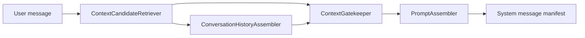
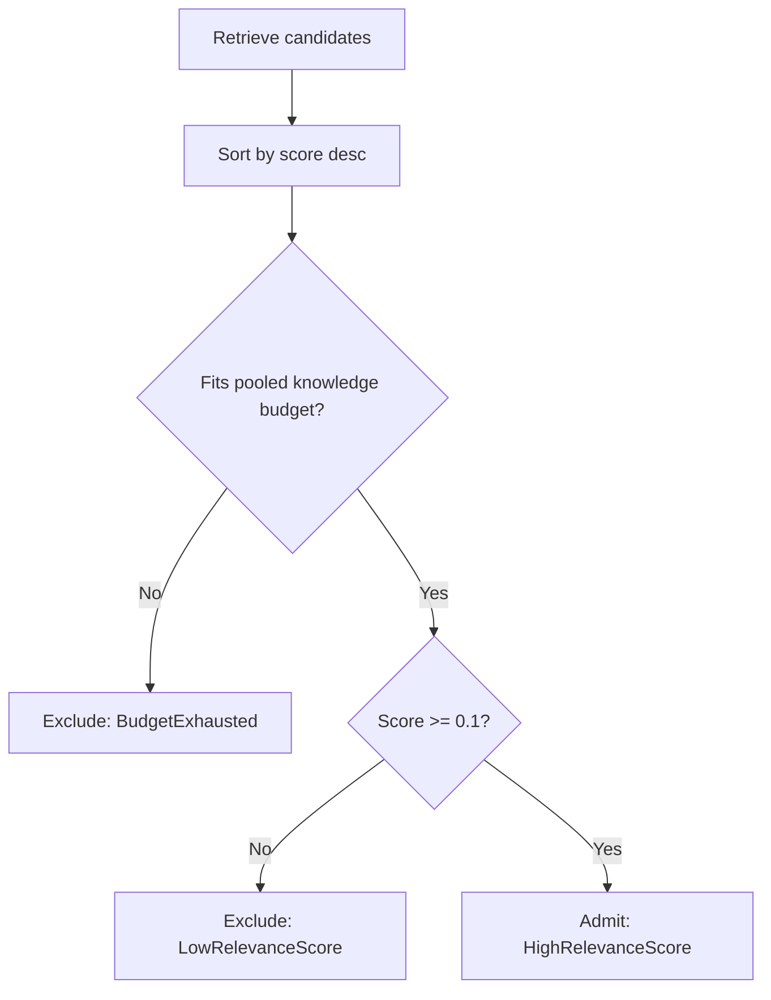

# Context Gating
Context gating is the Phase 1 mechanism that decides what the model is allowed to see for a turn. LeanKernel starts from an empty context window and admits only the context that earns its place through relevance and budget checks.
That deny-by-default posture is the core design difference from a naive "send everything" prompt strategy. It keeps prompts inspectable, controls token growth, and makes each admitted item explainable.
## Why it exists
Without a gatekeeper, old turns, low-value retrieval, and tool metadata can all accumulate until the prompt becomes expensive and noisy. Phase 1 avoids that by splitting context assembly into explicit steps.

## Runtime components
| Component | Responsibility |
| --- | --- |
| `ContextGatekeeper` | Orchestrates identity loading, onboarding evaluation, retrieval, admission, budget accounting, and final `ConversationContext` assembly. |
| `ContextBudget` | Calculates token budgets from the configured context window and ratio settings. |
| `IIdentityProvider` / `OnboardingGapDetector` | Load durable identity pages from GBrain and detect missing or weak onboarding fields before retrieval runs. |
| `ContextCandidateRetriever` | Fetches raw candidates from knowledge search and recent session history. |
| `ConversationHistoryAssembler` | Delegates to deterministic history shaping when enabled and falls back to newest-turn truncation when disabled. |
| `HistoryCompactionStrategy` | Assigns recency-based verbatim, compacted, summarized, and dropped tiers deterministically. |
| `HistoryShaper` | Runs compaction, summarization, marker persistence, and final budget pruning for the history slice. |
| `PromptAssembler` | Builds the inspectable system message and debug full-prompt view. |
Retrieval and admission are intentionally separate. A candidate can be available in storage and still remain invisible to the model.
## Budget calculation
`ContextBudget.FromConfig` starts with `LeanKernel:LiteLlm:ContextWindowTokens`, reserves response headroom first, then divides the remaining prompt budget by ratio.
| Setting | Default | Meaning |
| --- | --- | --- |
| `ResponseHeadroomRatio` | `0.25` | Tokens reserved for model output. |
| `SystemPromptBudgetRatio` | `0.15` | Share for the system prompt. |
| `WikiFactsBudgetRatio` | `0.20` | Share for wiki facts. |
| `ConversationBudgetRatio` | `0.40` | Share for recent conversation turns. |
| `RetrievalBudgetRatio` | `0.20` | Share for retrieved knowledge. |
| `ToolsBudgetRatio` | `0.05` | Share reserved for tool metadata. |
With the default `128000` token window, Phase 1 computes:
```text
Total context window    = 128000
Response headroom       = 32000
Usable prompt budget    = 96000
System prompt           = 14400
Wiki facts              = 19200
History                 = 38400
Retrieval               = 19200
Tools                   = 4800
```
One important nuance: `ContextGatekeeper` currently pools wiki and retrieval slices into one shared knowledge-admission budget. In practice, wiki facts and retrieved knowledge compete inside a shared `38400` token envelope, even though usage is still reported separately by source.
## Admission flow

`ContextCandidateRetriever` gathers:
- knowledge candidates from `IKnowledgeService.SearchAsync(message.Content, maxResults: 20)`
- recent turns from `ISessionStore.GetHistoryAsync(sessionId, maxTurns: 50)`
`ConversationHistoryAssembler` then applies deterministic history shaping for the conversation budget. Recent turns stay verbatim, older turns can be compacted or summarized through LiteLLM, and the final history slice still drops oldest shaped segments until it fits budget exactly. When shaping is disabled, the assembler falls back to the original newest-turn truncation behavior.
Knowledge admission is deterministic for a fixed candidate set:
1. sort by descending score
2. break ties by `Source`, then `Key`
3. estimate token cost if needed
4. reject over-budget items
5. reject scores below `0.1`
6. classify admitted items as wiki facts or retrieved knowledge
7. record every decision in `AdmissionLog`
## What deny-by-default means
A candidate is excluded unless both of these conditions are true:
- there is still budget available for it
- its relevance score is high enough
That is why a fact can exist in GBrain and still remain out of the prompt. Availability is not admission.
The same posture applies to history. If recent turns already fill the history slice, older turns are not squeezed in "just in case." They stay out.
## Prompt assembly
After admission, `PromptAssembler` turns the selected context into a stable manifest in this order:
1. system prompt
2. identity context
3. onboarding guidance
4. relevant knowledge
5. retrieved context
6. available tools
Example:
```text
You are LeanKernel, a personal AI assistant...
## Identity Context
### User Preferences (identity-user-default)
- preferred_name: Alex
## Relevant Knowledge
- [wiki] Deployment runbook summary...
## Retrieved Context
- [gbrain:incident-42] Recent outage notes...
## Available Tools: wiki_read, wiki_search
```
The debug-oriented full prompt view appends the selected conversation turns after the system manifest so the final prompt stays inspectable.
## Budget usage and tool reservation
The returned `ConversationContext` includes `ContextBudgetUsage` for system prompt, wiki facts, history, retrieval, and tools. In Phase 1, `ToolsUsed` remains `0` inside `ContextGatekeeper`; tool visibility is merged later by `TurnPipeline`, so the gatekeeper reserves tool budget conceptually but does not spend it directly.
## Configuration
Budget ratios still live under `LeanKernel:Context`.
| Key | Default | Why it matters |
| --- | --- | --- |
| `SystemPromptBudgetRatio` | `0.15` | Prevents the system prompt from crowding out runtime context. |
| `WikiFactsBudgetRatio` | `0.20` | Reserves room for structured wiki knowledge. |
| `ConversationBudgetRatio` | `0.40` | Makes recent turns the largest explicit slice. |
| `RetrievalBudgetRatio` | `0.20` | Limits how much external retrieval can expand the prompt. |
| `ToolsBudgetRatio` | `0.05` | Keeps tool metadata bounded. |
| `ResponseHeadroomRatio` | `0.25` | Protects output space before prompt assembly starts. |

History shaping lives under `LeanKernel:History`.
| Key | Default | Why it matters |
| --- | --- | --- |
| `RecentTurnsVerbatim` | `6` | Newest turns that always stay verbatim. |
| `CompactedTurnsMax` | `10` | Next-oldest turns eligible for key-point compaction. |
| `SummarizedTurnsMax` | `20` | Older turns eligible for one-paragraph summarization. |
| `EnableCompaction` | `true` | Enables the compacted tier. |
| `EnableSummarization` | `true` | Enables the summarized tier. |
| `CompactionModel` | `gpt-4o-mini` | LiteLLM route used for compaction and summarization. |
| `CompactionTemperature` | `0.1` | Keeps compaction output stable for the same source turns. |
| `MaxSummaryTokens` | `200` | Caps compacted or summarized artifact size. |
| `PersistCompactionMarkers` | `true` | Persists trace markers for operator auditability. |
```json
{
  "LeanKernel": {
    "LiteLlm": { "ContextWindowTokens": 128000 },
    "Context": {
      "ResponseHeadroomRatio": 0.25,
      "SystemPromptBudgetRatio": 0.15,
      "WikiFactsBudgetRatio": 0.20,
      "ConversationBudgetRatio": 0.40,
      "RetrievalBudgetRatio": 0.20,
      "ToolsBudgetRatio": 0.05
    },
    "History": {
      "RecentTurnsVerbatim": 6,
      "CompactedTurnsMax": 10,
      "SummarizedTurnsMax": 20,
      "EnableCompaction": true,
      "EnableSummarization": true,
      "CompactionModel": "gpt-4o-mini",
      "CompactionTemperature": 0.1,
      "MaxSummaryTokens": 200,
      "PersistCompactionMarkers": true
    }
  }
}
```
## Example outcome
| Candidate | Score | Tokens | Result |
| --- | --- | ---: | --- |
| `wiki/deployments` | `0.92` | `1200` | Admitted. |
| `incident-42` | `0.67` | `2800` | Admitted if budget remains. |
| `old-note` | `0.04` | `600` | Excluded as `LowRelevanceScore`. |
If another high-scoring candidate would overflow the pooled knowledge budget, it is still excluded as `BudgetExhausted`. Relevance is necessary, but budget still wins.
## Related documentation
- [Turn Pipeline](turn-pipeline.md)
- [Knowledge Retrieval](knowledge-retrieval.md)
- [Tool Governance](tool-governance.md)
- [Diagnostics](diagnostics.md)
- [Configuration reference](../configuration/configuration-reference.md)
