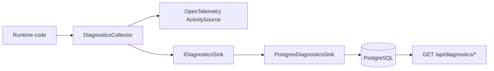

# Diagnostics
Phase 1 diagnostics give LeanKernel a structured way to observe runtime behavior without relying only on console logs. The implementation combines three layers:
- structured diagnostic entries
- OpenTelemetry-compatible activities and metrics
- structured logging enrichment
Together, those layers make it easier to inspect turn behavior, token use, tool visibility, and runtime health.
## Runtime components
| Component | Responsibility |
| --- | --- |
| `DiagnosticsCollector` | Records structured diagnostic events and creates tracing activities. |
| `ProviderHealthTracker` | Tracks provider-health transitions for PostgreSQL, LiteLLM, and GBrain. |
| `ProviderHealthCheck` | Surfaces tracked provider status through ASP.NET Core health checks. |
| `SpendTracker` / `SpendGuardService` | Track node-local spend and evaluate allow/warn/block guardrail decisions. |
| `ContextDiagnosticsService` | Persists and resolves per-turn context snapshots for the diagnostics APIs. |
| `LeanKernelMetrics` | Publishes runtime counters, histograms, and observable gauges through `System.Diagnostics.Metrics`. |
| `PostgresDiagnosticsSink` | Persists `DiagnosticEntry` payloads to PostgreSQL. |
| `LeanKernelLogEnricher` | Adds the `ServiceName` property to Serilog events. |
| Gateway diagnostics + health endpoints | Return persisted raw entries, turn-scoped context diagnostics, and aggregated runtime health. |

## Diagnostic entries
`DiagnosticsCollector` records typed payloads as `DiagnosticEntry` objects when diagnostics are enabled and persistence is turned on.
Each entry includes:
- `Id`
- `SessionId`
- optional `TurnId`
- `Category`
- `Payload`
- `Timestamp`
The collector currently supports these categories through dedicated methods:
| Method | Category |
| --- | --- |
| `RecordContextAdmissionAsync` | `ContextAdmission` |
| `RecordBudgetUsageAsync` | `BudgetAllocation` |
| `RecordToolVisibilityAsync` | `ToolVisibility` |
| `RecordModelRoutingAsync` | `ModelRouting` |
| `RecordQualityGateAsync` | `QualityGate` |
| `StartTurnActivity` | Turn lifecycle activity only |
The payloads are implementation objects such as `ContextAdmissionRecord`, `ContextBudgetUsage`, `RoutingDecision`, or small anonymous objects for quality outcomes.
## Tracing with OpenTelemetry
`DiagnosticsCollector` owns a static `ActivitySource` named `LeanKernel.Diagnostics`. The Gateway can now opt into full OpenTelemetry export for inbound ASP.NET Core requests, outbound `HttpClient` calls, LeanKernel diagnostics activities, and EF Core command activities emitted through `LeanKernel.Persistence`.
Those activities carry tags such as:
- `session.id`
- `turn.id`
- `admitted.count`
- `excluded.count`
- `budget.total_used`
- `model.selected`
- `quality.outcome`
That gives the runtime a tracing-friendly representation of major decisions without forcing every consumer to inspect raw payload JSON.
## Metrics
`LeanKernelMetrics` publishes runtime metrics through a `Meter` named `LeanKernel` version `1.0.0`.
| Metric | Type | Meaning |
| --- | --- | --- |
| `leankernel.turns.processed` | counter | Total turns processed, tagged by model. |
| `leankernel.tokens.used` | counter | Total tokens consumed, tagged by model. |
| `leankernel.turn.latency` | histogram | Turn processing latency in milliseconds. |
| `leankernel.quality_gate.failures` | counter | Quality-gate failures, tagged by reason. |
| `leankernel.escalations` | counter | Model escalations, tagged by source and target model. |
| `leankernel.budget.utilization` | histogram | Budget usage ratio. |
| `leankernel.requests.total` | counter | Total HTTP requests, tagged by endpoint and method. |
| `leankernel.requests.duration` | histogram | HTTP request latency in milliseconds. |
| `leankernel.requests.errors` | counter | Error responses, tagged by endpoint, method, and status code. |
| `leankernel.spend.total_usd` | observable gauge | Current node-local daily and monthly spend totals. |
| `leankernel.providers.health` | observable gauge | Provider health, tagged by provider (`1=healthy`, `0=unhealthy`). |
| `leankernel.ratelimit.rejected` | counter | Rate-limited requests, tagged by caller partition. |
These names are the current implementation contract. If a dashboard expects different names, the code would need to change to match it.
## Persistence
`PostgresDiagnosticsSink` provides the current `IDiagnosticsSink` implementation. It stores each `DiagnosticEntry` as entry id, session id, turn id, category, serialized payload JSON, and timestamp.
When entries are read back, the sink:
1. queries by `sessionId`
2. orders by timestamp
3. deserializes the payload into `JsonElement`
That lets the Gateway endpoints return stored diagnostics without knowing the original runtime type of each payload. `ContextDiagnosticsService` layers on top of those raw entries by storing one `ContextSnapshot` payload per turn, then resolving the latest or requested `turnId` without recomputing context assembly.
## API access
Gateway exposes four diagnostics endpoints.
| Endpoint | Method | Purpose |
| --- | --- | --- |
| `/api/diagnostics/{sessionId}` | `GET` | Return persisted diagnostic entries for a session. |
| `/api/diagnostics/{sessionId}/context` | `GET` | Return the stored context admission audit for the latest turn or a specific `turnId`. |
| `/api/diagnostics/{sessionId}/budget` | `GET` | Return stored budget allocation and usage details for the latest turn or a specific `turnId`. |
| `/api/diagnostics/{sessionId}/history` | `GET` | Return stored history shaping diagnostics for the latest turn or a specific `turnId`. |
If Gateway API-key auth is enabled, these endpoints also require `X-Api-Key`. The `/context`, `/budget`, and `/history` routes return `404` when no persisted snapshot exists for the requested session or turn.
```json
{
  "entries": [
    {
      "id": "...",
      "sessionId": "session-1",
      "turnId": "turn-1",
      "category": "BudgetAllocation",
      "payload": {
        "systemPromptUsed": 42,
        "wikiFactsUsed": 120
      },
      "timestamp": "2025-01-01T00:00:00Z"
    }
  ],
  "count": 1
}
```
## Structured logging
`LeanKernelLogEnricher` adds a `ServiceName` property to Serilog log events. Gateway wires that enricher into both the bootstrap logger and the main Serilog configuration. The default service name is `leankernel`, but it can be changed through diagnostics configuration.
## Configuration
Diagnostics behavior is controlled under `LeanKernel:Diagnostics`.
| Key | Default | Purpose |
| --- | --- | --- |
| `Enabled` | `true` | Turns collector activity on or off. |
| `PersistToDatabase` | `true` | Enables sink writes when an `IDiagnosticsSink` is available. |
| `ContextDiagnosticsEnabled` | `true` | Enables persisted context snapshot reads and writes for the diagnostics APIs. |
| `MaxDiagnosticsPerSession` | `100` | Caps how many stored context snapshots are considered when resolving the latest or requested turn. |
| `ServiceName` | `leankernel` | Value used by the Serilog log enricher. |
```json
{
  "LeanKernel": {
    "Diagnostics": {
      "Enabled": true,
      "PersistToDatabase": true,
      "ContextDiagnosticsEnabled": true,
      "MaxDiagnosticsPerSession": 100,
      "ServiceName": "leankernel"
    }
  }
}
```
## Current integration boundaries
Phase 2 adds one direct runtime integration point: `TurnPipeline` now stores a persisted `ContextSnapshot` through `IContextDiagnosticsService` after context assembly and tool visibility resolution. `DiagnosticsCollector` remains an opt-in instrumentation surface for other diagnostic categories, so the system still combines always-on snapshot storage with selectively invoked collector methods.
The currently visible surfaces are:
- Serilog enrichment
- the metrics type itself
- persisted raw diagnostics when callers use `DiagnosticsCollector` and a sink is configured
- persisted per-turn context snapshots stored by `TurnPipeline`
- Gateway access to both raw entries and turn-scoped context diagnostics
## How to read Phase 1 diagnostics
The best way to think about the feature is as an observability toolkit rather than a single end-to-end pipeline:
- use diagnostic entries for structured per-session evidence
- use persisted context snapshots when you need the exact context/budget/history decision for one turn
- use activities for tracing and correlation
- use metrics for aggregate runtime signals
- use enriched logs for broad operational visibility
## Related documentation
- [Turn Pipeline](turn-pipeline.md)
- [Context Gating](context-gating.md)
- [Context Diagnostics API](context-diagnostics-api.md)
- [Gateway API](gateway-api.md)
- [Authentication and Authorization](authentication.md)
- [Configuration reference](../configuration/configuration-reference.md)
