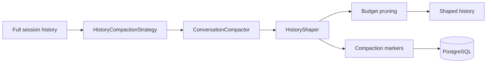

# History Shaping
History shaping gives LeanKernel a deterministic way to fit longer conversations into a bounded prompt budget. Instead of keeping only the newest turns verbatim, Phase 2 assigns recency-based tiers, compacts or summarizes older segments through LiteLLM, and records markers that explain what was transformed.

The goal is not to preserve every original token. The goal is to preserve the most useful structure while keeping the budget honest.
## Why it exists
A simple newest-turn truncation policy is easy to reason about, but it wastes useful context:

- recent turns need fidelity
- mid-range turns often need only key facts and decisions
- old turns usually need a brief summary or can be dropped completely

Phase 2 keeps those choices explicit and auditable.

## Runtime components
| Component | Responsibility |
| --- | --- |
| `HistoryCompactionStrategy` | Assigns turns to `Verbatim`, `Compacted`, `Summarized`, or `Dropped` tiers by recency. |
| `ConversationCompactor` | Calls LiteLLM `chat/completions` to compact or summarize grouped turns. |
| `HistoryShaper` | Orchestrates tier execution, token accounting, final pruning, and marker persistence. |
| `ConversationHistoryAssembler` | Uses `HistoryShaper` when enabled and falls back to newest-turn truncation when disabled. |
| `CompactionMarkerEntity` | Stores persisted marker rows for operator auditability. |
## Tiering strategy
Tier assignment is deterministic for a fixed input history and configuration.

| Tier | Default size | Meaning |
| --- | --- | --- |
| `Verbatim` | newest `6` turns | Keep the original turns unchanged. |
| `Compacted` | next `10` turns | Compress into a shorter factual segment. |
| `Summarized` | next `20` turns | Collapse into a brief outcome-oriented summary. |
| `Dropped` | everything older | Excluded from prompt history. |

The strategy calculates those tiers from the end of the history list backward, so recency wins.

If compaction or summarization is disabled, the strategy rolls counts forward rather than creating a half-enabled tier map. That keeps tier assignment deterministic even when one mode is off.
## Compaction flow
`ConversationHistoryAssembler` calls `HistoryShaper` only when history shaping is enabled and the shaper is registered.

The shaper then:

1. creates a deterministic tier plan
2. summarizes the oldest kept summarized range
3. compacts the next range
4. appends the newest verbatim turns
5. drops oldest shaped segments until the total token count fits budget exactly

That last step is important. A successful compaction pass does not guarantee the result fits budget. `HistoryShaper` still enforces the final ceiling by removing the oldest remaining segment first.
## LiteLLM-backed compaction
`ConversationCompactor` uses one low-temperature LiteLLM call for each shaped segment.

| Operation | Prompt intent |
| --- | --- |
| `CompactAsync` | Extract key facts, decisions, and context concisely. |
| `SummarizeAsync` | Produce one short paragraph focused on outcomes and decisions. |

The implementation uses:

- `chat/completions`
- `HistoryConfig.CompactionModel`
- `HistoryConfig.CompactionTemperature` (default `0.1`)
- `HistoryConfig.MaxSummaryTokens`

Low temperature is the main reason the output is described as deterministic rather than purely creative.
## Traceability and markers
Every compacted or summarized segment gets a `CompactionMarker`.

The marker records:

- marker type (`compacted` or `summarized`)
- timestamp
- original turn count
- original token count
- compacted token count
- model identity through `CompactedBy`

When markers are persisted, `HistoryShaper` writes them to `CompactionMarkerEntity` in PostgreSQL together with the compacted content.

Generated shaped `ConversationTurn` items also carry:

- `IsCompacted = true`
- `CompactionSourceId` as the original turn id or range such as `t3..t4`

That gives the runtime a prompt-facing trace and a database-facing audit trail.
## Budget enforcement and fallback
The shaping contract is strict:

- never exceed the supplied conversation budget
- prefer newer context over older context
- keep a valid history result even when the budget is tiny

When shaping is disabled, `ConversationHistoryAssembler` falls back to the Phase 1 behavior of inserting newest turns until the budget is full.
## Configuration
History shaping is configured under `LeanKernel:History`.

| Key | Default | Purpose |
| --- | --- | --- |
| `RecentTurnsVerbatim` | `6` | Newest turns that always remain verbatim. |
| `CompactedTurnsMax` | `10` | Next-oldest turns eligible for compaction. |
| `SummarizedTurnsMax` | `20` | Older turns eligible for summarization. |
| `EnableCompaction` | `true` | Enables the compacted tier. |
| `EnableSummarization` | `true` | Enables the summarized tier. |
| `CompactionModel` | `gpt-4o-mini` | LiteLLM route used for compaction and summarization. |
| `CompactionTemperature` | `0.1` | Keeps shaping output stable. |
| `MaxSummaryTokens` | `200` | Caps each compacted or summarized artifact. |
| `PersistCompactionMarkers` | `true` | Persists markers when a DB context factory is available. |
```json
{
  "LeanKernel": {
    "History": {
      "RecentTurnsVerbatim": 6,
      "CompactedTurnsMax": 10,
      "SummarizedTurnsMax": 20,
      "CompactionModel": "gpt-4o-mini",
      "CompactionTemperature": 0.1,
      "PersistCompactionMarkers": true
    }
  }
}
```
## How to think about the feature
History shaping is a deterministic budget-management tool, not a memory system. It decides how much fidelity each recency band deserves inside one turn:

- newest turns keep literal wording
- mid-range turns keep condensed facts
- older turns keep a short summary if they still fit
- the rest are dropped explicitly

That makes the conversation slice explainable in the same way context gating makes knowledge admission explainable.
## Related documentation
- [Context Gating](context-gating.md)
- [Turn Pipeline](turn-pipeline.md)
- [Context Diagnostics API](context-diagnostics-api.md)
- [Phase 2 Configuration](../configuration/phase-2-config.md)
