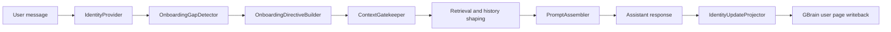
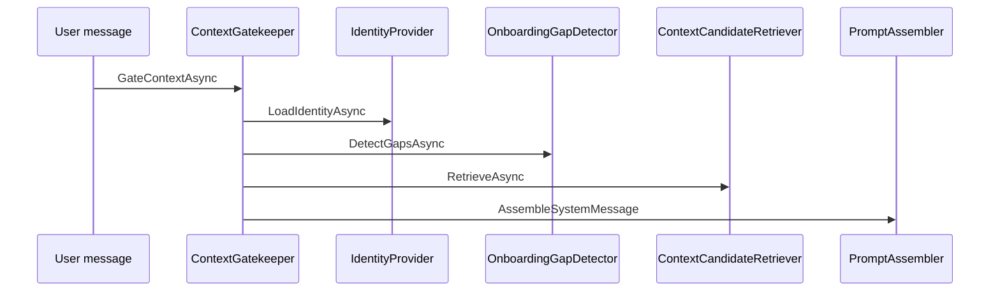

# Identity and Onboarding
Phase 2 identity and onboarding give LeanKernel durable user grounding without adding a second profile store. The runtime reads identity from GBrain pages, turns the useful parts into prompt-safe context, asks a small number of follow-up questions when confidence is low, and writes allowlisted updates back after the turn.

The feature is intentionally additive. LeanKernel still answers the current request even when it is learning missing preferences.
## Why it exists
A personal runtime needs stable context such as preferred name, timezone, work style, and autonomy level. If those facts live only inside recent chat history, they are easy to lose, hard to audit, and expensive to keep re-sending.

Phase 2 moves that grounding into durable GBrain pages and keeps the turn flow non-blocking.

## Runtime components
| Component | Responsibility |
| --- | --- |
| `IdentityProvider` | Loads the agent profile page and default user-preference page from GBrain and converts them into `IdentityContext`. |
| `OnboardingGapDetector` | Finds missing, placeholder, weak, or stale fields inside user preferences. |
| `OnboardingDirectiveBuilder` | Produces a short non-blocking follow-up block with at most `MaxOnboardingQuestionsPerTurn` questions. |
| `ContextGatekeeper` | Loads identity before retrieval, attaches onboarding guidance, and accounts for identity tokens in the system-prompt budget. |
| `IdentityUpdateProjector` | Runs after generation through `IResponseEnhancer`, extracts allowlisted facts, and writes them back to GBrain best-effort. |
| `PromptAssembler` | Renders identity before onboarding, then the rest of the admitted context. |
## Identity as GBrain pages
`IdentityProvider` reads two configured page keys concurrently:

- `identity-agent-main`
- `identity-user-default`

The current implementation uses fixed configured keys, not per-user dynamic page names. `userId` still matters because it is stored in `IdentityContext` and reused as the `subject` metadata when writeback occurs.

Pages can contain YAML frontmatter plus a free-form body. The parser keeps structured fields such as `value`, `confidence`, `last_updated`, and `source`, but it also tolerates unstructured pages and malformed frontmatter.
```text
---
preferred_name:
  value: Alex
  confidence: 0.9
timezone:
  value: UTC+2
---
Primary user preferences
```
Prompt assembly does not inject the raw page. `IdentityProvider` builds prompt-safe summary segments such as:

- `### Agent Profile (identity-agent-main)`
- `- communication_style: concise`
- `### User Preferences (identity-user-default)`
- `- preferred_name: Alex`
## Gap detection
`OnboardingGapDetector` inspects only the allowlisted fields from `LeanKernel:Identity:AllowedIdentityFields`.

It raises deterministic gap codes for four cases:

| Gap type | Example code | Trigger |
| --- | --- | --- |
| Missing | `missing_preferred_name` | Field absent or blank. |
| Placeholder | `placeholder_timezone` | Value looks like `todo`, `unknown`, `n/a`, and similar placeholders. |
| Weak | `weak_locale` | Field confidence is below `OnboardingConfidenceThreshold`. |
| Stale | `stale_recurring_goals` | `last_updated` is too old for that field. |

Staleness rules are field-specific. For example, `recurring_goals` becomes stale after 90 days, while most other fields allow a much longer refresh window.
## Additive onboarding flow
Identity loading happens before retrieval inside `ContextGatekeeper`.

`OnboardingDirectiveBuilder` only adds guidance when both of these are true:

1. gaps were detected
2. `IdentityContext.OverallConfidence` is below the onboarding threshold

The directive always starts with:
```text
Continue answering the user's current request.
```
That is the key behavior difference from a blocking onboarding wizard. LeanKernel learns while still responding.
## Identity extraction and writeback
`IdentityUpdateProjector` runs after the assistant response exists. It looks for deterministic acknowledgement patterns such as preferred name, timezone, locale, work style, and autonomy level.

Important constraints:

- only allowlisted fields are eligible for writeback
- higher-confidence existing values win on conflicts
- matching existing values can still refresh confidence and timestamps
- failures are logged and suppressed so the user response is unchanged
- conflict records can be written to `IDiagnosticsSink` as `ResponseEnhancement`

Writeback targets the configured user preference page and serializes the page back into YAML-frontmatter format.
## Configuration
Identity behavior is configured under `LeanKernel:Identity`.

| Key | Default | Purpose |
| --- | --- | --- |
| `AgentProfilePageKey` | `identity-agent-main` | GBrain page key for the agent profile. |
| `UserPreferencePageKey` | `identity-user-default` | GBrain page key used for the default user preference page. |
| `OnboardingConfidenceThreshold` | `0.6` | Minimum confidence before onboarding follow-up stops. |
| `MaxOnboardingQuestionsPerTurn` | `2` | Hard cap on onboarding questions added to one turn. |
| `EnableIdentityExtraction` | `true` | Enables post-turn writeback through `IdentityUpdateProjector`. |
| `AllowedIdentityFields` | eight fields | Allowlist for gap detection and writeback. |
```json
{
  "LeanKernel": {
    "Identity": {
      "AgentProfilePageKey": "identity-agent-main",
      "UserPreferencePageKey": "identity-user-default",
      "OnboardingConfidenceThreshold": 0.6,
      "MaxOnboardingQuestionsPerTurn": 2,
      "EnableIdentityExtraction": true
    }
  }
}
```
## How to think about the feature
Phase 2 identity is not a separate account system. It is a durable context layer attached to the turn pipeline:

- load stable identity before retrieval
- surface uncertainty as lightweight onboarding guidance
- preserve the user experience by staying non-blocking
- write back only small, allowlisted, deterministic updates

That keeps personalization inspectable and bounded.
## Related documentation
- [Context Gating](context-gating.md)
- [Turn Pipeline](turn-pipeline.md)
- [Scoped Retrieval](scoped-retrieval.md)
- [Configuration reference](../configuration/configuration-reference.md)
