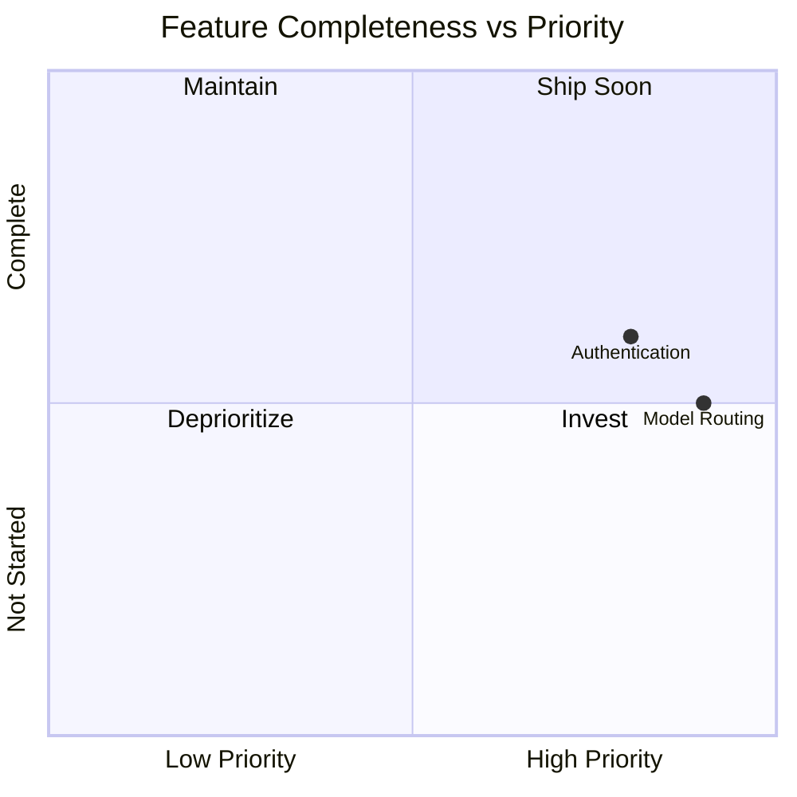

# Features

This section contains product requirements documents (PRDs) and feature design specifications for LeanKernel.

## Contents

| Document | Description |
|----------|-------------|
| [authentication.md](authentication.md) | Authentication and authorization model: local passcode, OIDC, API tokens, endpoint policies, and migration path. |
| [intelligent-model-routing.md](intelligent-model-routing.md) | Intelligent cost-quality model routing: task complexity scoring, free-first policy, quality gates, and spend guardrails. |

## Feature Status

