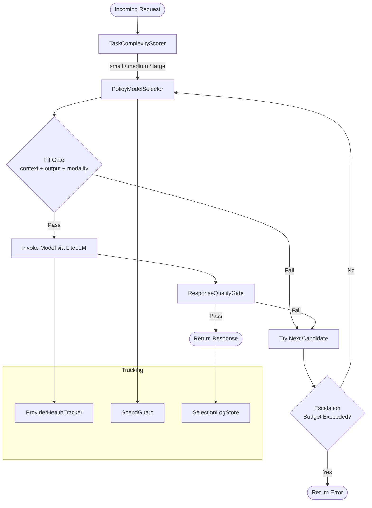
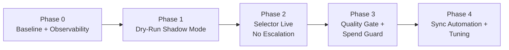

# Intelligent Cost-Quality Model Routing

## Overview

LeanKernel uses an intelligent routing policy to select the best model for each request while optimizing for quality-per-cost in real time.

- Prioritizes free models by default.
- Preserves answer quality by selecting the most capable model required for the task.
- Falls back to paid models only when free providers are rate-limited, unavailable, or fail quality gates.
- Continuously syncs provider limits (context window and output limits) from deployed model metadata.

## Goals

- **Quality-first under budget constraints**: choose the strongest suitable model while avoiding unnecessary paid usage.
- **Free-first policy**: prefer free providers before paid fallback.
- **Task-aware model selection**: route by complexity, context size, and requested output characteristics.
- **Automated config hygiene**: sync deployed model limits into `config/litellm/config.yaml`.
- **Operational resilience**: automatic escalation/fallback on 429/5xx and quality failures.
- **Traceability**: emit structured logs/metrics explaining why a model was selected.

---

## Provider Matrix

| Provider | Tier | Notes |
|----------|------|-------|
| Groq | Free | Low context window, fast. |
| Gemini | Free | High context window, aggressive rate limits. |
| Azure | Free (credits) | Free until monthly credit budget exhausted; includes GPT-5.4 variants, Kimi, and DeepSeek. |
| GitHub Copilot | Paid | Fallback only unless escalation policy requires it. |

### Policy Defaults

- Default order: free candidates first, paid candidate last.
- Paid provider selected only when:
  - All free candidates fail fit/availability/quality checks, or
  - Request priority is explicitly marked `critical`.
- Kimi and DeepSeek must be present in active route chains.

---

## Routing Pipeline

---

## Functional Requirements

### FR-1: Task Complexity Classification

Each request is classified into `small`, `medium`, or `large` based on token count and constraint density.

A **constraint** is any distinct imperative requirement extracted from the user message:

- Explicit numbered/listed requirements
- Hard output format requirements (JSON schema, fixed sections)
- Required tools/providers/models
- Mandatory inclusions/exclusions

| Tier | Criteria |
|------|----------|
| `small` | Estimated input ≤ 4,000 tokens and ≤ 3 constraints |
| `medium` | Estimated input 4,001–16,000 tokens or 4–8 constraints |
| `large` | Estimated input > 16,000 tokens, > 8 constraints, or multi-step generation expected |

### FR-2: Capability Fit Gate

Before invoking a model:

- Input fits model `context_window`.
- Requested output fits model `max_tokens`.
- Required modality/features are supported.

### FR-3: Free-First with Quality Preservation

Candidate order per complexity tier:

1. Free candidates in same tier.
2. Free candidates in adjacent tier.
3. Paid fallback candidates.

### FR-4: Quality Gate and Escalation

After a response is generated, deterministic quality checks are applied:

- Non-empty output (`trimmed length > 0`).
- Minimum useful output length for non-trivial tasks (`>= 80 chars` unless prompt asks for terse output).
- Constraint coverage (`>= 80%` of explicitly enumerated constraints detected in output for medium/large).

### FR-5: Failure and Rate-Limit Handling

On status codes `429, 500, 502, 503, 504`:

- Mark deployment as cooled down for 60s (configurable).
- Retry with next candidate.
- Enforce escalation budget:
  - Max provider attempts per request: `3`
  - Max end-to-end selection time budget: `30s`

### FR-6: Deployed Limit Sync

The `scripts/sync_litellm_model_limits.py` utility syncs chat model limits from live provider metadata:

| Provider | Metadata Source |
|----------|----------------|
| Gemini | `https://generativelanguage.googleapis.com/v1beta/models` |
| Groq | `https://api.groq.com/openai/v1/models` |
| Azure | `{AZURE_AI_API_BASE}/openai/v1/models` (all configured key/base pairs) |

Fields synced: `context_window`, `max_tokens`.

### FR-7: Explainability and Metrics

Per request, emit structured selection metadata:

| Field | Description |
|-------|-------------|
| `request_id` | Correlation ID |
| `route`, `alias`, `provider`, `model` | Selected route details |
| `selection_reason` | Why this model was selected |
| `fallback_path` | Candidates tried before selection |
| `retry_count` | Number of retries |
| `provider_outcome` | success / error / 429 |
| `latency_ms` | End-to-end latency |
| `token_usage` | Input/output tokens |
| `cost_bucket` | `free` or `paid` |

### FR-8: Spend Guardrail

| Threshold | Behavior |
|-----------|---------|
| Soft | Emit warning alerts |
| Hard | Disable paid fallback except `critical` priority requests |

---

## Tier and Alias Mapping

| Alias | Tier | Model |
|-------|------|-------|
| `gpt-5.4-nano` | `small` | `gpt-5.4-nano-1` |
| `gpt-5.4-mini` | `medium` | `gpt-5.4-mini-1` |
| `gpt-5.4` | `large` | `gpt-5.4-1` |

`kimi-k2.6` and `DeepSeek-V3.2` must remain in active route chains across all tiers.

---

## Components

| Component | File | Responsibility |
|-----------|------|----------------|
| `TaskComplexityScorer` | `src/LeanKernel.Thinker/Routing/TaskComplexityScorer.cs` | Classifies request tier |
| `PolicyModelSelector` | `src/LeanKernel.Thinker/Routing/PolicyModelSelector.cs` | Ranks candidates by free-first and fit checks |
| `ResponseQualityGate` | `src/LeanKernel.Thinker/Routing/ResponseQualityGate.cs` | Validates response quality and triggers escalation |
| `ProviderHealthTracker` | `src/LeanKernel.Thinker/Routing/ProviderHealthTracker.cs` | Tracks cooldowns/rate limits |
| `SpendGuard` | `src/LeanKernel.Thinker/Routing/SpendGuard.cs` | Enforces paid spend thresholds |
| `SelectionLogStore` | `src/LeanKernel.Thinker/Routing/SelectionLogStore.cs` | Persists selection metadata |
| `sync_litellm_model_limits.py` | `scripts/sync_litellm_model_limits.py` | Syncs model limits from provider metadata |

---

## Observability Dashboard

### KPI Panels

| Panel | Metric | Visualization |
|-------|--------|---------------|
| Free vs. Paid Usage | % requests served by free providers (7-day rolling) | Line chart with 90% target line |
| Escalation Rate by Tier | Escalation events per tier per hour | Stacked bar chart |
| Latency Percentiles | p50/p95/p99 per active route (rolling 1h and 24h) | Multi-line time series |
| Error / 429 Rate by Provider | 429, 5xx rate per provider per hour | Grouped bar chart |
| Cost-per-Request Trend | Rolling average estimated cost bucket over time | Area chart |
| Complexity Distribution | % classified small/medium/large per hour | Stacked area chart |
| Provider Health / Cooldown | Current cooldown state per deployment | Status table |
| Spend Guard Threshold | Current paid spend vs. soft and hard thresholds | Gauge |
| Selection Reason Breakdown | Top reasons for model selection | Pie / donut chart |

### Alert Thresholds

| Alert | Condition | Severity |
|-------|-----------|---------|
| Free usage below target | Free provider rate < 85% over 1-hour window | Warning |
| Free usage critical | Free provider rate < 70% over 30-minute window | Critical |
| Paid spend soft limit | Paid spend reaches 80% of configured daily cap | Warning |
| Paid spend hard limit | Paid spend reaches 100% of configured daily cap | Critical |
| Latency spike | p95 latency increase ≥ 30% vs baseline for 15 min | Warning |
| Success rate drop | Success rate drop ≥ 3% vs baseline for 30 min | Critical |
| Provider unhealthy | Any provider in cooldown for ≥ 10 consecutive minutes | Warning |

### Tooling Options

- **Grafana + Loki** (primary): log-based metrics, suitable for Docker Compose stack.
- **Blazor admin panel** (alternative): embedded `/admin/routing` route with in-memory or SQLite backend.

---

## Rollout Plan

| Phase | Description | Exit Criteria |
|-------|-------------|---------------|
| 0 | Deploy dashboard, capture 7-day baseline metrics | All panels rendering live data |
| 1 | Shadow mode — log decisions, keep static routes | Shadow selector ≥ 85% agreement with accepted outcomes |
| 2 | Selector live, escalation disabled | Monitor cost/latency drift |
| 3 | Quality gate + spend guardrail enabled | Acceptance criteria met |
| 4 | Sync automation in CI, threshold tuning | Stable operation |

**Rollback criteria**: automatically revert to static routes if either condition holds for > 30 minutes:

- Success rate drops ≥ 3% vs baseline.
- p95 latency increases ≥ 30% vs baseline.

---

## Acceptance Criteria

| ID | Criterion |
|----|-----------|
| AC-1 | Free provider selected first in ≥ 90% of `small`/`medium` requests over a 7-day rolling window of ≥ 1,000 requests |
| AC-2 | Paid usage rate decreases ≥ 25% vs baseline; success rate change within ±1% |
| AC-3 | p95 latency increase ≤ 15% vs baseline |
| AC-4 | Quality-gate escalation triggers for empty/low-coverage responses; ≤ 3 attempts per request |
| AC-5 | Tier aliases resolve to intended deployments |
| AC-6 | Kimi and DeepSeek present in active route chains across all tiers |
| AC-7 | Sync utility supports dry-run and write mode and reports field-level diffs |
| AC-8 | Selection logs include `request_id`, provider/model, reason, fallback path, and cost bucket |
| AC-9 | Dashboard operational before Phase 1 exits, all 9 KPI panels rendering live data |

---

## Risks and Mitigations

| Risk | Mitigation |
|------|------------|
| Provider metadata incomplete/inconsistent | Best-effort sync, conservative defaults, dry-run diff review |
| Misclassification causes poor model choices | Shadow mode and threshold tuning before live activation |
| Over-escalation increases cost/latency | Strict attempt/time budgets and spend guard |
| Rate-limit storms | Cooldown tracker, cross-provider fallback, circuit breaker |
| Silent regression after rollout | Explicit rollback criteria and alerting |
