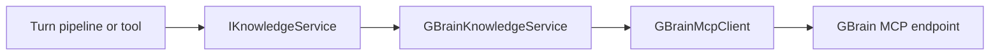

# Knowledge Retrieval
Phase 1 knowledge retrieval gives LeanKernel one runtime-facing way to search, read, and write knowledge: `IKnowledgeService`. In the current implementation, that service is backed by the Bun-hosted `garrytan/gbrain` server over the MCP JSON-RPC protocol.
This matters for two reasons. It supplies ranked retrieval candidates for context gating, and it exposes knowledge operations to the agent through built-in wiki tools.
Phase 2 adds scoped retrieval on top of the same contract so context assembly can enforce namespace policies, perform bounded entity expansion, and emit retrieval diagnostics without changing the GBrain transport layer.
## Why GBrain sits behind `IKnowledgeService`
LeanKernel treats knowledge access as a runtime capability, not as a Gateway concern. The host composes the service, but the knowledge package owns the protocol details and payload mapping.
That keeps the rest of the runtime dependent on a small contract:
- `SearchAsync`
- `GetPageAsync`
- `PutPageAsync`

## Runtime components
| Component | Responsibility |
| --- | --- |
| `GBrainMcpClient` | Sends MCP JSON-RPC requests over `HttpClient` to the root HTTP endpoint exposed by `gbrain serve --http`. |
| `GBrainKnowledgeService` | Implements `IKnowledgeService` on top of the MCP client. |
| `RetrievalScopePolicy` | Resolves the effective retrieval scope from request metadata and configured defaults. |
| `EntityExpander` | Finds related entity terms and linked pages within bounded expansion limits. |
| `ScopedKnowledgeService` | Applies scope rules, score boosts, and retrieval diagnostics before candidates reach context gating. |
| `KnowledgeServiceCollectionExtensions` | Configures the typed client and registers the base knowledge service. |
| Built-in wiki tools | Expose search, read, and write operations to the agent runtime. |
## MCP protocol usage
The low-level client speaks the MCP tool protocol with JSON-RPC envelopes.
| MCP method | Purpose |
| --- | --- |
| `tools/call` | Execute a GBrain tool such as `search`, `get_page`, or `put_page`. |
| `tools/list` | Discover the tools exposed by the GBrain endpoint. |
A typical request uses `jsonrpc`, `id`, `method`, and `params`, with `params` carrying the tool `name` and `arguments`.
```json
{
  "jsonrpc": "2.0",
  "id": 1,
  "method": "tools/call",
  "params": {
    "name": "search",
    "arguments": {
      "query": "deployment rollback",
      "limit": 5
    }
  }
}
```
The client unwraps MCP tool envelopes, prefers `structuredContent` when present, and falls back to text content when necessary. LeanKernel keeps using direct JSON-RPC POSTs against the root GBrain HTTP endpoint rather than adding an extra gateway layer.
## Search, read, and write operations
`GBrainKnowledgeService` maps MCP tools to the `IKnowledgeService` contract.
| `IKnowledgeService` method | GBrain tool | Result |
| --- | --- | --- |
| `SearchAsync` | `search` | Returns `RetrievalCandidate` items with key, content, score, metadata, and a rough token estimate. |
| `GetPageAsync` | `get_page` | Returns a `KnowledgePage` or `null` when GBrain reports not found. |
| `PutPageAsync` | `put_page` | Creates or updates a page in the knowledge store. |
### Search
The service:
- calls `search` with `query` and `limit`
- maps `slug` to the LeanKernel key and `compiled_truth` to the candidate content
- preserves the upstream `page_id` as retrieval metadata when present
- sets `Source = "gbrain"`
- estimates tokens with `text.Length / 4`
That rough token estimate is intentional. It is cheap, deterministic, and sufficient for Phase 1 retrieval scoring and budgeting.
### Read
`GetPageAsync` calls `get_page` with a `slug` argument, maps `compiled_truth` and `updated_at` into `KnowledgePage`, and projects `links[].to_slug` into `LinkedPages`. If GBrain returns an error whose message contains `not found`, the service returns `null` instead of throwing.
### Write
`PutPageAsync` is a thin adapter over `put_page`. It logs the request at debug level, sends `slug` plus `content` to GBrain, and relies on the client to surface transport or protocol errors.
## Phase 2 scoped retrieval
`ContextCandidateRetriever` now branches on `LeanKernel:Retrieval:ScopingEnabled`.

When scoped retrieval is enabled, the runtime:
1. resolves the effective scope with `RetrievalScopePolicy`
2. calls `IScopedKnowledgeService`
3. filters candidates by include/exclude namespace rules and required metadata
4. performs bounded entity-aware expansion through `EntityExpander`
5. records `RetrievalDiagnostics` for every candidate considered

There is no silent fallback from a scoped request to unrestricted retrieval. If the configured policy excludes every candidate, the result is an empty scoped set plus diagnostics.
## Built-in wiki tools
Phase 1 exposes knowledge operations through three built-in tools.
| Tool | Category | Purpose |
| --- | --- | --- |
| `wiki_search` | `knowledge` | Search the wiki for relevant information. |
| `wiki_read` | `knowledge` | Read one page by key. |
| `wiki_write` | `knowledge` | Create or update a wiki page. |
These tools are registered in `AddLeanKernelTools` and built from `IServiceScopeFactory`. That keeps the tool definitions singleton-safe while resolving `IKnowledgeService` per execution.
Tool inputs are simple:
- `wiki_search` requires `query` and accepts optional `max_results`
- `wiki_read` requires `key`
- `wiki_write` requires `key` and `content`
```text
wiki_search(query: "incident review", max_results: 3)
wiki_read(key: "runbooks/deployments")
wiki_write(key: "notes/phase-1", content: "Updated summary...")
```
## Configuration
The GBrain client is configured under `LeanKernel:GBrain`.
| Key | Default | Purpose |
| --- | --- | --- |
| `BaseUrl` | `http://gbrain:8789` | Root MCP HTTP endpoint for the typed HTTP client. |
| `AuthToken` | empty | Optional bearer token added to requests. |
| `TimeoutSeconds` | `30` | Per-request HTTP timeout. |

Scoped retrieval is configured under `LeanKernel:Retrieval`.
| Key | Default | Purpose |
| --- | --- | --- |
| `ScopingEnabled` | `true` | Switches `ContextCandidateRetriever` between raw and scoped retrieval. |
| `DefaultScope` | `global` | Scope used when request metadata does not specify one. |
| `MaxEntityExpansionResults` | `5` | Upper bound for related candidates discovered by entity expansion. |
| `EntityBoostMultiplier` | `1.5` | Multiplier applied to entity-matching candidates. |
| `MinScopeRelevanceScore` | `0.3` | Global scoped-retrieval score floor before gatekeeper admission. |
| `EmitRetrievalDiagnostics` | `true` | Includes per-candidate decisions and expanded entities in diagnostics. |
| `ScopePolicies` | empty | Named include/exclude namespace and metadata rules. |

Entity expansion depth remains part of `LeanKernel:Context` through `EntityExpansionDepth` and defaults to `2`.
```json
{
  "LeanKernel": {
    "GBrain": {
      "BaseUrl": "http://gbrain:8789",
      "AuthToken": "",
      "TimeoutSeconds": 30
    },
    "Retrieval": {
      "ScopingEnabled": true,
      "DefaultScope": "global",
      "MaxEntityExpansionResults": 5,
      "EntityBoostMultiplier": 1.5,
      "MinScopeRelevanceScore": 0.3,
      "EmitRetrievalDiagnostics": true,
      "ScopePolicies": [
        {
          "Name": "global",
          "ExcludeNamespaces": ["identity"]
        },
        {
          "Name": "personal",
          "IncludeNamespaces": ["identity", "preferences"],
          "MinScore": 0.2
        }
      ]
    }
  }
}
```
Request-level scope overrides are passed through `LeanKernelMessage.Metadata` using `retrieval_scope`, `task_scope`, or `agent_scope`, in that precedence order.
## Service registration and runtime role
`AddLeanKernelKnowledge` configures the typed `HttpClient` for `GBrainMcpClient` and registers `IKnowledgeService` as `GBrainKnowledgeService`. The rest of the runtime never needs to know about raw HTTP calls or JSON-RPC envelopes.
Knowledge retrieval does not decide what enters the prompt. It only supplies candidates:
- `GBrainKnowledgeService` finds relevant material
- `ContextCandidateRetriever` packages it with session history
- `ContextGatekeeper` decides whether any of it is admitted
In other words, retrieval provides options; gating makes the final decision.
## Failure model
Two failure classes are visible in Phase 1:
- transport failures from `HttpClient`
- MCP protocol failures translated into `GBrainException`
The client logs MCP errors before throwing. The service then either propagates the failure or, in the not-found page case, converts it into a `null` result.
## Related documentation
- [Context Gating](context-gating.md)
- [Tool Governance](tool-governance.md)
- [Turn Pipeline](turn-pipeline.md)
- [Configuration reference](../configuration/configuration-reference.md)
