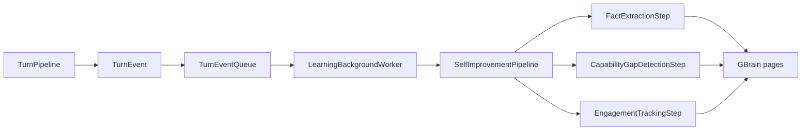

# Learning Pipeline
The learning pipeline is LeanKernel's asynchronous post-turn self-improvement path.
It watches completed turns after delivery, extracts durable signals from them, and writes those signals back into knowledge pages and engagement aggregates without extending user-visible latency.

This subsystem is fully decoupled from synchronous response delivery.

## Why learning exists
By the time a turn finishes, LeanKernel has one useful asset that Phase 1 and Phase 2 did not exploit directly: a complete, context-rich event describing what the user asked, what the assistant returned, and what context was admitted. Phase 3 turns that event into best-effort learning work instead of making the user wait for it inline.

## Runtime components
| Component | Responsibility |
| --- | --- |
| `TurnEventQueue` | Bounded `Channel<TurnEvent>` that implements `ITurnEventSink`. |
| `LearningBackgroundWorker` | Drains the queue in the background with bounded concurrency. |
| `SelfImprovementPipeline` | Runs enabled `ILearningStep` implementations in stable order. |
| `FactExtractionStep` | Uses LiteLLM to extract new facts worth remembering. |
| `CapabilityGapDetectionStep` | Detects repeated inability or refusal patterns deterministically. |
| `EngagementTrackingStep` | Updates lightweight aggregate engagement metrics and topic frequency. |

## Queue semantics
The queue is intentionally bounded and non-blocking.

| Behavior | Current implementation |
| --- | --- |
| Capacity | `LearningConfig.QueueCapacity` (default `100`) |
| Full behavior | `BoundedChannelFullMode.DropOldest` |
| Backpressure | never applied to the synchronous turn pipeline |
| Completion | queue stops accepting items on worker shutdown |

When the queue is full, LeanKernel drops the oldest buffered event, logs a warning, and accepts the new one. That is a deliberate trade-off: learning is best-effort, so delivery must win.

## Background worker behavior
`LearningBackgroundWorker` starts only when learning is enabled.

It:

- reads queued events until shutdown
- limits concurrent work with `MaxConcurrentLearningTasks`
- logs per-turn failures without throwing back into the request path
- tries to drain in-flight work during shutdown

The worker uses a 10-second drain timeout before abandoning buffered items, which keeps host shutdown bounded.

## Learning steps
`SelfImprovementPipeline` sorts steps by `Order` and then by `Name`, which makes execution deterministic even when multiple steps share the same registration lifetime.

| Order | Step | How it works |
| ---: | --- | --- |
| 10 | `FactExtractionStep` | Sends a small LiteLLM request asking for a JSON array of new facts, then writes each fact to a turn-scoped knowledge page. |
| 20 | `CapabilityGapDetectionStep` | Reuses routing refusal patterns plus built-in inability phrases, then aggregates repeated gaps into a shared knowledge page. |
| 30 | `EngagementTrackingStep` | Updates total turns, positive/negative signals, and topic frequency in a shared aggregate page. |

`FactExtractionStep` is the only LLM-based learning step. The others stay cheap and deterministic.

## Writes to GBrain
The learning subsystem reuses `IKnowledgeService`, so facts and aggregates land in the same knowledge storage model used elsewhere in LeanKernel.

Important consequences:

- extracted facts become normal knowledge pages
- repeated capability gaps can be aggregated over time
- engagement metrics stay inspectable instead of hidden in memory only

Shared aggregate pages use `KnowledgePageUpdateCoordinator` so concurrent background work does not overwrite itself.

## Relationship to the turn pipeline
`TurnPipeline` only publishes a `TurnEvent`. It does not wait for queueing, extraction, aggregation, or background completion before returning the assistant response.

That boundary is the feature's main design promise: learning can fail, lag, or drop work under pressure without delaying the user.

## Configuration
Learning lives under `LeanKernel:Learning`.

| Key | Default | Purpose |
| --- | --- | --- |
| `Enabled` | `true` | Turns the entire subsystem on or off. |
| `FactExtractionEnabled` | `true` | Registers the LLM-based fact extraction step. |
| `CapabilityGapDetectionEnabled` | `true` | Registers the deterministic capability-gap step. |
| `EngagementTrackingEnabled` | `true` | Registers the engagement metrics step. |
| `MaxConcurrentLearningTasks` | `2` | Limits concurrent background learning work. |
| `QueueCapacity` | `100` | Bounded queue size before drop-oldest behavior starts. |
| `ExtractionModel` | `gpt-4o-mini` | LiteLLM route for fact extraction. |
| `ExtractionTemperature` | `0.1` | Keeps fact extraction stable. |
| `MinTurnLengthForExtraction` | `50` | Skips very short turns before the LLM step runs. |

## How to think about the feature
The learning pipeline is a background observer. It learns from completed turns, but it is never allowed to hold the foreground turn hostage.

## Related documentation
- [Turn Pipeline](turn-pipeline.md)
- [Response Enhancement](response-enhancement.md)
- [Context Gating](context-gating.md)
- [Phase 3 Configuration](../configuration/phase-3-config.md)
