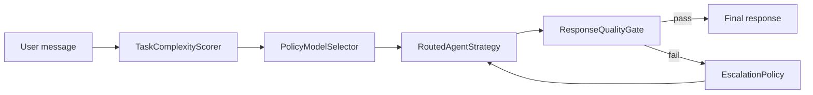

# Model Routing
Model routing is LeanKernel's Phase 3 answer to a simple problem: not every turn deserves the same model.
The runtime now scores each request, maps that score to a cost tier, and retries upward only when the first answer fails deterministic quality checks.

Routing is deliberately opt-in. When `LeanKernel:Routing:Enabled=false`, LeanKernel still uses the existing single-model `StaticAgentStrategy` path.

## Why routing exists
A single default model is easy to reason about, but it treats a one-line question and a multi-step tool-heavy request as the same workload. Phase 3 splits those cases so the runtime can stay cheaper on easy turns and more resilient on harder ones.



## Runtime components
| Component | Responsibility |
| --- | --- |
| `TaskComplexityScorer` | Produces a deterministic `0.0-1.0` complexity score from prompt length, tool pressure, history size, long-context signals, and multi-step markers. |
| `PolicyModelSelector` | Maps the score to `Economy`, `Standard`, or `Premium` and resolves the configured model name for that tier. |
| `RoutedAgentStrategy` | Replaces `StaticAgentStrategy` when routing is enabled and runs the full score → select → invoke → quality → escalate loop. |
| `EscalationPolicy` | Allows only forward movement through the tier ladder: `Economy → Standard → Premium`. |
| `AgentFactory` | Reuses LiteLLM-backed `IChatClient` instances for the selected model route. |
| `TurnPipeline` | Persists the final `RoutingDecision` and related diagnostics after the strategy finishes. |

## How complexity scoring works
`TaskComplexityScorer` only uses the current `AgentStrategyContext`, so the same turn and same config produce the same score.

It combines these signals:

- estimated tokens in the user message
- available tool count
- number of history turns
- long history or long system prompt
- multi-step indicators such as ordered lists or phrases like `first`, `then`, and `finally`

The current defaults come from `LeanKernel:Routing:Scoring`:

| Setting | Default | Effect |
| --- | --- | --- |
| `HighComplexityTokenThreshold` | `2000` | User message token estimate that immediately pushes the base score into premium territory. |
| `MediumComplexityTokenThreshold` | `500` | User message token estimate that moves the base score into the standard range. |
| `ToolUsageComplexityBoost` | `0.3` | Boost scaled by tool count. |
| `MultiTurnComplexityBoost` | `0.2` | Boost scaled by history length. |
| `LongContextComplexityBoost` | `0.2` | Split across long history and long system prompt signals. |

The scorer rounds the final result and caps it at `1.0`, then keeps a factor list such as `tooling:2` or `multi-step-instructions` for later diagnostics.

## Tier selection
`PolicyModelSelector` maps the score to `ModelTier` with fixed thresholds:

- score `< 0.3` → `Economy`
- score `0.3` to `0.7` → `Standard`
- score `> 0.7` → `Premium`

The tier-to-model mapping is configuration-driven, not hard-coded into the strategy:

| Tier | Gateway default model | Max tokens | Cost weight |
| --- | --- | ---: | ---: |
| `Economy` | `gpt-4o-mini` | `4096` | `0.3` |
| `Standard` | `gpt-4o` | `8192` | `1.0` |
| `Premium` | `claude-sonnet-4-20250514` | `16384` | `3.0` |

The decision is captured as a `RoutingDecision` with the selected tier, model name, score, human-readable reason, contributing factors, and escalation metadata when applicable.

## Escalation behavior
Routing does not stop at the first model call when the answer looks unusable.

`RoutedAgentStrategy` evaluates every attempt with `ResponseQualityGate`. If the gate fails, `EscalationPolicy` may produce a new `RoutingDecision` for the next tier.

Escalation stops when either condition is true:

- the current tier is already `Premium`
- `MaxEscalationAttempts` has been reached

That means routing is optimistic but bounded. LeanKernel tries to recover with a better model, but it does not loop indefinitely.

## Diagnostics and auditability
Every routed attempt logs structured diagnostics with:

- session id and turn id
- selected model and tier
- complexity score
- escalation attempt number
- check-by-check quality summary
- contributing factors and final reason

After execution, `TurnPipeline` records the final `RoutingDecision` through `DiagnosticsCollector.RecordModelRoutingAsync` and also publishes it in `TurnEvent.RoutingDecision`. Routing diagnostics therefore survive beyond logs.

## Configuration
Routing lives under `LeanKernel:Routing`.

| Key | Default | Why it matters |
| --- | --- | --- |
| `Enabled` | `false` | Keeps `StaticAgentStrategy` authoritative until operators opt in. |
| `MaxEscalationAttempts` | `2` | Caps quality-driven retries. |
| `Economy`, `Standard`, `Premium` | see table above | Bind the three tier definitions. |
| `Scoring:*` | see scoring table | Controls deterministic complexity scoring. |
| `QualityMinOutputLength` | `50` | Used by the quality gate after each routed attempt. |
| `QualityMinConstraintCoverage` | `0.6` | Used by the quality gate after each routed attempt. |

```json
{
  "LeanKernel": {
    "Routing": {
      "Enabled": false,
      "MaxEscalationAttempts": 2,
      "Economy": { "Model": "gpt-4o-mini" },
      "Standard": { "Model": "gpt-4o" },
      "Premium": { "Model": "claude-sonnet-4-20250514" }
    }
  }
}
```

## How to think about the feature
Model routing does not create a second turn pipeline. It swaps the strategy inside the existing pipeline so LeanKernel can make smarter model choices without changing persistence, context gating, response enhancement, or turn-event publication.

## Related documentation
- [Turn Pipeline](turn-pipeline.md)
- [Quality Gates](quality-gates.md)
- [Shadow Routing](shadow-routing.md)
- [Configuration reference](../configuration/configuration-reference.md)
