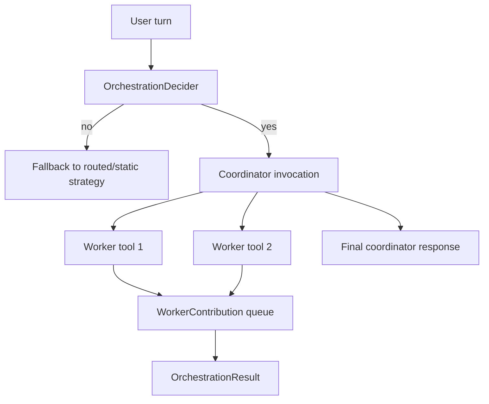

# Multi-Agent Orchestration
Multi-agent orchestration is LeanKernel's coordinator-worker path for tasks that are too complex, too decomposable, or too delegation-heavy for one agent call.
Instead of inventing a second runtime, Phase 3 adapts specialized workers into tools and lets a coordinator decide when to use them.

The feature remains disabled by default, so ordinary turns still use routed or static single-agent execution until operators opt in.

## Why orchestration exists
Some requests benefit from specialization: a retrieval-heavy subtask, a drafting pass, or a scoped worker that should only see a few tools. Coordinator-worker orchestration keeps that specialization explicit and auditable instead of burying it in one oversized system prompt.

## Runtime components
| Component | Responsibility |
| --- | --- |
| `OrchestratedAgentStrategy` | Entry point that decides between orchestration and fallback execution. |
| `OrchestrationDecider` | Heuristics for when to orchestrate instead of staying single-agent. |
| `WorkerAgent` | Scoped worker with its own model, prompt, tool allowlist, and timeout. |
| `WorkerAsToolAdapter` | Exposes a worker as an `AITool`/`AIFunction` with a required `task` argument. |
| `ToolGovernancePolicy` | Enforces which tools remain visible once worker allowlists are applied. |
| `OrchestrationResult` | Captures coordinator output, worker contributions, total duration, and invocation count. |

## When LeanKernel chooses orchestration
`OrchestrationDecider` uses deterministic heuristics rather than a separate planning model.

It turns orchestration on when any of these signals appear:

- explicit delegation markers such as `worker`, `specialist`, `parallel`, or `orchestrate`
- multi-step structure such as ordered lists or phrases like `first`, `then`, and `finally`
- complexity score `>= 0.55` from `TaskComplexityScorer`

If none of those conditions hold, `OrchestratedAgentStrategy` falls back to the existing routed or static strategy.

## Workers as scoped tools
Each `WorkerDefinition` provides:

- `Name`
- `Description`
- `Model`
- `SystemPrompt`
- `AllowedTools`
- `AllowedCategories`
- optional `Scope`

`WorkerAgent` turns that definition into a real worker invocation by building a new `AgentStrategyContext` with:

- the delegated task as `UserMessage`
- worker-specific system instructions
- no inherited history by default
- worker-visible tools resolved through `IToolRegistry.GetVisibleTools(...)`

That last step is where tool governance matters. A worker only sees tools that survive the `ToolVisibilityContext` filters, so specialization is enforced by the same governance layer used elsewhere in the runtime.

## Delegation mechanics
`WorkerAsToolAdapter` makes each worker callable by the coordinator model as an `AITool`/`AIFunction`.

The adapter:

- requires a single `task` string argument
- limits parallel worker calls with a shared `SemaphoreSlim`
- records every result into a concurrency-safe `ConcurrentQueue<WorkerContribution>`
- returns useful plain text back to the coordinator even on worker failure

That means the coordinator can reason in tool-call terms while the runtime still keeps a structured trace of which workers ran and what they contributed.

## Guardrails
Multi-agent execution includes several explicit safety bounds.

| Guardrail | Current behavior |
| --- | --- |
| `Enabled` flag | Entire feature stays off until configured on. |
| `MaxWorkerConcurrency` | Caps simultaneous worker calls in one orchestration run. |
| `MaxOrchestrationDepth` | Prevents uncontrolled recursion. |
| `WorkerTimeout` | Applies a linked cancellation timeout to each worker invocation. |
| empty worker list | Causes graceful fallback to routed/static execution. |

One important boundary is failure handling. If orchestration fails before any worker runs, LeanKernel falls back to single-agent execution. If it fails after worker execution has started, fallback is blocked to avoid duplicate side effects.

## Traceability
Successful orchestration populates `AgentStrategyContext.OrchestrationResult`, and `TurnPipeline` can then persist it through diagnostics and publish it on `TurnEvent`.

Each `WorkerContribution` records:

- worker name
- delegated task
- response text
- duration
- success flag
- optional error

## Configuration
Orchestration is configured under `LeanKernel:Orchestration`.

| Key | Default | Why it matters |
| --- | --- | --- |
| `Enabled` | `false` | Keeps single-agent execution as the default runtime shape. |
| `MaxWorkerConcurrency` | `3` | Limits coordinator fan-out. |
| `MaxOrchestrationDepth` | `2` | Stops recursive worker chains. |
| `WorkerTimeout` | `00:01:00` | Prevents hanging worker calls. |
| `Workers` | sample list in `appsettings.json` | Declares the available worker definitions. |

## How to think about the feature
Multi-agent orchestration is not a separate product surface. It is a strategy swap inside the same turn pipeline, just like model routing, but with one extra idea: specialized workers become tools that the coordinator can invoke deliberately.

## Related documentation
- [Model Routing](model-routing.md)
- [Tool Governance](tool-governance.md)
- [Turn Pipeline](turn-pipeline.md)
- [Phase 3 Configuration](../configuration/phase-3-config.md)
