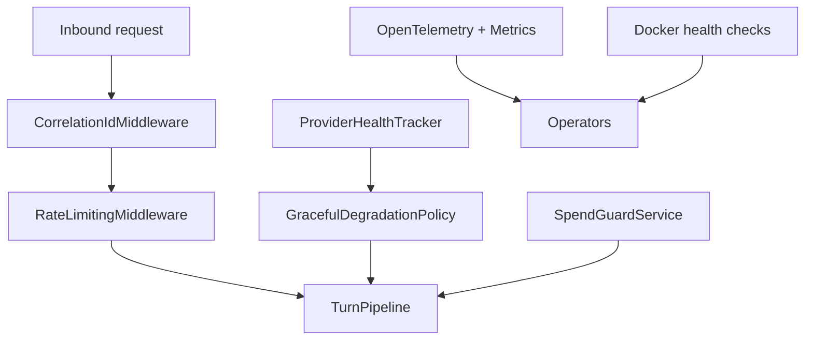

# Production Operations

> Canonical operations reference now lives at [`../operations/production-ops.md`](../operations/production-ops.md). This page is retained for compatibility links during docs migration.

Production operations is LeanKernel's Phase 3 hardening layer for running the runtime safely under real load.
It combines provider health tracking, spend controls, rate limiting, graceful degradation, request correlation, tracing, and container health checks into one operational story.

These features do not change what a turn means. They change how safely the runtime behaves when dependencies fail, traffic spikes, or observability needs increase.

## Why this layer exists
A reliable agent platform needs more than good prompts and routing rules. It also needs to know when providers are unhealthy, when spend is nearing limits, when requests should be rejected, and how to keep operators informed during degraded states.

## Runtime components
| Component | Responsibility |
| --- | --- |
| `ProviderHealthTracker` | Tracks health state for `database`, `litellm`, and `gbrain` using configurable success/failure thresholds. |
| `SpendGuardService` | Estimates request cost by model tier and returns `Allow`, `Warn`, or `Block`. |
| `RateLimitingMiddleware` | Enforces per-minute, per-hour, and concurrent-request limits per caller. |
| `GracefulDegradationPolicy` | Converts provider-health state into non-throwing runtime decisions. |
| `CorrelationIdMiddleware` | Ensures every request carries an `X-Correlation-Id` for logs, metrics, and downstream HTTP calls. |
| `LeanKernelMetrics` | Publishes request, spend, provider-health, quality, escalation, and rate-limit metrics. |

## Provider health and degraded behavior
`ProviderHealthTracker` runs probes in the background and also accepts runtime observations from `TurnPipeline` when a model call succeeds or fails.

Health state then feeds two surfaces:

- `/api/health` and ASP.NET Core health checks
- `GracefulDegradationPolicy`

The current degradation rules are intentionally explicit:

| Provider state | Runtime behavior |
| --- | --- |
| LiteLLM unhealthy | Skip model execution and return a clear user-facing unavailable message. |
| GBrain unhealthy | Continue without live retrieval and append a warning. |
| database unhealthy | Continue in degraded persistence mode and append a warning. |

The policy never throws. It returns a `GracefulDegradationDecision` that the turn pipeline can apply safely.

## Spend guard and request admission
`SpendGuardService` is node-local and disabled by default.

It estimates cost from:

- projected model tier
- estimated input tokens
- estimated output tokens

The result is a `SpendGuardDecision` with projected session, daily, and monthly totals plus one of three actions:

- `Allow`
- `Warn`
- `Block`

Warnings are appended to the final response. Blocks short-circuit model execution with a clear reason instead of throwing.

## Rate limiting
`RateLimitingMiddleware` enforces sliding-window limits and a concurrent-request cap.

Partitioning is:

1. `X-Api-Key` when present
2. remote IP address otherwise
3. `anonymous` as a final fallback

Health endpoints are exempt so operational checks do not rate-limit themselves. Rejections return HTTP `429 Too Many Requests` and increment `leankernel.ratelimit.rejected`.

## Correlation and tracing
`CorrelationIdMiddleware` reads `X-Correlation-Id` or creates one, stores it on the response, and enriches the log scope. A delegating handler then forwards the same id on outbound HTTP requests.

OpenTelemetry wiring in `Program.cs` is opt-in:

- traces for ASP.NET Core, HTTP clients, and LeanKernel activity sources
- metrics from the `LeanKernel` meter
- logs through OpenTelemetry logging exporters
- OTLP export when `OpenTelemetry:Otlp:Endpoint` is configured

If neither console export nor an OTLP endpoint is configured, exporter registration is skipped.

## Operational endpoints and container health
The main health surfaces are:

- `GET /api/health` for JSON gateway and provider status
- `/healthz` for ASP.NET Core health checks

The Docker Compose stack wires health checks for:

- Postgres via `pg_isready`
- LiteLLM via `/health`
- GBrain via `/health`
- LeanKernel engine via `/api/health`

That gives both application-level and container-level signals from the same hardening work.

## Configuration
Most hardening settings live under `LeanKernel:Hardening`.

| Section | Key defaults |
| --- | --- |
| `SpendGuard` | `Enabled=false`, daily `$10`, session `$2`, monthly `$100`, warning at `80%` |
| `RateLimit` | `Enabled=true`, `30` requests/minute, `300` requests/hour, `5` concurrent |
| `HealthTracking` | probe every `30` seconds, unhealthy after `3` failures, healthy after `2` successes |
| `Resilience` | shared retry/timeout settings used by probes and resilient clients |

OpenTelemetry export uses top-level `OpenTelemetry:*` keys rather than `LeanKernel:Hardening:*`.

## How to think about the feature
Production operations is the runtime's safety net. It does not make turns smarter; it makes the system more predictable when the environment stops being ideal.

## Related documentation
- [Diagnostics](diagnostics.md)
- [Gateway API](gateway-api.md)
- [Scheduler](scheduler.md)
- [Phase 3 Configuration](../configuration/phase-3-config.md)
