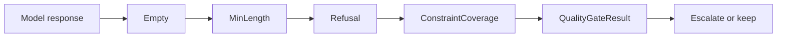

# Quality Gates
Quality gates are LeanKernel's deterministic answer to the question "was this response good enough to keep?"
Instead of asking another model to judge the first model, Phase 3 runs a small fixed set of synchronous checks and records the result as structured diagnostics.

Quality gates are designed to influence routing, not to block delivery. LeanKernel always returns the best response it has, even if every routed attempt fails the gate.

## Why quality gates exist
Routed execution only helps if the runtime knows when the first answer was clearly weak. Empty output, one-line non-answers, refusal boilerplate, and responses that ignore the user's constraints are all cases where an escalation can be justified without another probabilistic model call.



## Check order
`ResponseQualityGate` always evaluates the same four checks in the same order.

| Order | Check | What it looks for | Failure outcome |
| ---: | --- | --- | --- |
| 0 | `EmptyResponseCheck` | Empty or whitespace-only output | `FailedEmpty` |
| 1 | `MinLengthCheck` | Response shorter than `QualityMinOutputLength` | `FailedTooShort` |
| 2 | `RefusalDetectionCheck` | Configured refusal phrases matched by case-insensitive string comparison | `FailedRefusal` |
| 3 | `ConstraintCoverageCheck` | Too few prompt constraints reflected back in the answer | `FailedLowCoverage` |

Every check returns a `QualityCheckResult` with:

- `Passed`
- `Score`
- `Details`

`QualityGateResult.OverallScore` is the average of those per-check scores.

## First failure wins
The gate evaluates all checks, but the first failing check decides the final `QualityOutcome` and `FailureReason`.

In practice the current gate emits one of these outcomes:

- `Passed`
- `FailedEmpty`
- `FailedTooShort`
- `FailedRefusal`
- `FailedLowCoverage`

The enum also contains `Escalated`, but escalation is currently modeled by `RoutingDecision` and `EscalationPolicy`, not by the gate itself.

## Refusal detection is heuristic, not model-based
`RefusalDetectionCheck` is intentionally simple. It loads `LeanKernel:Routing:RefusalPatterns`, normalizes them, and looks for direct string matches in the response.

That means the check is:

- fast enough to run on every routed attempt
- deterministic for the same response text
- easy to tune through configuration

It also means the gate does not inspect provider-native safety metadata or ask another LLM whether the refusal was justified.

## Constraint coverage
`ConstraintCoverageCheck` tries to answer: did the response cover the important terms from the request?

If explicit `ExpectedConstraints` are not supplied, it derives up to eight normalized terms from the user message, removes stable stop words, and then checks whether those terms or phrases appear in the normalized response.

This is a lightweight heuristic, not semantic understanding. It works well for deterministic escalation triggers precisely because it stays simple.

## Relationship to routing
`RoutedAgentStrategy` runs the quality gate after every model invocation.

```text
invoke model -> evaluate quality -> pass = keep response
                               -> fail = try next tier if allowed
                               -> no next tier = return current response anyway
```

That makes quality gates advisory but operationally important:

- they can trigger escalation when routing is enabled
- they never suppress delivery on their own
- they still produce diagnostics even when no escalation is possible

## Diagnostics
`TurnPipeline` records the final `QualityGateResult` through `DiagnosticsCollector.RecordQualityGateAsync` when the active strategy returns quality metadata.

The runtime also logs per-attempt summaries with:

- selected model and tier
- `QualityOutcome`
- overall quality score
- each check's pass/fail state and score
- final failure reason

## Configuration
Quality-gate thresholds live in `LeanKernel:Routing` because routed execution is the feature that consumes them.

| Key | Default | Role |
| --- | --- | --- |
| `QualityMinOutputLength` | `50` | Minimum response length before `MinLengthCheck` fails. |
| `QualityMinConstraintCoverage` | `0.6` | Minimum ratio required by `ConstraintCoverageCheck`. |
| `RefusalPatterns` | built-in list | Case-insensitive phrases matched by `RefusalDetectionCheck`. |

```json
{
  "LeanKernel": {
    "Routing": {
      "QualityMinOutputLength": 50,
      "QualityMinConstraintCoverage": 0.6,
      "RefusalPatterns": [
        "I cannot",
        "I'm sorry, I can't"
      ]
    }
  }
}
```

## How to think about the feature
Quality gates are a deterministic policy layer, not a second model. They exist so LeanKernel can make a bounded, explainable decision about whether to keep the current answer or spend more on the next tier.

## Related documentation
- [Model Routing](model-routing.md)
- [Shadow Routing](shadow-routing.md)
- [Turn Pipeline](turn-pipeline.md)
- [Configuration reference](../configuration/configuration-reference.md)
