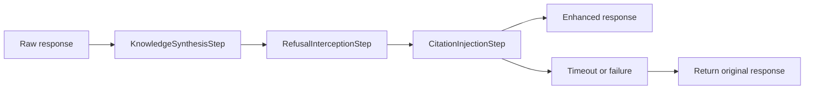

# Response Enhancement
Response enhancement is LeanKernel's synchronous post-generation pipeline for polishing an answer before it is persisted and returned.
It runs after model invocation but before assistant-turn persistence, which makes it part of delivery quality rather than part of background learning.

The enhancement pipeline is optional and bounded. If it times out or fails, LeanKernel falls back to the original response.

## Why enhancement exists
Model routing and quality gates decide which response to keep, but some improvements are cheaper to apply after generation than to encode into the model prompt every time. Phase 3 uses a deterministic enhancement pipeline for those small, inspectable adjustments.



## Runtime components
| Component | Responsibility |
| --- | --- |
| `ResponseEnhancementPipeline` | Orders steps, enforces the pipeline-wide timeout, and returns `EnhancementResult`. |
| `KnowledgeSynthesisStep` | Appends a compact `Sources:` note when retrieved knowledge clearly overlaps with the answer. |
| `RefusalInterceptionStep` | Adds a retry-oriented note when a benign request received a refusal-like answer. |
| `CitationInjectionStep` | Injects inline `[source: page-key]` markers into clearly supported sentences. |
| `EnhancementResult` | Captures original response, final response, per-step results, and total duration. |

## Step order
The pipeline runs steps in ascending `Order`.

| Order | Step | Default |
| ---: | --- | --- |
| 10 | `KnowledgeSynthesisStep` | enabled |
| 20 | `RefusalInterceptionStep` | enabled |
| 30 | `CitationInjectionStep` | disabled |

Every step receives the response-in-progress plus the originating user message, optional session id, and retrieved knowledge from the gated context.

## Timeout and fallback behavior
`ResponseEnhancementPipeline` applies a single timeout budget to the full pipeline, not to each step independently.

If any step:

- throws an exception, or
- runs past `MaxEnhancementTimeMs`

the pipeline returns the original unenhanced response and records the partial step outcomes in `EnhancementResult`.

That rollback behavior matters. LeanKernel does not leak partially enhanced text after a failed pipeline run.

## Step semantics
The current steps are intentionally lightweight and side-effect-free.

- `KnowledgeSynthesisStep` only adds a `Sources:` note when relevant retrieved candidates overlap the response and no sources note already exists.
- `RefusalInterceptionStep` reuses routing refusal patterns and only softens the response when the user message appears benign.
- `CitationInjectionStep` only injects inline markers when sentence-level overlap with retrieved knowledge is strong enough and no citation is already present.

Because the steps avoid persistence, external API calls, or hidden state, they stay deterministic and idempotent for the same input.

## Relationship to the turn pipeline
`TurnPipeline` still keeps identity writeback separate from response enhancement.

The current order is:

1. run the selected strategy
2. optionally run `IdentityUpdateProjector` as a best-effort hook
3. build `EnhancementStepInput`
4. run `IResponseEnhancer`
5. persist the assistant turn and publish `TurnEvent`

That separation preserves Phase 2 identity behavior while making enhancement traceable as its own Phase 3 subsystem.

## Diagnostics
When an enhancement pipeline runs successfully enough to produce an `EnhancementResult`, `TurnPipeline` records it through `DiagnosticsCollector.RecordResponseEnhancementAsync`.

The result captures:

- original response
- enhanced response
- whether the final response changed
- per-step `Applied`, `Modified`, `Reason`, and duration values
- total enhancement duration

## Configuration
Enhancement lives under `LeanKernel:Enhancement`.

| Key | Default | Purpose |
| --- | --- | --- |
| `Enabled` | `true` | Enables the pipeline itself. |
| `KnowledgeSynthesisEnabled` | `true` | Registers `KnowledgeSynthesisStep`. |
| `RefusalInterceptionEnabled` | `true` | Registers `RefusalInterceptionStep`. |
| `CitationInjectionEnabled` | `false` | Registers `CitationInjectionStep`. |
| `MaxEnhancementTimeMs` | `5000` | Pipeline-wide timeout budget in milliseconds. |

```json
{
  "LeanKernel": {
    "Enhancement": {
      "Enabled": true,
      "KnowledgeSynthesisEnabled": true,
      "RefusalInterceptionEnabled": true,
      "CitationInjectionEnabled": false,
      "MaxEnhancementTimeMs": 5000
    }
  }
}
```

## How to think about the feature
Response enhancement is a last-mile improvement layer. It does not replace routing, quality gates, or learning; it simply gives LeanKernel one bounded chance to make a kept answer clearer and more traceable before delivery.

## Related documentation
- [Turn Pipeline](turn-pipeline.md)
- [Quality Gates](quality-gates.md)
- [Learning Pipeline](learning-pipeline.md)
- [Phase 3 Configuration](../configuration/phase-3-config.md)
