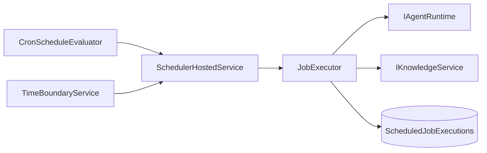

# Scheduler
The scheduler is LeanKernel's Phase 3 runtime for cron-driven jobs and proactive work.
It evaluates due jobs on a background tick, executes them through the same service boundaries used by user traffic, and persists every execution for auditability.

The feature is disabled by default and ships as infrastructure for proactive behavior, not as a separate agent runtime.

## Why the scheduler exists
User-triggered turns are only one kind of agent work. Phase 3 adds scheduled prompts, knowledge refreshes, and maintenance tasks so the platform can do useful work on a clock without creating a second execution path.

## Runtime components
| Component | Responsibility |
| --- | --- |
| `SchedulerHostedService` | Runs the scheduler loop, evaluates enabled jobs, and enforces concurrency limits. |
| `CronScheduleEvaluator` | Parses cron expressions with Cronos and decides whether a job is due. |
| `TimeBoundaryService` | Resolves timezone-aware `Morning`, `Afternoon`, `Evening`, and `Night` boundaries. |
| `JobExecutor` | Executes one scheduled occurrence and persists the result. |
| `ScheduledJobExecution` | Structured record of one attempted job run. |

## Job types
The current scheduler supports three job types.

| Job type | What it does |
| --- | --- |
| `agent-prompt` | Builds a `LeanKernelMessage` and runs it through `IAgentRuntime.RunTurnAsync`, just like a user turn. |
| `knowledge-refresh` | Rehydrates one page by key or searches and rewrites matching knowledge pages. |
| `maintenance` | Runs housekeeping tasks including persistence cleanup and knowledge fact defragmentation/retirement with 5W1H normalization. |

The `knowledge-fact-defrag` maintenance task defaults to `normalization_mode=hybrid` with `normalization_context_mode=related-pages`: deterministic normalization first, then bounded LLM-assisted repair for partial pages using deterministic related-page evidence (links, same-session pages, semantic neighbors). Missing 5W1H fields are marked as partial (not silently defaulted).

The important pattern is consistency: `agent-prompt` jobs do not bypass the main agent runtime.

## Tick and due-check behavior
`SchedulerHostedService` wakes up every `TickIntervalSeconds`, walks the enabled jobs, and asks `CronScheduleEvaluator` whether each job is due.

Due calculation uses two sources:

- in-memory last-scheduled tracking to avoid double-firing in one process lifetime
- persisted execution history from Postgres so a restart does not replay the same occurrence

This makes the scheduler lightweight but still restart-aware.

## Time-of-day awareness
`TimeBoundaryService` classifies the current local time as:

- `Night` before 06:00 and after 22:00
- `Morning` from 06:00 to 11:59
- `Afternoon` from 12:00 to 17:59
- `Evening` from 18:00 to 21:59

Jobs can then use `timezone`, `required_boundary`, or `time_boundary` parameters to say "only run this prompt in the local morning" without encoding that logic into the prompt itself.

## Concurrency and shutdown
The scheduler is intentionally bounded.

| Guardrail | Current behavior |
| --- | --- |
| `Enabled` | Entire hosted service remains off until configured on. |
| `MaxConcurrentJobs` | Shared `SemaphoreSlim` limit for in-flight job execution. |
| per-job scope | Each execution gets its own DI scope. |
| shutdown | Stops accepting new work, then waits for active jobs to finish. |

That keeps proactive work from turning into unbounded contention with normal traffic.

## Audit trail
Every attempted execution is written to the `ScheduledJobExecutions` table with:

- job name
- scheduled time
- start and completion timestamps
- success flag
- result text
- error text when applicable

The persisted audit trail is what makes the scheduler operationally explainable instead of "fire and forget."

## Configuration
Scheduler configuration lives under `LeanKernel:Scheduler`.

| Key | Default | Purpose |
| --- | --- | --- |
| `Enabled` | `false` | Enables the hosted scheduler loop. |
| `TickIntervalSeconds` | `60` | Polling interval for due-job evaluation. |
| `MaxConcurrentJobs` | `2` | Limits simultaneous job execution. |
| `DefaultTimezone` | `UTC` | Fallback timezone for cron and boundary evaluation. |
| `Jobs` | sample list in `appsettings.json` | Declares scheduled job definitions. |

Each job definition includes `Name`, `CronExpression`, `JobType`, `Prompt`, `ChannelId`, `UserId`, `Enabled`, and free-form `Parameters`.

## How to think about the feature
The scheduler is LeanKernel's proactive entry point. It does not replace chat turns; it creates time-based turns and maintenance work that still flow through the same runtime contracts.

## Related documentation
- [Turn Pipeline](turn-pipeline.md)
- [Channels](channels.md)
- [Production Operations](production-ops.md)
- [Phase 3 Configuration](../configuration/phase-3-config.md)
