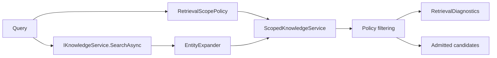

# Scoped Retrieval
Scoped retrieval adds policy enforcement and entity-aware expansion to LeanKernel knowledge search. Instead of treating every retrieval request as globally visible, Phase 2 resolves an explicit scope, filters candidates against that scope, boosts candidates connected to discovered entities, and records diagnostics for every candidate considered.

This work extends the broader [Knowledge Retrieval](knowledge-retrieval.md) story without changing the underlying `IKnowledgeService` transport contract.
## Why it exists
Raw retrieval is good at finding possibly relevant material. It is not enough when the runtime needs to:

- avoid leaking identity or private namespaces into a general turn
- apply deterministic minimum-score rules by scope
- pull in nearby related entities without unbounded traversal
- explain why a candidate was admitted or rejected

Phase 2 keeps those responsibilities in `LeanKernel.Context`, not in the GBrain client.

## Runtime components
| Component | Responsibility |
| --- | --- |
| `RetrievalScopePolicy` | Resolves the effective scope name and matching `ScopePolicyDefinition`. |
| `ScopedKnowledgeService` | Applies scope rules, score thresholds, entity boost logic, sorting, and diagnostics. |
| `EntityExpander` | Discovers related entities and linked pages within configured depth and result limits. |
| `ContextCandidateRetriever` | Switches between scoped retrieval and raw `IKnowledgeService.SearchAsync` based on config. |
| `RetrievalDiagnostics` | Captures totals and per-candidate decisions for the retrieval operation. |
## Scope policy resolution
`RetrievalScopePolicy` uses request metadata first and configuration second.
The precedence order is deterministic:

1. `retrieval_scope`
2. `task_scope`
3. `agent_scope`
4. `DefaultScope`

A requested scope is then matched against `ScopePolicies` by name.

Two nuances matter:

- if the requested policy is missing but the configured default policy exists, the policy resolver falls back to the default policy
- if no default policy can be resolved, `ScopedKnowledgeService` returns no admitted candidates and records `unknown_scope` in diagnostics instead of widening retrieval silently
## Filtering logic
After the base search and expansion pass, `ScopedKnowledgeService` evaluates every candidate against the effective policy.

| Check | What it does |
| --- | --- |
| Namespace include | If `IncludeNamespaces` is non-empty, only those namespaces are eligible. |
| Namespace exclude | Matching excluded namespaces are rejected even if the score is high. |
| Required metadata | Every key in `RequiredMetadataKeys` must be present. |
| Minimum score | The final score must meet `max(MinScopeRelevanceScore, policy.MinScore)`. |

Namespace resolution prefers `candidate.Metadata["namespace"]`. If that metadata is missing, the service falls back to the prefix before `/` or `:` in the candidate key.

Admitted candidates are sorted deterministically:

1. adjusted score descending
2. source ascending
3. key ascending
## Entity expansion and score boosting
`EntityExpander` performs two bounded discovery passes.
### 1. Seed extraction
It extracts entity terms from:

- non-trivial query tokens
- `subject` metadata on top candidates
- the last segment of candidate keys such as `projects/atlas -> atlas`
### 2. Expansion
It then:

- searches GBrain for those terms, capped by `MaxEntityExpansionResults`
- walks linked pages from seed candidates, capped by `Context:EntityExpansionDepth`
- deduplicates discovered candidates, entities, and visited page keys

Candidates that match discovered entities or boosted keys receive the configured multiplier.
```text
adjusted score = original score × EntityBoostMultiplier
```
The original backend score is preserved in diagnostics even when the adjusted score is higher.
## Retrieval diagnostics
Phase 2 records a decision for every candidate considered, not just admitted ones.
`RetrievalDiagnostics` includes:

- `EffectiveScope`
- `TotalConsidered`
- `TotalAdmitted`
- `TotalExcludedByScope`
- `TotalExcludedByScore`
- `ExpandedEntities`
- one `RetrievalCandidateDecision` per candidate

Each decision records:

- candidate key and source
- original score
- adjusted score
- admitted or rejected status
- exclusion reason such as `out_of_scope_namespace`, `missing_metadata:kind`, `low_score`, or `unknown_scope`

`ScopedKnowledgeService` creates the diagnostics object with placeholder `SessionId` and `TurnId`. `ContextCandidateRetriever` fills those values from the current session and optional message metadata.
## Configuration
Scoped retrieval is configured under `LeanKernel:Retrieval`, with expansion depth still living under `LeanKernel:Context`.

| Key | Default | Purpose |
| --- | --- | --- |
| `ScopingEnabled` | `true` | Switches `ContextCandidateRetriever` to `IScopedKnowledgeService`. |
| `DefaultScope` | `global` | Scope used when request metadata is missing. |
| `MaxEntityExpansionResults` | `5` | Upper bound on related candidates discovered during expansion. |
| `EntityBoostMultiplier` | `1.5` | Multiplier applied to entity-matching candidates. |
| `MinScopeRelevanceScore` | `0.3` | Global score floor applied after scope adjustments. |
| `EmitRetrievalDiagnostics` | `true` | Includes per-candidate decisions and expanded entities. |
| `ScopePolicies` | empty | Named include/exclude and metadata rules. |
| `Context:EntityExpansionDepth` | `2` | Maximum linked-page traversal depth for expansion. |
```json
{
  "LeanKernel": {
    "Retrieval": {
      "ScopingEnabled": true,
      "DefaultScope": "global",
      "EntityBoostMultiplier": 1.5,
      "ScopePolicies": [
        {
          "Name": "global",
          "ExcludeNamespaces": ["identity"]
        }
      ]
    }
  }
}
```
## How to think about the feature
Scoped retrieval is not a second retrieval engine. It is a policy-and-diagnostics layer around the same knowledge service:

- resolve the scope explicitly
- search broadly enough to find candidates
- shrink the candidate set deterministically
- boost related entities within strict bounds
- explain every keep-or-drop decision

That is what makes Phase 2 retrieval inspectable instead of implicit.
## Related documentation
- [Knowledge Retrieval](knowledge-retrieval.md)
- [Context Gating](context-gating.md)
- [Context Diagnostics API](context-diagnostics-api.md)
- [Phase 2 Configuration](../configuration/phase-2-config.md)
