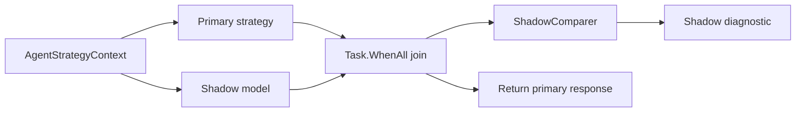

# Shadow Routing
Shadow routing lets LeanKernel compare a second model against live traffic without changing what the user sees.
The feature wraps the authoritative strategy, runs a shadow invocation in parallel, records comparison data, and still returns only the primary response.

This is evaluation infrastructure, not a fallback path.

## Why shadow routing exists
Routing policies are easier to tune when operators can observe what an alternate model would have done on the same turn. Shadow routing provides that comparison without exposing experimental behavior to users and without rewriting the main turn pipeline.



## Runtime components
| Component | Responsibility |
| --- | --- |
| `ShadowRoutingStrategy` | Decorator around the authoritative `IAgentStrategy`. |
| `AgentFactory` | Creates the `IChatClient` for the configured shadow model. |
| `ShadowComparer` | Produces deterministic comparison metrics from the primary and shadow response text. |
| `IDiagnosticsSink` | Persists the resulting `ShadowRoutingResult` when diagnostics are available. |

## Authoritative behavior
The primary strategy still owns the turn.

- if routing is disabled, the inner strategy can be `StaticAgentStrategy`
- if routing is enabled, the inner strategy can be `RoutedAgentStrategy`
- if orchestration is enabled, the inner strategy can be `OrchestratedAgentStrategy`

`ShadowRoutingStrategy.Name` simply forwards the inner strategy name, which is another signal that shadow routing is not treated as a separate execution mode.

## Parallel execution
When `ShadowRoutingEnabled=true` and `ShadowModel` is non-empty, the decorator:

1. starts the primary invocation through `_inner.InvokeAsync(...)`
2. builds the same message and options shape for the shadow call
3. invokes the configured shadow model through `AgentFactory.GetChatClientForModel(...)`
4. waits for both tasks with `Task.WhenAll`
5. compares the results and records a diagnostic entry

The shadow response is never substituted in later. Even a clearly better shadow answer remains observational data only.

## Comparison metrics
`ShadowComparer` currently keeps the comparison intentionally small and deterministic.

| Metric | Meaning |
| --- | --- |
| `LengthRatio` | Shadow response length divided by primary response length. |
| `BothNonEmpty` | Whether both responses contain non-whitespace content. |
| `PrimaryRefusal` | Whether the primary response matches configured refusal patterns. |
| `ShadowRefusal` | Whether the shadow response matches configured refusal patterns. |
| `Notes` | Highlights notable differences such as "shadow significantly longer" or refusal mismatches. |

Refusal detection reuses the same pattern list used by routed quality checks, so comparison logic stays aligned with production routing rules.

## Failure isolation
Shadow routing is explicitly best-effort.

- if the shadow call throws, the failure is logged and turned into a comparison note
- if diagnostics persistence throws, the failure is logged and suppressed
- if the shared cancellation token is cancelled, the primary path still governs turn cancellation

That isolation is the most important design rule: shadow evaluation must never become the reason a user-facing turn fails.

## Diagnostics
Successful or failed shadow comparisons are stored as a `ShadowRoutingResult` with:

- primary and shadow model names
- primary and shadow responses
- latencies
- best-effort token counts
- derived `ShadowComparison` metadata

The diagnostic category is `Shadow`, which makes it easy to separate this telemetry from ordinary routing and quality records.

## Configuration
Shadow routing uses two keys inside `LeanKernel:Routing`.

| Key | Default | Purpose |
| --- | --- | --- |
| `ShadowRoutingEnabled` | `false` | Enables the decorator around the authoritative strategy. |
| `ShadowModel` | empty | The LiteLLM model route used for the non-authoritative comparison call. |

```json
{
  "LeanKernel": {
    "Routing": {
      "ShadowRoutingEnabled": false,
      "ShadowModel": ""
    }
  }
}
```

## How to think about the feature
Shadow routing is a calibration tool. It helps operators learn whether the current routing policy under-selects or over-selects model tiers, but it never changes the answer that the runtime returns.

## Related documentation
- [Model Routing](model-routing.md)
- [Quality Gates](quality-gates.md)
- [Diagnostics](diagnostics.md)
- [Configuration reference](../configuration/configuration-reference.md)
