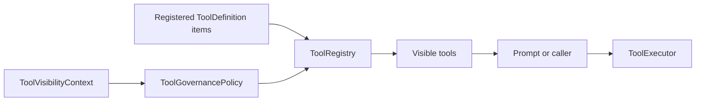

# Tool Governance
Tool governance controls which tools are visible to the agent for a given turn. In Phase 1, this is a visibility problem before it is an execution problem: the runtime first decides which tools are exposed, and only then can any caller execute one by name.
LeanKernel keeps governance simple and explicit. The system does not rely on hidden per-tool checks during execution. Instead, it resolves a visible tool set up front and passes that smaller surface into the turn flow.
## Core components
| Component | Responsibility |
| --- | --- |
| `ToolGovernancePolicy` | Applies visibility rules for one `ToolVisibilityContext`. |
| `ToolRegistry` | Stores tool definitions and returns the visible subset. |
| `ToolExecutor` | Executes a resolved tool handler by name and arguments. |
| Built-in tools | Provide default wiki, internet, filesystem, data, and optional browser tool surfaces. |

## Governance versus execution
A governance policy answers, "Which tools should this caller be able to see?" An executor answers, "What happens when a caller invokes this tool?"
Phase 1 keeps those concerns separate:
- `ToolRegistry` plus `ToolGovernancePolicy` determine visibility
- `ToolExecutor` runs the selected handler and converts failures into `ToolResult`
The executor does **not** perform a second governance pass. If a deployment needs stricter enforcement, callers should execute only tools that were made visible through the registry path.
## How tools are registered
`AddLeanKernelTools` registers:
- a singleton `ToolGovernancePolicy`
- a singleton `IToolRegistry`
- a singleton `IToolExecutor`
The built-in registry is created in `AddLeanKernelTools` and currently includes:
- `knowledge`: `wiki_search`, `wiki_read`, `wiki_write`
- `internet`: `web_search`, `web_fetch`, `http_request`
- `filesystem`: `directory_create`, `directory_list`, `extract_text`, `file_read`, `file_write`, `file_edit`, `file_copy`, `file_move`, `file_delete`, `file_search`, `file_stat`, `file_touch`, `file_chmod`
- `data`: `json_transform`, `csv_xlsx_read_write`, `database_query`
- `browser` when `LeanKernel:BrowserService:Enabled=true`: `browser_run_task`, `browser_get_run`, `browser_get_artifact`, `browser_cancel_run`
The underlying `ToolRegistry` accepts `IEnumerable<ToolDefinition>`, so the runtime can be extended with more tool definitions without changing the policy class itself.
## Visibility rules
`ToolGovernancePolicy` uses three rules.
| Rule | Effect |
| --- | --- |
| `AllowedToolNames` has values | Only those exact tool names are visible. |
| Otherwise `AllowedCategories` has values | Only tools in those categories are visible. |
| Otherwise | All registered tools are visible. |
Explicit tool-name allow lists take precedence over category filters.
### Open by default
If neither allow list is set, Phase 1 leaves all registered tools visible. That open-default behavior is intentional at this stage because the built-in tool set is small and well understood.
### Case-insensitive matching
Tool lookup and visibility matching are case-insensitive. The registry stores tools in a `StringComparer.OrdinalIgnoreCase` dictionary, and the policy checks names and categories with the same intent.
## Visibility context
The policy evaluates one `ToolVisibilityContext` at a time.
| Property | Purpose |
| --- | --- |
| `AgentRole` | Future-facing role hint for governance decisions. |
| `UserId` | Caller identity passed from the turn pipeline. |
| `AllowedCategories` | Optional category allow list. |
| `AllowedToolNames` | Optional exact-name allow list. |
In the current `TurnPipeline`, the runtime passes only `UserId`, so the default open-visibility path is used unless a caller builds a narrower context elsewhere.
## Built-in tools
The current runtime ships with multi-category built-ins by default.
| Tool | Category | What it does |
| --- | --- | --- |
| `wiki_search` | `knowledge` | Searches the knowledge wiki through `IKnowledgeService.SearchAsync`. |
| `wiki_read` | `knowledge` | Reads a specific page through `IKnowledgeService.GetPageAsync`. |
| `wiki_write` | `knowledge` | Creates or updates a page through `IKnowledgeService.PutPageAsync`. |
| `web_search` | `internet` | Runs web search and returns summarized results. |
| `web_fetch` | `internet` | Fetches URL content with SSRF checks and bounded extraction. |
| `http_request` | `internet` | Executes bounded HTTP requests with optional headers/query/body. |
| `extract_text` | `filesystem` | Extracts text from local files, including OCR-supported formats. |
| `json_transform` | `data` | Applies deterministic JSON select/project/filter/sort/slice/flatten transforms. |
| `csv_xlsx_read_write` | `data` | Reads and writes CSV/XLSX files within allowed filesystem root. |
| `database_query` | `data` | Executes read-only, parameterized SQL against configured named connections. |
| `browser_run_task` | `browser` | Submits an asynchronous Webwright browser task when browser automation is enabled. |
| `browser_get_run` | `browser` | Polls browser task status and artifact manifest. |
| `browser_get_artifact` | `browser` | Fetches a manifest-listed browser artifact as base64. |
| `browser_cancel_run` | `browser` | Requests idempotent cancellation of a browser task. |
These tools resolve `IKnowledgeService` through `IServiceScopeFactory` during execution. That avoids holding a transient knowledge service instance for the full process lifetime.
## How the turn pipeline uses governance
`TurnPipeline` asks the registry for visible tools using a `ToolVisibilityContext` that includes the sender id:
```csharp
_toolRegistry.GetVisibleTools(new ToolVisibilityContext
{
    UserId = message.SenderId
});
```
The returned tool names are merged into the `ConversationContext` and surfaced in the assembled system message. Tool governance therefore already affects the model through visibility and prompt shaping, even before model-native tool invocation is implemented.
## Execution behavior
`ToolExecutor` is intentionally small. It:
1. looks up a tool by name
2. returns a failed `ToolResult` when the tool does not exist
3. returns a failed `ToolResult` when the tool has no handler
4. executes the handler when present
5. converts unexpected exceptions into failed `ToolResult` values
It preserves `OperationCanceledException`, which allows cancellation to flow correctly.
## What Phase 1 does not do yet
Tool governance is not a full authorization system. It does not currently:
- persist per-user tool policies
- audit every allowed or denied execution attempt
- inject approval workflows
- bind directly to configuration models
- enforce a second execution-time allow-list check inside `ToolExecutor`
That narrower design keeps the initial runtime simple while still making tool exposure explicit.
## Extensibility
The design scales by adding more `ToolDefinition` instances rather than rewriting the policy engine. Typical extension points are:
- add more built-in or custom tool definitions to the registry
- set `Category` consistently on new tools
- provide narrower `ToolVisibilityContext` values from a caller or higher-level runtime path
- replace or extend the policy if a later phase needs richer rules
## Related documentation
- [Knowledge Retrieval](knowledge-retrieval.md)
- [Turn Pipeline](turn-pipeline.md)
- [Context Gating](context-gating.md)
- [Phase 1 Configuration](../configuration/phase-1-config.md)
