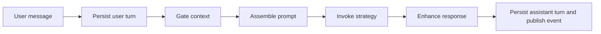
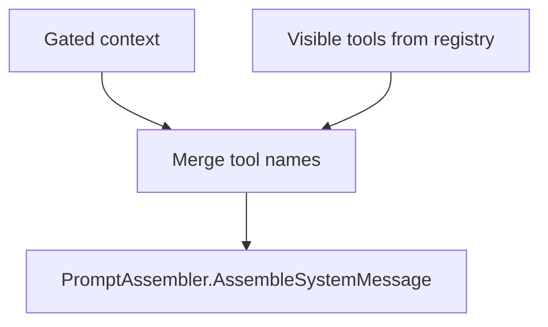

# Turn Pipeline
`TurnPipeline` is the canonical execution path for every LeanKernel chat turn. It turns a user message into a persisted session turn, a gated prompt, a model invocation, and a final assistant response.
The runtime keeps this path deliberately linear even as Phase 3 adds routed execution, response enhancement, and richer diagnostics, which makes the flow easier to inspect and extend.
## Why the pipeline exists
A single turn touches session persistence, context gating, prompt assembly, tool visibility, model invocation, optional post-processing, and turn events. `TurnPipeline` keeps those responsibilities in one stable sequence while `AgentRuntime` exposes that sequence through the public `IAgentRuntime` interface.

## Public entry point
`AgentRuntime` is intentionally thin:
- it implements `IAgentRuntime`
- it accepts a single `ITurnPipeline`
- it forwards `RunTurnAsync` directly to `ProcessAsync`
That split keeps the public contract stable even if the internal sequence evolves.
## The six-step flow plus asynchronous learning handoff
| Step | What happens | Why it matters |
| --- | --- | --- |
| 1 | Persist the user turn to the session store. | The session history includes the current input before context is assembled. |
| 2 | Build a `ContextBudget` and gate context through `IContextGatekeeper`. | The runtime admits only context that fits the budget. |
| 3 | Resolve visible tools and assemble the system message. | Prompt construction stays explicit and inspectable. |
| 4 | Invoke `IAgentStrategy`. | Model execution is replaceable without rewriting the pipeline. |
| 5 | Optionally run `IResponseEnhancer`. | Post-processing stays optional and local. |
| 6 | Persist the assistant turn and optionally publish `TurnEvent`. | The turn result becomes durable and observable. |
| 7 | Let background learning drain the emitted event asynchronously. | Post-turn self-improvement stays off the delivery path. |
## Step 1: persist the user turn
`TurnPipeline` first resolves a session id:
- if `message.SessionId` is set, it is reused
- otherwise `ISessionStore.GetOrCreateSessionIdAsync` creates or resolves one from channel and sender
The pipeline appends the user message before any model call. That ordering matters because context gating can then see the current input when it asks for session history.
## Step 2: gate context
The pipeline builds a budget with:
```csharp
ContextBudget.FromConfig(_config.LiteLlm.ContextWindowTokens, _config.Context)
```
It then calls `IContextGatekeeper.GateContextAsync(message, budget, sessionId, ct)`. The returned `ConversationContext` contains the system prompt, admitted history, admitted knowledge, budget usage, and the admission log.
This is where LeanKernel's deny-by-default posture enters the turn flow.
## Step 3: assemble the prompt
Before invoking the model, the pipeline merges visible tool names into the gated context.

Visible tools come from `IToolRegistry.GetVisibleTools(new ToolVisibilityContext { UserId = message.SenderId })`. The merged tool names are copied into a new `ConversationContext`, then `PromptAssembler` builds the final system message.
Phase 1 does not yet adapt `ToolDefinition` into model-native tool objects. The strategy context therefore sets `Tools = null` while still surfacing tool names in the prompt manifest.
## Step 4: invoke the strategy
Model execution is delegated to `IAgentStrategy`. The current implementation is `StaticAgentStrategy`, which represents the default single-model Phase 1 path.
The strategy receives:
- the current user message
- the assembled system message
- the admitted conversation history
- the future-facing `Tools` slot
This is the handoff point between orchestration and model-specific behavior.
## Step 5: enhance the response
Phase 3 keeps response enhancement optional, but the shape is now more explicit:

- `IdentityUpdateProjector` still runs as a separate best-effort writeback hook so Phase 2 identity persistence remains intact.
- `IResponseEnhancer` now represents the synchronous response enhancement pipeline.
- `TurnPipeline` builds an `EnhancementStepInput` containing the raw response, user message, session id, and retrieved knowledge, then uses `EnhancementResult.EnhancedResponse` as the final response.

When `LeanKernel:Enhancement:Enabled=true`, the pipeline can run deterministic steps such as knowledge synthesis, benign-refusal interception, and optional citation injection before the assistant turn is persisted. Enhancement is bounded by `MaxEnhancementTimeMs`; on timeout or failure LeanKernel falls back to the original response instead of blocking delivery.
## Step 6: persist and emit
Once a final response exists, the pipeline:
1. creates an assistant timestamp
2. generates a turn id
3. appends the assistant turn to the session store
4. optionally publishes a `TurnEvent`
The published event includes the session id, turn id, role, content, the originating user message, the final assistant response, timestamp, final `ConversationContext`, the model that actually handled the turn, and an optional structured `RoutingDecision` when routed execution is enabled.

When `LeanKernel:Learning:Enabled=true`, `TurnEvent` publication can feed the background learning subsystem. `TurnPipeline` still only publishes the event; queueing, drop-oldest behavior, concurrency limits, and learning-step execution all happen outside the synchronous response path.
## Extensibility points
| Extension point | Current role |
| --- | --- |
| `IContextGatekeeper` | Swaps how context is admitted without changing turn orchestration. |
| `IAgentStrategy` | Swaps how the model is invoked. |
| `IResponseEnhancer` | Adds optional post-processing after generation. |
| `ITurnEventSink` | Publishes completed turns to another subsystem. |
| `IToolRegistry` | Changes visible tools without changing prompt assembly logic. |
The important pattern is that orchestration stays in `LeanKernel.Agents`, while specialized behavior stays behind existing contracts.
## Error handling and failure boundaries
`TurnPipeline` does not swallow exceptions. If persistence, context gating, or strategy invocation fails, the exception propagates to the caller.
That keeps the failure boundary honest, but it also means turn state can be partial:
- the user turn may already be persisted
- the assistant turn may not exist yet
- the optional event may never be published
Phase 1 prefers durable early input capture over all-or-nothing orchestration. Constructor null guards protect the composed dependencies up front, and the shared `CancellationToken` flows through the async calls.
## Diagnostics integration
Diagnostics are still adjacent to the pipeline, but the current pipeline now has two direct integration points:

- optional `IContextDiagnosticsService` for persisted context snapshots
- optional `DiagnosticsCollector` for structured model-routing diagnostics when a strategy produces a `RoutingDecision`

After context gating and tool-visibility merge, but before strategy invocation, the pipeline stores a `ContextDiagnosticsSnapshot` containing:
- admission decisions
- budget usage and budget allocation
- retrieval diagnostics
- history shaping diagnostics

The current integration points are therefore:
- structured logging from `TurnPipeline`
- persisted session history
- stored context snapshots through `IContextDiagnosticsService`
- optional persisted `ModelRouting`, `QualityGate`, and `ResponseEnhancement` diagnostics through `DiagnosticsCollector`
- the emitted `TurnEvent`
- generic and context-specific Gateway diagnostics endpoints

A successful turn can now produce context, budget, history, and model-routing diagnostics even though not every `DiagnosticsCollector` category is recorded automatically.
## Configuration touchpoints
`TurnPipeline` depends on `LeanKernelConfig`, especially these settings:
| Key | Purpose |
| --- | --- |
| `LeanKernel:LiteLlm:ContextWindowTokens` | Drives context budget calculation. |
| `LeanKernel:LiteLlm:DefaultModel` | Fallback value for `TurnEvent.ModelUsed` when the active strategy does not override it. |
| `LeanKernel:Routing:*` | Controls routed strategy selection, tier mapping, and optional `TurnEvent.RoutingDecision` metadata. |
| `LeanKernel:Enhancement:*` | Controls synchronous post-model enhancement steps and their timeout budget. |
| `LeanKernel:Learning:*` | Controls asynchronous post-turn learning queueing, concurrency, and step toggles. |
| `LeanKernel:Context:*` | Controls how the gatekeeper divides prompt budget. |
```json
{
  "LeanKernel": {
    "LiteLlm": {
      "DefaultModel": "gpt-4o-mini",
      "ContextWindowTokens": 128000
    }
  }
}
```
## How to think about the pipeline
`TurnPipeline` is the runtime's contract for order of operations. It guarantees that LeanKernel does not:
- invoke a strategy before the turn is persisted
- skip context gating and go straight to model invocation
- hide tool visibility inside an opaque prompt builder
- publish a completed event before the assistant turn exists
That sequencing is what makes the rest of the runtime explainable.
## Related documentation
- [Context Gating](context-gating.md)
- [Tool Governance](tool-governance.md)
- [Diagnostics](diagnostics.md)
- [Gateway API](gateway-api.md)
- [Phase 1 Configuration](../configuration/phase-1-config.md)
