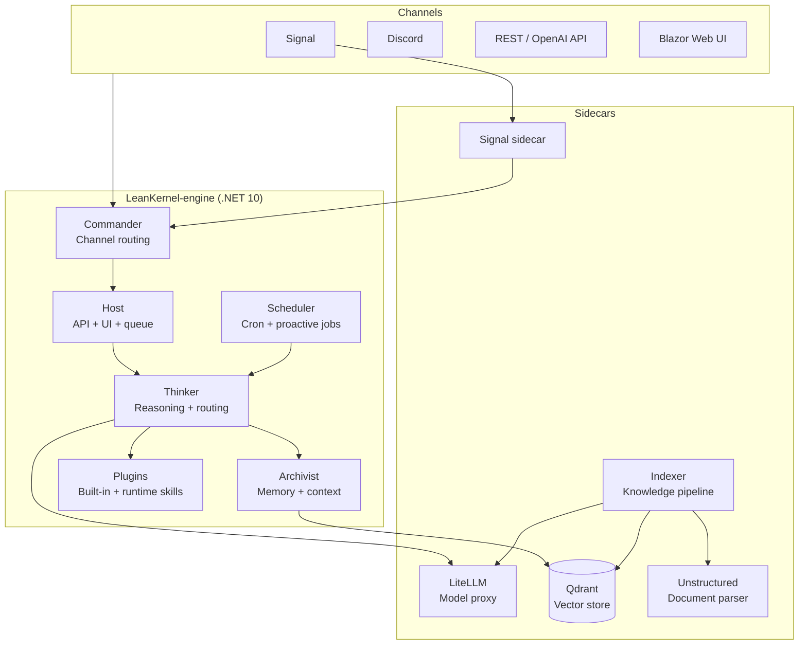

# LeanKernel Documentation

LeanKernel is a personal AI agent platform built on .NET 10. It integrates a reasoning layer, memory system, runtime skills, scheduled jobs, and containerized sidecars for model routing, vector search, document parsing, and messaging channels.

## Documentation Sections

| Section | Description |
|---------|-------------|
| [ARCHITECTURE.md](ARCHITECTURE.md) and [architecture/](architecture/index.md) | System components, runtime topology, data flows, ownership rules, and the evolutionary roadmap. |
| [features/](features/index.md) | Product requirements for authentication, intelligent model routing, and other platform features. |
| [plans/](plans/index.md) | Roadmap execution PRDs for autonomy controls, replay/provenance, budget guardrails, memory hygiene, and benchmark scoring. |
| [skills/](skills/index.md) | Runtime skill system: how skills are defined, discovered, loaded, and executed. |
| [development/](development/index.md) | Quality gates, test coverage, SonarQube scan, and the LiteLLM single-file spec plan. |

---

## System Overview



---

## Quick Start

```bash
# Copy environment template
cp .env.example .env
# Edit .env with your API keys

# Build and start all services
docker compose up -d

# View logs
docker compose logs -f engine
```

The web UI is available at `http://localhost:5080` (or the port configured in `LEANKERNEL_PORT`).

---

## Repository Structure

```
LeanKernel/
├── config/               # Sidecar configuration (LiteLLM, indexer, signal)
├── data/                 # Runtime data (wiki, skills, agents, sessions)
├── docs/                 # Documentation (this folder)
│   ├── architecture/     # System design and component reference
│   ├── development/      # Developer guides and quality gates
│   ├── features/         # PRDs and feature specifications
│   ├── plans/            # Roadmap execution PRDs
│   └── skills/           # Runtime skill system docs
├── scripts/              # Quality scripts and utilities
└── src/                  # .NET 10 solution
    ├── LeanKernel.Core/      # Shared models and interfaces
    ├── LeanKernel.Commander/ # Channel routing
    ├── LeanKernel.Thinker/   # Reasoning, routing, agents
    ├── LeanKernel.Archivist/ # Memory, sessions, knowledge
    ├── LeanKernel.Scheduler/ # Cron and proactive jobs
    ├── LeanKernel.Plugins/   # Built-in tools and skill loading
    ├── LeanKernel.Generators/# Source generation
    └── LeanKernel.Host/      # ASP.NET Core API and Blazor UI
```
