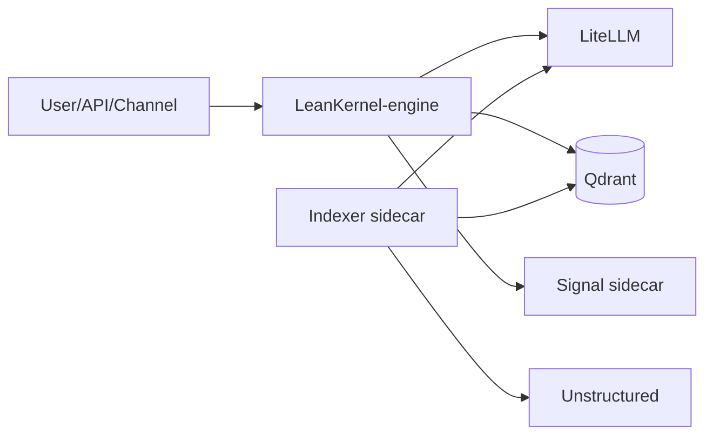

# LeanKernel Documentation

LeanKernel is a .NET 10 personal agent platform with a modular monolith architecture and sidecar services for model proxying, vector storage, parsing, and indexing.

## Documentation Sections

| Section | Description |
| --- | --- |
| [CONTRIBUTING-DOCS.md](CONTRIBUTING-DOCS.md) | Documentation contribution guide and per-phase documentation requirements for the rearchitecture. |
| [architecture/](architecture/index.md) | Current architecture, ownership boundaries, runtime topology, and key request flows. |
| [features/](features/index.md) | Feature documentation organized by implementation phase. |
| [configuration/](configuration/index.md) | Phase-by-phase configuration reference for new settings and defaults. |
| [skills/](skills/index.md) | Runtime skill loading model, `SKILL.md` contract, and security/runtime behavior. |
| [development/](development/index.md) | Build/test quality gates and LiteLLM spec compiler details. |
| [plans/](plans/index.md) | Forward-looking roadmap PRDs and planning artifacts. |

## Runtime Summary

> For a detailed view of LeanKernel’s internal modules (Commander, Thinker, Archivist, etc.), see the [architecture overview](architecture/index.md).
