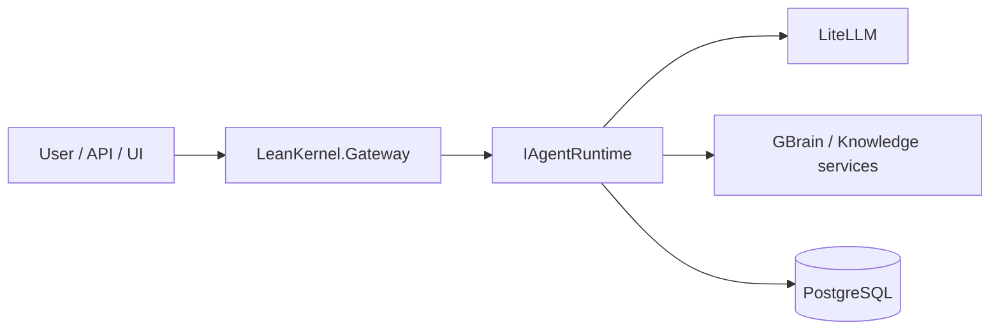

# LeanKernel Documentation

This documentation set is organized for quick onboarding and implementation-accurate reference.

## Start Paths

- New to the repo: [`getting-started/index.md`](getting-started/index.md)
- System design and ownership: [`architecture/index.md`](architecture/index.md)
- Product/runtime capability docs: [`features/index.md`](features/index.md)
- HTTP surface and contracts: [`api/index.md`](api/index.md)
- Runtime configuration: [`configuration/index.md`](configuration/index.md)
- Build/test/quality workflows: [`development/index.md`](development/index.md)
- Runtime operations and health: [`operations/index.md`](operations/index.md)
- Skills and skill format: [`skills/index.md`](skills/index.md)
- Planning artifacts: [`plans/index.md`](plans/index.md)

## Runtime Summary

## Documentation Conventions

- Kebab-case file names.
- Hierarchical folder structure.
- `index.md` in each folder.
- Canonical page per topic; related pages cross-link instead of duplicating content.

See also: [`CONTRIBUTING-DOCS.md`](CONTRIBUTING-DOCS.md).
