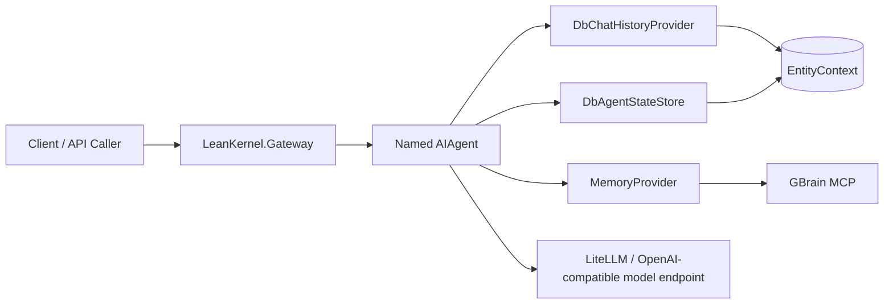

# LeanKernel Documentation

This documentation set covers the current modular-monolith LeanKernel rebuild in this workspace.

It follows the same conventions as the reference docs in `~/source/repos/leankernel/docs`:

- kebab-case file names
- hierarchical folders by domain
- `index.md` in each folder
- one canonical page per topic

## Start Paths

- New to the repo: [`getting-started/index.md`](getting-started/index.md)
- System design and boundaries: [`architecture/index.md`](architecture/index.md)
- Runtime capabilities: [`features/index.md`](features/index.md)
- HTTP surface: [`api/index.md`](api/index.md)
- Runtime configuration: [`configuration/index.md`](configuration/index.md)
- Build and test workflows: [`development/index.md`](development/index.md)
- Local stack operations: [`operations/index.md`](operations/index.md)
- Architectural decisions: [`decisions/index.md`](decisions/index.md)
- Planning artifacts: [`plans/`](plans/)

## Runtime Summary

## Current Scope

This docs set describes the implementation that actually exists today:

- `src/Common/LeanKernel.Core`
- `src/Common/LeanKernel.Data`
- `src/Common/LeanKernel.Logic`
- `src/Services/LeanKernel.Gateway`
- test projects under `test/`

It does not document the larger aspirational module list in `README.md` as if it were already implemented.

## Code Anchors

- Gateway composition root: [`../src/Services/LeanKernel.Gateway/Programs.cs`](../src/Services/LeanKernel.Gateway/Programs.cs)
- Solution file: [`../src/LeanKernel.sln`](../src/LeanKernel.sln)
- Local stack: [`../docker-compose.yml`](../docker-compose.yml)
- ADRs: [`decisions/index.md`](decisions/index.md)
