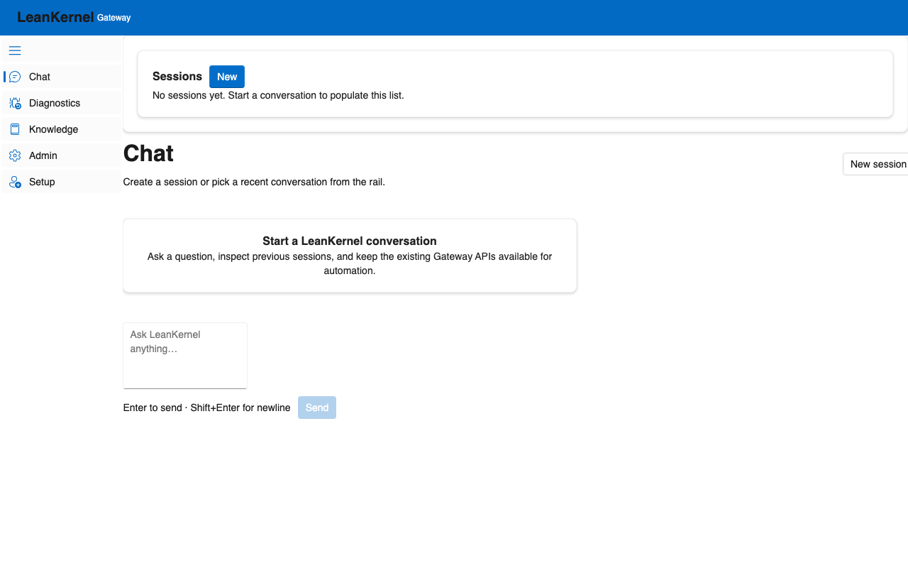
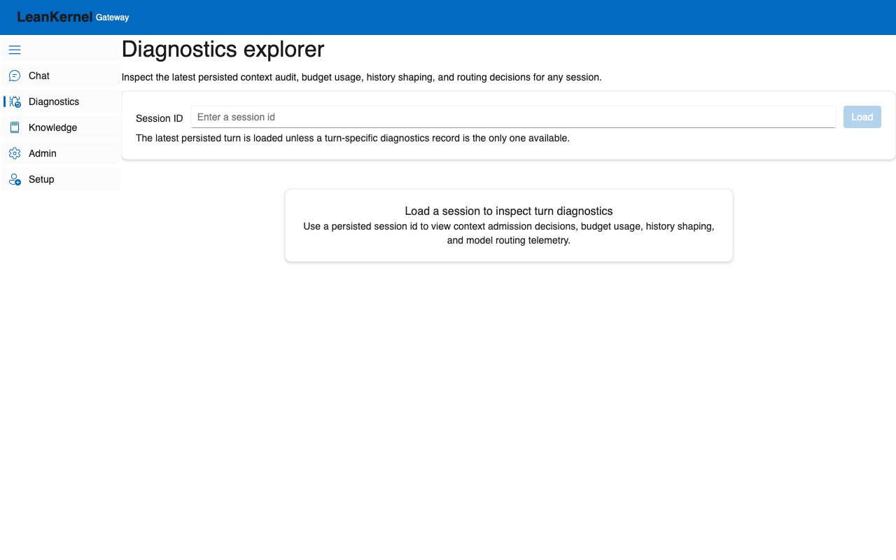
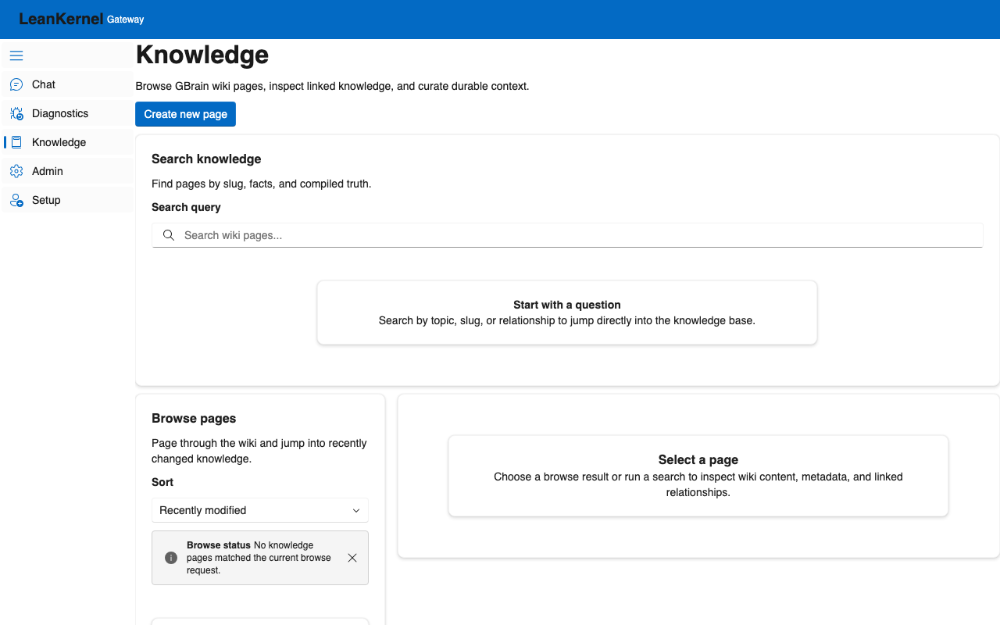
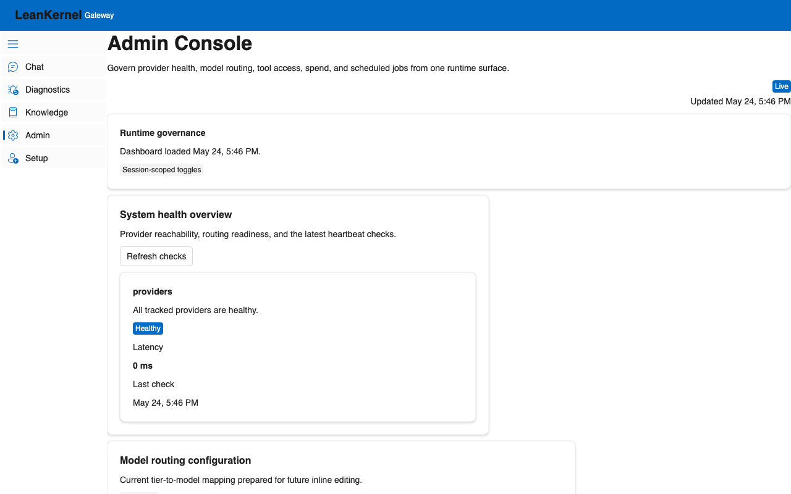
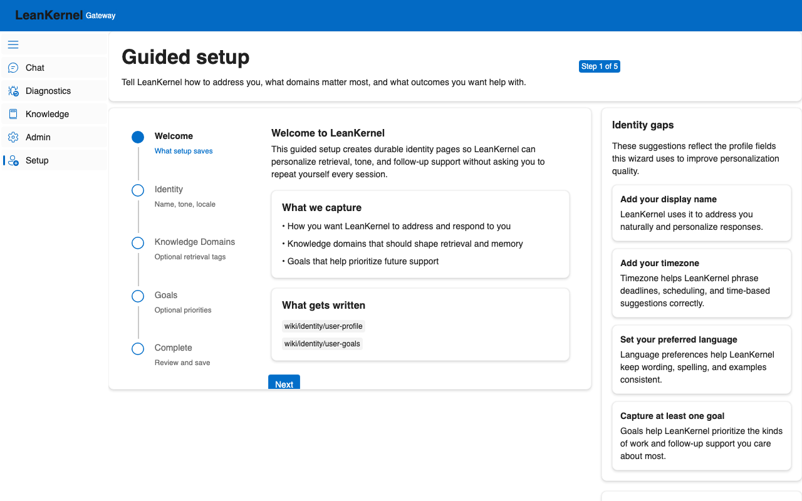

# Implementation Plan — LeanKernel UI/UX Re-Architecture

This plan covers a full UI/UX audit, a revised design system, and a detailed plan to replace custom markup with native, built-in FluentUI Blazor components.

---

## 1. UI/UX Audit Report & Findings

We utilized Playwright to capture screenshots of the running application at `http://localhost:5080`. Below is the audit of each interface along with specific areas for improvement.

### A. Chat Page

- **Audit Findings**:
  - The dual-pane layout (Session List on the left, Chat main body on the right) is functional but feels standard and static.
  - The message bubbles (`ChatMessage.razor`) utilize simple borders. There is minimal visual contrast between **User** and **LeanKernel** messages, leading to visual fatigue during long chats.
  - The composer shell is cramped. The send button is in a plain footer container, and empty states feel very clinical instead of welcoming.

### B. Diagnostics Explorer

- **Audit Findings**:
  - The telemetry layout displays deep details but is presented as large blocks of plain cards.
  - Admitted versus Excluded context gate lists are rendered side-by-side, but they lack smooth vertical alignment, custom icons, and visual micro-animations.
  - Progress bars for token budget utilization are plain and do not draw immediate attention to over-budget areas with glowing alert states.

### C. Knowledge Management

- **Audit Findings**:
  - The search text field and pagination buttons feel loosely organized.
  - The relationship graph view is a static stack of buttons. It lacks any real visual sense of a "graph" or semantic connection, which could be easily elevated using modern card outlines, connection indicators, and soft glows.

### E. Admin Console

- **Audit Findings**:
  - The custom spend trend bar chart is static and lacks tooltips or interactive hover indicators.
  - Grid structures for scheduled jobs and model routing rules lack clear borders, row-striping, or smooth loading states when data is being refreshed.

### F. Guided Setup / Onboarding

- **Audit Findings**:
  - The multi-step `FluentWizard` works well, but the layout is tight.
  - Identity gap cards on the right side feel generic and detached from the main wizard flow.

---

## 2. Proposed UI/UX Design System Upgrades

To move LeanKernel to a high-end, premium engineering product, we will implement a gorgeous design system with these characteristics:

1. **Rich Aesthetics**:
   - Establish custom theme variables in `app.css` utilizing modern HSL colors.
   - Introduce **Glassmorphism** for cards: light frosted backdrops (`backdrop-filter: blur(16px)`), extremely thin glowing borders, and smooth shadows.
   - Enhance states: Use glowing violet shadows for focus/active items and warm emeralds/ambers for system statuses.
2. **Interactive Elements & Micro-Animations**:
   - Add transition lifts (`transform: translateY(-2px)`) on all interactive cards.
   - Add sweep shines on buttons and dynamic borders that animate on hover.
3. **Responsive Typography & Font Optimization**:
   - Import the **Outfit** or **Inter** font family from Google Fonts for clean, modern readability.

---

## 3. Native FluentUI Blazor Component Replacements

We will replace/enhance custom HTML structures with built-in FluentUI Blazor components as follows:

| Screen / Feature | Current Custom Markup | FluentUI Native Replacement |
| :--- | :--- | :--- |
| **Session List** | Plain `foreach` loop rendering interactive custom cards. | Wrap sessions in interactive `FluentCard` with unified design states, utilizing `FluentStack` with vertical dividers and clear selected styles. |
| **Chat Composer** | Custom layout holding a textarea and plain button. | Enhance with built-in `FluentTextArea` and standard input styling, utilizing Fluent icons (`Icons.Regular.Size16.Send`). |
| **Admin Spend Chart** | Custom CSS-styled bar tags. | Integrate built-in **`FluentTooltip`** wrapper for each bar in the spend chart so hovering displays detailed spend values dynamically. |
| **Diagnostics / Lists** | Side-by-side card loops. | Leverage **`FluentAccordion`** and **`FluentAccordionItem`** for context gate admissions/exclusions, keeping the layout clean and expandable. |
| **Grid Lists** | Plain table structures. | Standardize all tabular lists to use **`FluentDataGrid`** with custom template columns, sorting indicators, and hover styles. |

---

## 4. Proposed File Changes

### A. Design System & Core Styles

#### [MODIFY] [app.css](../../src/LeanKernel.Gateway/wwwroot/css/app.css)
- Revise the design tokens to support a highly premium dark/light mode surface with HSL variables.
- Add frosted glass card overrides (`.lk-card`, `.lk-card-interactive`).
- Define premium font assets, custom animations, and hover transitions.

#### [MODIFY] [App.razor](../../src/LeanKernel.Gateway/Components/App.razor)
- Add a Google Fonts link for modern typography (**Outfit**).

---

### B. Shared & Interactive Components

#### [MODIFY] [SessionList.razor](../../src/LeanKernel.Gateway/Components/Shared/SessionList.razor)
- Apply the upgraded styling tokens to make selected sessions look exceptionally premium with active status glows.

#### [MODIFY] [ChatMessage.razor](../../src/LeanKernel.Gateway/Components/Shared/ChatMessage.razor)
- Revise layouts to clearly distinguish User messages (right-aligned, subtle gradient accent) from LeanKernel responses (left-aligned, soft frosted glass).
- Add copy button functionality using the native clipboard APIs.
- Enhance markdown code-block rendering.

---

### C. Application Pages

#### [MODIFY] [Chat.razor](../../src/LeanKernel.Gateway/Components/Pages/Chat.razor)
- Enhance the empty state card with a gorgeous icon, gradient header, and soft shadow.
- Align page title section and spacing with the new spacing scale.

#### [MODIFY] [Diagnostics.razor](../../src/LeanKernel.Gateway/Components/Pages/Diagnostics.razor)
- Format context gate lists with high-fidelity badges, proper column alignments, and modern card panels.
- Add glow states to budget utilization progress bars.

#### [MODIFY] [Knowledge.razor](../../src/LeanKernel.Gateway/Components/Pages/Knowledge.razor)
- Style search elements, browse lists, and graph panels using card lifts and clear active indicators.

#### [MODIFY] [Admin.razor](../../src/LeanKernel.Gateway/Components/Pages/Admin.razor)
- Wrap the spend bar chart elements in **`FluentTooltip`** to provide dynamic, rich details on hover.
- Make the spend bars light up on hover with subtle box-shadow glows.
- Format grids and metrics panels to ensure absolute visual consistency.

#### [MODIFY] [Onboarding.razor](../../src/LeanKernel.Gateway/Components/Pages/Onboarding.razor)
- Space out the multi-step form fields.
- Make identity gap cards look premium with glowing warning/success tags.

---

## 5. Verification Plan

### Automated Tests
- Run `dotnet test` in the `LeanKernel.Tests.Playwright` project to verify that all navigation and standard elements load and function correctly.

### Manual Verification
- Deploy and review the UI in the browser across standard viewports (Desktop: 1280px+, Mobile/Tablet: <900px).
- Verify dark/light theme legibility, hover states, scroll behaviors, and responsive margins.

---

## 6. Cross-Model Review (Implementation Order)

This plan was reviewed with a separate model before continuing implementation. The next iteration should execute in this order to reduce churn and keep UI behavior stable:

1. **Stabilize shared design tokens and surfaces in `app.css`** first, then apply them to pages.
2. **Replace page-level inline styles with shared utility classes** to keep spacing and elevation consistent.
3. **Preserve existing UI test anchors** (`chat-message-list`, `chat-composer-input`, `chat-send-button`, heading IDs) while refining layout.
4. **Improve keyboard accessibility for interactive cards** (session list, knowledge results, graph nodes) so interactions are not hover-only.
5. **Polish diagnostics scanability** (balanced admitted/excluded panels, clearer over-budget progress states).
6. **Strengthen knowledge relationships view** with clearer hierarchy and interactive connection styling.
7. **Keep spend chart tooltips progressive-enhancement only** and retain visible values for non-hover/touch users.
8. **Align onboarding sidebar cards and spacing** with the rest of the system and maintain clear status cues.
