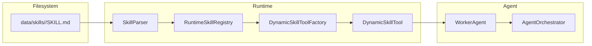

# Skills

This section covers the LeanKernel runtime skill system — how skills are defined, discovered, loaded, and executed.

## Contents

| Document | Description |
|----------|-------------|
| [skill-format.md](skill-format.md) | Implemented `SKILL.md` frontmatter contract and runtime execution behavior. |
| [runtime-skills-plan.md](runtime-skills-plan.md) | Roadmap/remediation notes for future skill system hardening. |

## How Skills Work

## Skill Discovery Paths

Skills are loaded from configured `LeanKernel:Skills:BasePaths` directories (comma-separated).  
Default in appsettings is `/app/data/skills`.

Each configured path is scanned recursively for `SKILL.md`.

## Built-in Tools

The following tools are always available without a `SKILL.md`:

| Tool (Class/Model Name) | Capability |
|------------------------|-----------|
| `WikiQueryTool` / `search_wiki` | Query 5W1H wiki memory |
| `DocumentSearchTool` / `search_documents` | Search indexed document corpus |
| `KnowledgeSearchTool` / `search_knowledge` | Semantic search over Qdrant |
| `WebSearchTool` / `web_search` | Web search integration |
| `FileSystem*`, `Directory*` tools | Read/search/mutate files under the configured data directory |

> **Note:** The left side is the internal tool class name (used in code and logs); the right side is the tool name exposed to the model and used in skill definitions and API calls. Always use the model-exposed name (e.g. `search_documents`) in prompts, skills, and API requests.
