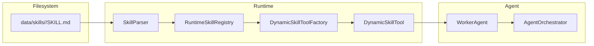

# Skills

This section covers the LeanKernel runtime skill system — how skills are defined, discovered, loaded, and executed.

## Contents

| Document | Description |
|----------|-------------|
| [skill-format.md](skill-format.md) | The `SKILL.md` file format including frontmatter schema, operation definitions, binary provisioning, and security model. |
| [runtime-skills-plan.md](runtime-skills-plan.md) | Review of architectural gaps in the current skill system and the phased remediation plan. |

## How Skills Work

## Skill Discovery Paths

Skills are loaded from two base directories at startup:

| Path | Contents |
|------|----------|
| `data/skills/` | User-managed runtime skills |
| `data/agents/<name>/` | Agent-specific skill overrides |

## Built-in Tools

The following tools are always available without a `SKILL.md`:

| Tool | Capability |
|------|-----------|
| `WikiQueryTool` | Query 5W1H wiki memory |
| `KnowledgeSearchTool` | Semantic search over Qdrant |
| `ReminderTool` | Schedule reminders via the scheduler |
| `WebSearchTool` | Web search integration |
| `FileSystemTool` | Read files from the data directory |
