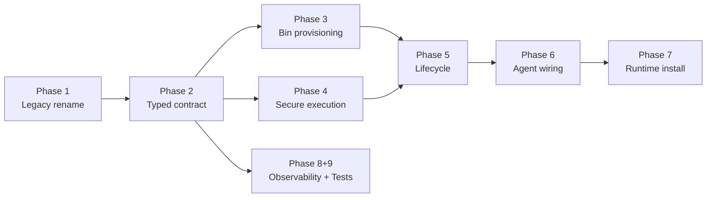

# Runtime Skills System — Remediation Plan

This document reviews the runtime skill system, identifies architectural gaps, and defines the remediation plan.

## Design Goals

- Balance **human-accessibility** (skills authored as readable markdown) and **determinism** (the runtime invokes exactly one well-defined operation).
- Balance **security** (no arbitrary process execution, no SSRF, no secret leakage) and **convenience** (adding a skill should not require rebuilding the image whenever possible).

## Current State

- Skills are discovered from the filesystem by `RuntimeSkillRegistry` and turned into tools by `DynamicSkillToolFactory` / `DynamicPluginHost`.
- Skill metadata includes a `requires.bins` hint in several skills (`ms-todo`, `simplefin`, `screenshot-ocr`), but the runtime system does not consume it.
- The container build installs `signal-cli-native` only — there is no install path for `ms-todo-cli`, `simplefin-cli`, `paddleocr`, or any future skill binary.
- A legacy nested-metadata key (vendor-name prefix) must be removed in favor of a flat `metadata` map plus a structured `runtime` block.

---

## Identified Gaps

### A. Skill Contract / Parsing

| # | Gap | Impact |
|---|-----|--------|
| 1 | Metadata layout drift — `baseUrl`/`cliCommand`/`authType` silently `null` for every existing skill | Operations fail at runtime |
| 2 | `requires.bins` is documentation-only — runtime cannot check binary availability | Failures at first invocation |
| 3 | Operation extraction is prose-scraping — brittle, untestable | Incorrect operation mapping |
| 4 | Per-operation parameter schema missing — model has no knowledge of valid parameters | Failed tool calls |
| 5 | No validation at load time — malformed skills silently downgraded | Silent failures |
| 6 | Authoring redundancy — same fact expressed multiple times | Divergence between docs and behavior |

### B. Runtime Registration / Lifecycle

| # | Gap | Impact |
|---|-----|--------|
| 7 | Background fire-and-forget initialization — first agent request can hit empty registry | Tool calls fail on startup |
| 8 | Cache invalidation does not refresh tools — live edits require restart | Hot reload broken |
| 9 | No file-watch debounce — editor saves trigger cache storm | Race conditions |
| 10 | Built-in tools not merged — `WikiQueryTool`, `KnowledgeSearchTool`, etc. lost to agents | Missing capabilities |
| 11 | Name-collision behavior undefined — non-deterministic winner | Unpredictable tool resolution |
| 12 | Stale tool references — agents may use outdated `ITool` instances | State drift |

### C. Agent / Tool Wiring

| # | Gap | Impact |
|---|-----|--------|
| 13 | `AllowedTools` references obsolete names — `simplefin_skill` vs `simplefin` | Allowlists never match |
| 14 | Allowlist never enforced — all tools exposed to every agent | Security boundary violation |
| 15 | No category/capability indexing — routing by intent not possible | Inflexible agent assignment |

### D. Security

| # | Gap | Impact |
|---|-----|--------|
| 16 | Shell-injection via string-concatenated arguments | RCE risk |
| 17 | No executable allowlist — skill file on disk can execute any binary | Privilege escalation |
| 18 | SSRF surface — `baseUrl` from SKILL.md without validation | SSRF attacks |
| 19 | Auth not wired despite parsing — secrets not applied to outgoing requests | Auth bypass |
| 20 | Unbounded output + deadlock risk — `ReadToEndAsync` + `WaitForExitAsync` | DoS / pipe deadlock |
| 21 | Whole input JSON forwarded — internal routing fields leak to upstream APIs | Information leak |
| 22 | No sandboxing — subprocesses inherit host process user, env, and filesystem | Privilege escalation |

### E. Binary Provisioning

| # | Gap | Impact |
|---|-----|--------|
| 23 | No install path for `requires.bins` | Skills silently unusable |
| 24 | No version pinning or integrity check | Supply chain risk |
| 25 | No graceful degradation — missing binary → `Win32Exception` at invocation | Confusing failures |

### F. Observability

| # | Gap | Impact |
|---|-----|--------|
| 26 | No invocation audit — skill calls not logged with operation, duration, outcome | Blind operations |
| 27 | No metrics — cannot answer "which skills are failing" | No operational insight |

---

## Implementation Phases

### Phase 1 — Strip Legacy Nested-Metadata Key

- Rename `src/LeanKernel.Plugins/BuiltIn/OpenclaSkills` → `Skills`
- Drop the nested vendor key from the parser; read flat `metadata` and a new `runtime` block
- Update existing `SKILL.md` files to the flat layout

### Phase 2 — Typed Contract + Structured Operations

- Introduce `SkillManifest`, `SkillRuntime`, `SkillOperation`, `SkillParameters` records
- Replace prose-scraping in `SkillParser` with deserialization of `runtime:` and `operations:` blocks
- Validate at load time: required fields, JSON Schema compile, host allowlist for HTTP, flag-parameter mapping
- Quarantine invalid skills with structured error surfaced via admin endpoint

### Phase 3 — Binary Provisioning (Tier 1)

- Add Dockerfile layers for `ms-todo-cli`, `simplefin-cli`, `paddleocr` with pinned versions + SHA256
- Emit `/opt/LeanKernel/tools/tools-manifest.json` during build
- Implement `IBinaryResolver` to resolve `requires.bins[].name` → absolute path
- Skills missing required bin are marked `Unavailable` and excluded from agent tool lists

### Phase 4 — Secure Execution

- Switch to `ProcessStartInfo.ArgumentList` (no shell)
- Implement bounded, concurrent stdout/stderr reads with size cap
- Add `IEgressPolicy` enforced via typed `HttpClient` per skill
- Wire `auth.type` + `auth.secretRef` to outbound requests through `ISecretProvider`
- Drop `operation` discriminator from outbound HTTP bodies

### Phase 5 — Deterministic Loading + Hot Reload

- Replace background `InitializeAsync` with synchronous load during `IHostedService.StartAsync`
- Merge built-in `ITool` registrations and dynamic skills into a single `IToolRegistry` with deterministic precedence
- Add debounced (250ms) file-watch handler that rebuilds tool instances atomically
- Define `ISkillLifecycleListener` for agents/orchestrators to refresh allowlists on change

### Phase 6 — Agent Allowlist Consistency

- Normalize tool naming (skill `name:` *is* the tool name, no `_skill` suffix)
- Enforce `WorkerAgent.AllowedTools` inside `ToolFunctionAdapter.BuildTools()`
- Support category-based selection (`AllowedCategories: [financial]`)
- Update `WorkerAgent` defaults to current skill names

### Phase 7 — Tier 2 Runtime Install (Opt-in)

- Implement `SkillInstaller` with kind allowlist, mandatory checksum, per-user prefix
- Surface install state (`pending`, `installed`, `failed`) in the registry
- Add admin endpoint to trigger/refresh installs without restart

### Phase 8 — Observability

- Structured logging: skill, operation, parameter keys (values redacted), duration, exit code/HTTP status, output size
- Counters: invocations, failures, quarantined skills, missing bins
- Admin endpoint listing loaded skills, resolved bin paths, validation status, last reload time

### Phase 9 — Tests + Docs

- Unit tests: frontmatter parsing, schema compilation, validation errors, allowlist enforcement, argv rendering, egress policy, secret redaction
- Integration tests: end-to-end skill discovery → invocation with fixture CLI; hot reload; missing-bin quarantine
- Update `docs/skills/skill-format.md` with the new contract and a migration note

---

## Key Files

| File | Change |
|------|--------|
| `src/LeanKernel.Plugins/BuiltIn/Skills/SkillDefinition.cs` | Typed manifest model, per-operation schema, runtime block |
| `src/LeanKernel.Plugins/BuiltIn/Skills/SkillParser.cs` | Structured deserialization, no prose scraping |
| `src/LeanKernel.Plugins/BuiltIn/Skills/RuntimeSkillRegistry.cs` | Synchronous load, debounced watcher, quarantine list, lifecycle event |
| `src/LeanKernel.Plugins/BuiltIn/Skills/DynamicSkillTool.cs` | `ArgumentList`, bounded IO, egress + auth wiring |
| `src/LeanKernel.Plugins/BuiltIn/Skills/DynamicSkillToolFactory.cs` | Bin resolution + availability checks at factory time |
| `src/LeanKernel.Plugins/BuiltIn/Skills/IBinaryResolver.cs` (new) | Manifest-backed resolver |
| `src/LeanKernel.Plugins/BuiltIn/Skills/IEgressPolicy.cs` (new) | Host allowlist enforcement |
| `src/LeanKernel.Plugins/BuiltIn/Skills/ISecretProvider.cs` (new) | Pluggable secret backend |
| `src/LeanKernel.Host/Program.cs` | Replace fire-and-forget init with hosted service; merge registries |
| `src/LeanKernel.Thinker/Agents/WorkerAgent.cs` | Updated allowlists, category support |
| `src/LeanKernel.Thinker/ToolFunctionAdapter.cs` | Enforce per-agent allowlist |
| `Dockerfile` | Install pinned CLIs; emit `tools-manifest.json` |
