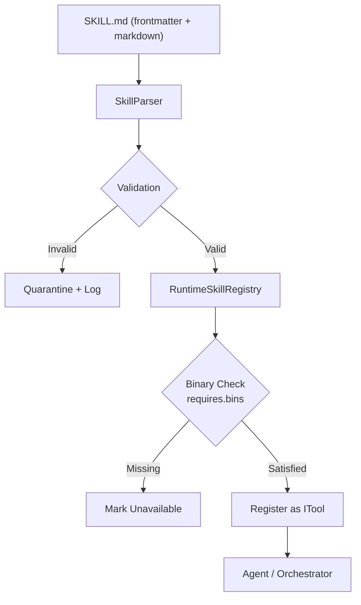

# Skill Definition Format

Skills are defined in `SKILL.md` files with YAML frontmatter. This format allows adding new skills without recompiling the container.

## File Structure

Each skill lives in its own directory with a single `SKILL.md` file:

```
data/skills/
├── emanate/
│   └── SKILL.md
├── doughray/
│   └── SKILL.md
└── my-new-skill/
    └── SKILL.md
```

## SKILL.md Format

### Frontmatter (YAML)

The file starts with YAML frontmatter enclosed in `---` markers. The `metadata` map carries presentation/discovery hints; `runtime` carries the deterministic contract; the markdown body is documentation.

```yaml
---
name: simplefin
description: "Inspect SimpleFin Bridge accounts and transactions."
metadata:
  emoji: "💸"
  homepage: "https://github.com/achingono/simplefin-cli"
  category: financial
  tags: [finance, accounts, transactions, read-only]
runtime:
  type: cli                      # cli | http | composite
  command: simplefin-cli
  baseUrl: null                  # required for http/composite
  auth:
    type: none                   # none | bearer | apiKey | header
    secretRef: null              # logical name resolved against secret store
  requires:
    bins:
      - name: simplefin-cli
        minVersion: "0.4.0"
  egress:
    allowHosts: []               # http skills must declare; empty == disallow
operations:
  - id: list_accounts
    summary: "List all linked accounts."
    invoke:
      argv: [account, list]
    parameters:
      type: object
      properties: {}
      additionalProperties: false
  - id: list_transactions
    summary: "List transactions, optionally filtered."
    invoke:
      argv: [transaction, list]
      flags:
        accountId: "--account-id"
        startDate: "--start-date"
        endDate:   "--end-date"
    parameters:
      type: object
      properties:
        accountId: { type: string }
        startDate: { type: string, format: date }
        endDate:   { type: string, format: date }
      additionalProperties: false
---

# SimpleFin Bridge

Human-readable playbook content here...
```

### Frontmatter Fields

| Field | Type | Required | Description |
|-------|------|----------|-------------|
| `name` | string | ✓ | Skill identifier (lowercase, no spaces) |
| `description` | string | ✓ | What the skill does (used in agent routing) |
| `metadata.emoji` | string | | Unicode emoji for UI display |
| `metadata.homepage` | string | | URL to skill documentation |
| `metadata.category` | string | | Category for grouping (e.g. `financial`, `productivity`) |
| `metadata.tags` | string[] | | Tags for capability-based routing |
| `runtime.type` | string | ✓ | `cli`, `http`, or `composite` |
| `runtime.command` | string | CLI only | CLI command name |
| `runtime.baseUrl` | string | HTTP only | Base URL for HTTP operations |
| `runtime.auth.type` | string | | `none`, `bearer`, `apiKey`, or `header` |
| `runtime.auth.secretRef` | string | | Logical secret name resolved against secret store |
| `runtime.requires.bins` | array | | Required CLI binaries with version constraints |
| `runtime.egress.allowHosts` | array | HTTP only | Allowed outbound hostnames; empty disallows all |
| `operations` | array | ✓ | List of operation definitions |

### Operation Definition

Each operation has the following fields:

| Field | Description |
|-------|-------------|
| `id` | Unique operation identifier (snake_case) |
| `summary` | Short human-readable description |
| `invoke.argv` | Argument list (no shell; shell injection prevention) |
| `invoke.flags` | Maps parameter names to CLI flags |
| `parameters` | JSON Schema for operation parameters |

---

## Runtime Principles



Key principles:

1. **Contract in frontmatter, prose in markdown.** Anything the runtime depends on lives in structured frontmatter. Markdown body is for the LLM and human readers.
2. **One source of truth per fact.** Each operation appears once in frontmatter.
3. **Fail loud at load time, not at first call.** Validation, binary availability, and schema compilation all happen during discovery.
4. **Least privilege by default.** No skill can execute outside an explicit allowlist of binaries and HTTP hosts.

---

## Binary Provisioning

Skills requiring external binaries use a two-tier provisioning model:

### Tier 1 — Image-managed (default, required for production)

- Binaries are installed by the `Dockerfile` into `/opt/LeanKernel/tools/<name>/<version>/` and symlinked into `PATH`.
- Each install step records upstream source, pinned version, and SHA256 checksum.
- A generated `config/tools-manifest.json` lists installed name/version/path; the registry consults it during skill load.
- A skill whose `requires.bins` cannot be satisfied is quarantined and logged without failing host startup.

### Tier 2 — Runtime install (opt-in, dev/experimental)

- Disabled by default. Enable via `LeanKernel:Skills:AllowRuntimeInstall=true`.
- Skills declare an `install:` block with kind, ref, and mandatory SHA256:

```yaml
runtime:
  requires:
    bins:
      - name: my-cli
        minVersion: "1.2.0"
        install:
          kind: npm      # npm | pip | github-release | script
          ref: "@scope/my-cli@1.2.0"
          sha256: "..."
```

- Installs land in `~/.LeanKernel/tools/` (not on system PATH).
- Runtime install is logged as an audit event.

---

## Security

All CLI subprocesses run with:

- `ArgumentList` (no shell — prevents injection)
- Bounded stdout/stderr (default 1 MiB) read concurrently
- Hard wall-clock timeout (default 30s)
- Filtered environment (only vars declared in `runtime.env` are passed)
- Per-invocation temp working directory cleaned up on exit

HTTP skills:
- Egress enforced via `egress.allowHosts`
- Auth secrets resolved via `ISecretProvider` keyed by `auth.secretRef`; secrets never appear in SKILL.md

---

## Built-in Skills

The following tools are built into `LeanKernel.Plugins.BuiltIn` and are always available:

| Tool | File | Description |
|------|------|-------------|
| `WikiQueryTool` | `WikiQueryTool.cs` | Query the 5W1H wiki memory |
| `KnowledgeSearchTool` | `KnowledgeSearchTool.cs` | Semantic search over Qdrant |
| `ReminderTool` | `ReminderTool.cs` | Schedule reminders |
| `WebSearchTool` | `WebSearchTool.cs` | Web search integration |
| `FileSystemTool` | `FileSystemTool.cs` | Read files from the data directory |
